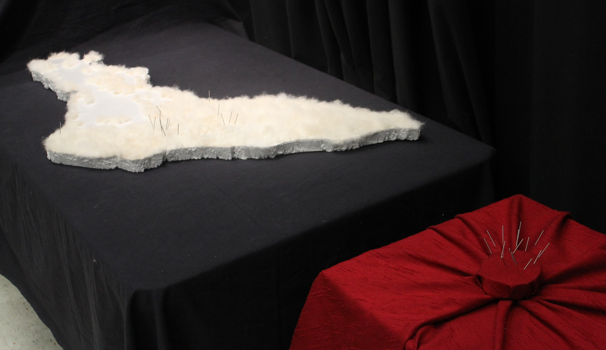
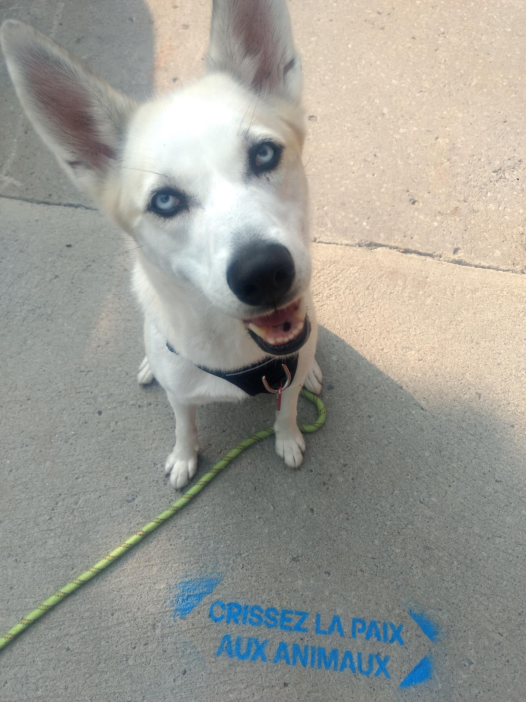

#  	*[…] and counting*

Lena MK, séminaire HAR7005, mai 2024. <a href="./statement.pdf" download>Télécharger le PDF</a>

## Project statement 

As we discussed the depth of restitution processes in our course, I was particularly inspired by the power of rituals and ceremonies to facilitate new narratives on a collective scale. Two artworks particularly inspired me as they touch on matters close to my research topic, public space and monuments. *PeoPL* (2018) by Laura Nsengiyumva is a reproduction of the Léopold II equestrian statue made of ice. The pedestal, placed upside-down above the sculpture, is fitted with incandescent lamps that slowly melt the sculpture during its exhibition at the Nuit Blanche 2018 in Brussels (Bisschop 2022, Yakoub 2021). *On Monumental Silences* (2018) by Ibrahim Mahama presents reinterpretations of a monument to the missionary-father De Deken, including a collective and participatory performance in which the public was invited to interact – mutilate, destroy, remodel – a clay reproduction of the monument (Bisschop 2022). Both artists used careful consideration to reflect the stakes of their narrative in the materials chosen to enact them. As I work more generally on public art and my selected practice for this project is cartography, I wondered if I could weave some of their artistic strategies and decolonial methods into my practice-based research.

Where do mapping and restitution meet? Restitution is present in my research through the above mentioned themes of public space and of monuments. It also emerges in the question of narratives, in the stories and the histories that are told on a topic such as public art. Public art is an art form that is particularly subject to over-representation of normativity, such as domination of *men artists* of European or colonial origins, of colonial topics favored by institutional powers, of capitalistic vision of society, and of thinking about land through extractivism. These narratives form the current imaginary on art in public space and marginalize a diversity of contributions, for example those by women and BIPOC artists. I envision restitution in this project as the thwarting these norms of visibility to renew the imaginaries of public art.

The power *in* and *of* maps is discussed at length in the rich [bibliography](https://www.zotero.org/groups/5236090/cartographie-et-restitution/library) we co-created with Andréanne Martel. As many recognize and criticize the western, colonial and imperial uses of maps (critical, radical, and decolonial cartography [^1]), others offer new approaches to subvert or hijack cartography (subcollection: `nouvelles approches de la cartographie`). Counter-cartography aims to reverse the power dynamics and introduces the reappropriation of mapping to produce new epistemologies, while “indigenous cartography serves as inspiration for non-hegemonic and emancipatory practices.” (Halder and Michel 2018: 16) As we presented these strategies in class, many worries subsisted: the apparatus of a map remains one of domination, as the god‘s eye view from above creates an illusion of control and an all-encompassing effect. Mapping also has a long history of objectifying the land, representing commodities whilst abstracting its liveliness.

Giving further thought to these issues – as well as relating them to the artistic practices I presented in introduction– lead me to the material choices I made for the project. The god’s eye view is part of an imperial paradigm and its visual technologies (Ramaswamy 2014: 4). To counter this effect, I was inspired by indigenous epistemologies of “tactile data visualisation” (O'Connor and al. 2023: 68). Tactility makes space for different interaction with cartography: the “viewer” is invited to physically interact with the map, going beyond the visual sphere to experience a sensory implication with the mapped territory. Using an organic material responded to this issue whilst also reminding us of the living nature of the represented land. I realized I wanted such material that also prompted physical touch, and it happened to be during the bi-annual shedding of my dog, Saphira [^2]. Her fluffy and soft fur attracts people to the point I sometimes notice people “discreetly” trying to touch it as she walks past them on the street. This intuitive touch was exactly what I was aiming for, and her shedding seemed an excellent way to use an organic material whilst preserving any waste, destruction or loss of life in its sourcing. Recycling and waste reduction also motivated the use of an insulation panel as a structural base for the map, as it was an unused product of my partner who works in construction.

Going back to the power of rituals, and yet still thinking about tactility, it was during an acupuncture session that I realized such needles would embody both these stakes. Acupuncture is an alternative medicine practice that defies western scientific knowledges. In its practice, needles are used to stimulate selected locations of the body. (Acupuncture) needles can provoke physical reactions: sometimes even just on sight, they are associated with a feeling of them piercing skin and even causing bloodshed. I only realized the extent of the ritualistic dimension during its practice: as I carefully placed a needle for each artwork onto the map, following their chronological order, I felt an agency both upon the history and the geography of public art made by womxn [^3]. It seemed almost necessary to share this feeling with others, whilst also solving the question of “how many should I place”. I focused on the 18 first, whom I’d nick-named “the ones that defied the odds” (*[celles qui ont défié la norme](https://observablehq.com/d/96b467b6f063cb55?collection=@maison-mona/gender-analysis#cell-87)*) when I visualized the data. The following are still to be activated, just as this history is yet to be made. The participatory process also became a way to reveal my methods: I use data and write code to create digital visualizations and maps. Exhibiting the code and the digital map returns to (*restitue*) this algorithmic approach even when the “end result” is a physical map [^4]. 

## Project description

*[…] and couting* is an installation focusing on the history of public art made by womxn. Its central component is a map of the Tiohtià:ke · Montréal, cut out from a white insulating panel made of extruded polystyrene a few centimeters thick. It is about 1.5 meters at its longest and half as wide, forming a crescent characteristic of the island’s topography. Its surface is covered in patches of white-beige hair, sourced from my dog’s shedding in the fall of 2023 [^5]. The patches fill the gaps between the pattern formed by the urban cycling paths, hand drawn with a light orange felt pen. Sticking out from the patches are acupuncture needles indicating the location of the first – 18 at the instantiation of the project – public artworks made by womxn.

For its participatory activation [^6], the map rests flat, propped up to a table’s height. it is accompanied by a computer and a second screen, displaying respectively the source code and a digital version of the map run on a localhost. Participants are invited to 

- add “to the count” in the code,
- search for the new artwork that appeared on the digital map, using the browser console to access its metadata,
- and place a new needle on the equivalent location of the physical map. 

To find the location, they can use the other needles/artworks as references while also following the both tactile and visual topographical references of the cycling paths and the fur patches. The title updates the count as each participatory action enriches the map, progressively activating a new narrative on public art and its history.

### Documentation

- [Description du projet](http://lenamk.site/doc/HAR7005/descriptionProjet) (Fall 2023)
- [Statement ](http://lenamk.site/doc/HAR7005/statement)(May 2024)
- [Code](https://github.com/lenaMK/doc/tree/main/viz/carte)
- [Visual and analytical notebooks](https://observablehq.com/collection/@maison-mona/gender-analysis)
- [Making of (photographs)](http://u.pc.cd/jRw) (April 2024)
- [Exhibition (photographs)](http://u.pc.cd/ONKitalK) (April 17th 2024)

### References

Bisschop, Allisson. 2022. “La force de l’art actuel face à la statuaire coloniale : les artistes et la question de la décolonisation de l’espace public en Belgique – Journal NaKaN.” Accessed October 23, 2023. https://nakanjournal.com/la-force-de-lart-actuel-face-a-la-statuaire-coloniale-les-artistes-et-la-question-de-la-decolonisation-de-lespace-public-en-belgique/.

Halder, Severin and Boris Michel. 2018. “Editorial – This Is Not an Atlas” in Orangotango+, Kollectif. 2018. *This Is Not an Atlas: A Global Collection of Counter-Cartographies*. Sozial- Und Kulturgeographie, volume 26. Bielefeld: Transcript Verlag. https://notanatlas.org/book/.

Martel, Andréanne and Lena Krause. 2023. *Cartographie et restitution*. Bibliographie Zotero. https://www.zotero.org/groups/5236090/cartographie-et-restitution/library

O’Connor, January, Mark Parman, Nicole Bowman, and Stephanie Evergreen. 2023. “Decolonizing Data Visualization: A History and Future of Indigenous Data Visualization.” *Journal of MultiDisciplinary Evaluation* 19 (44): 62–79. https://doi.org/10.56645/jmde.v19i44.783.

Ramaswamy, Sumathi. 2014. “The Work of Vision in the Age of European Empires” in Ramaswamy, Sumathi (ed.) and Martin Jay. 2014. *Empires of Vision: A Reader*. 2014. Duke University Press. https://doi.org/10.2307/j.ctv1220q6d.

Yakoub, Joachim Ben. 2021. “PeoPL’s Bursting Light.” *Third Text* 35 (4): 413–30. https://doi.org/10.1080/09528822.2021.1944531.

Special thanks to Liz Sales and Faith Holland and their *I Write Artist Statements* initiative. I especially used the blogpost [“Tips from our Project Statement Class” ](https://iwriteartiststatements.com/new-at-your-own-pace-project-statement-class/) from August 20th, 2023.

And thanks to Saphira, who (not so patiently) lets me brush her shedding. She was not harmed in this process.

[^1]: Instead of listing names/references, these are keyworks to filter through the Zotero library
[^2]: She is an alaskan husky breed we adopted a few years ago.
[^3]: During this process, I was also feeling very conscious of my relationship with this territory. As a settler who immigrated from Geneva (Switzerland) a few years ago, I try to express my gratitude for the welcome to live on this unceeded territory by honoring its history and cultures, with an especially marked interest in supporting indigenous ways of thinking and of knowing while I live and work on the island of Tiohtià:ke · Montréal. 
[^4]: Documentation about the data and some experimental visualizations are made available in the [“gender analysis” Observable notebook collection](https://observablehq.com/collection/@maison-mona/gender-analysis). The code for the participatory mapping activity is published on [Github](https://github.com/lenaMK/doc/tree/main/viz/carte). I plan to make some slight adjustments as I performed the *gender analysis* on the entire MONA dataset, whilst this map is focused on the island of Tiohtià:ke · Montréal. For the count to correspond to the number of needles on the map, I need to exclude all artworks outside of this scope.
[^5]: I used the entire bag of shedding I had brushed off Saphira in the Fall of 2023, and ran out while covering the west Island. I am still considering whether to use this Spring’s shedding to continue the map or if it should stay that way.
[^6]: One such participatory activations was organised on April 17th, during a end-of-year student exhibition (CIN7008) where I presented several  experiments in practise-based research (recherche-création).
