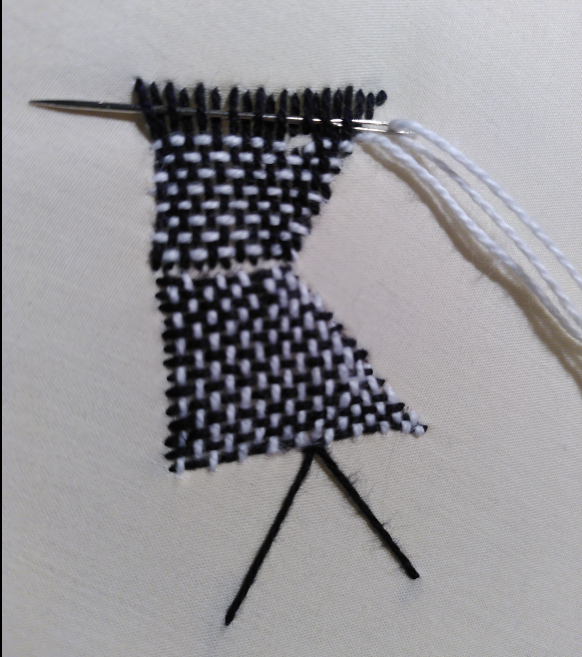
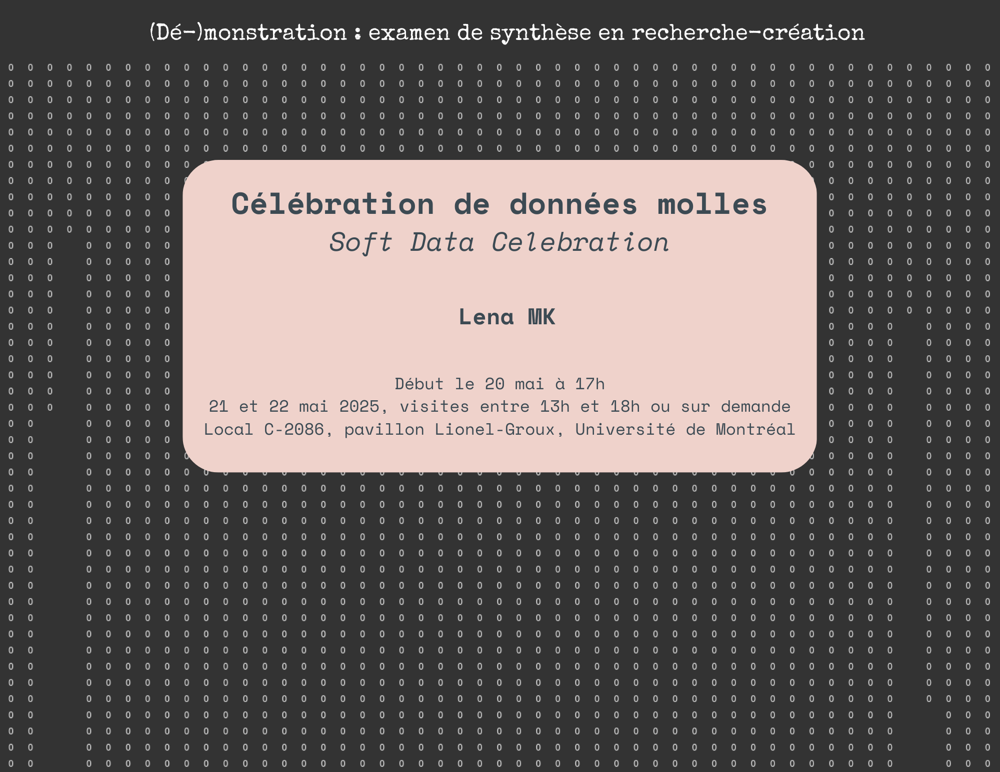

Recherche-création doctorale de [Lena MK](http://lenamk.site), 2023-2027, Université de Montréal. Cette recherche est financée par le [CRSH](https://www.nserc-crsng.gc.ca/Students-Etudiants/PG-CS/CGSD-BESCD_fra.asp).

## Écrire

### Examen de sythèse

- [Résumé de la proposition](./exSynth/resume) ([version en anglais](./exSynth/abstract))
- [Travail écrit](./exSynth/examen-ecrit.html)
- Partie pratique: *Célébration de données molles*, matérialisation de données de la collection du Musée d’art contemporain de Montréal
  - (dé-)monstration du 20 au 22 mai, visites sur demande pendant le mois de juin
    - jeudi 5 juin: 16h à 18h
    - lundi 9 juin: 13h à 18h
    - autres disponibilités à venir après l’examen oral
  - [protocole: « Célébration de données molles »](./exSynth/protocole_MAC) 
  - [audiodescription](./exSynth/audiodescription_donneesMolles.html)
  - (photographies et des vidéos à venir)
  
- [Questions du jury](./exSynth/questions)
  - [réponse](./exSynth/reponse)
- Examen oral: 12 juin 2025

### Conférences

- « The Matter of Maps. A Public Art Experiment », présentation orale à [ICC2025](https://icc2025.com/) *Mapping the Future: Innovation, Inclusion, and Sustainability* du 16 au 22 août à Vancouver, et article à suivre dans le N°47 *Contre-cartographier / Counter-mapping* de la revue [Intermédialités](http://intermedialites.com/appel-a-contributions-no-47-contre-cartographier-counter-mapping/)
- Avec Cassandre Roy, « La recherche-création en histoire de l’art :  Perspectives actuelles et futures », panel pour les Journées d’étude du  doctorat interuniversitaire en histoire de l’art *Trois décennies d’histoire de l’art à Montréal · Three Decades of Art History in Montreal Doc-Inter (1994-2024)*, 1er mai 2025, Montréal 
- [Imagining public art : feminist and algorithmic cartographies](./conf/ecoleDePrintemps_project), notes de la conférence présentée à la *XXIIème École de printemps d’histoire de l’art*, « Social imagining and the role of images, artworks and buildings », Weimar, Allemagne, 17 au 21 juin 2024

### Séminaires

- [L'informatique est-elle la magie noire du XXIe siècle?](./CIN7008/protocole), séminaire CIN7008, hiver 2024
- [Le numérique est-il un médium?](./HAR7009/medium), séminaire HAR7009, hiver 2024
- [*[…] and counting*](./HAR7005), séminaire HAR7005, mai 2024

## Faire

- *Playing with Anni Albers*, série inspirée des études à la machine à écrire d’Anni Albers, printemps 2025
  - [&lowbar;( Anni Albers )&lowbar;](http://lenamk.site/art-algorithmique/anni-typing_1/)
  - [//: Anni Albers ://](http://lenamk.site/art-algorithmique/anni-typing_2/)
  - [sSs_Anni Albers_SsS](http://lenamk.site/art-algorithmique/anni-typing_3/)

- [« Sketch de données:  rubans numériques»](../art-algorithmique/exSynth), étape de préparation pour la matérialisation de données du MAC, p5.js, hiver 2025
- [« Sketch de données: chronologie »](./viz/brodin/), préparation pour la chronologie brodée sur le genre des artistes en art public, p5.js, données MONA, hiver 2024
- [Carte numérique](./viz/carte) de l’installation *[…] and Counting*, d3.js, données ouvertes de la ville de Montréal et données MONA, hiver 2024
- [Expérimentations en art algorithmique](../art-algorithmique),  cours IFT6251, hiver 2024

### Documenter / montrer

- [Faire l’algorithme](../art-algorithmique/img/algo.mp4) (pour trouver l’algorithme)
