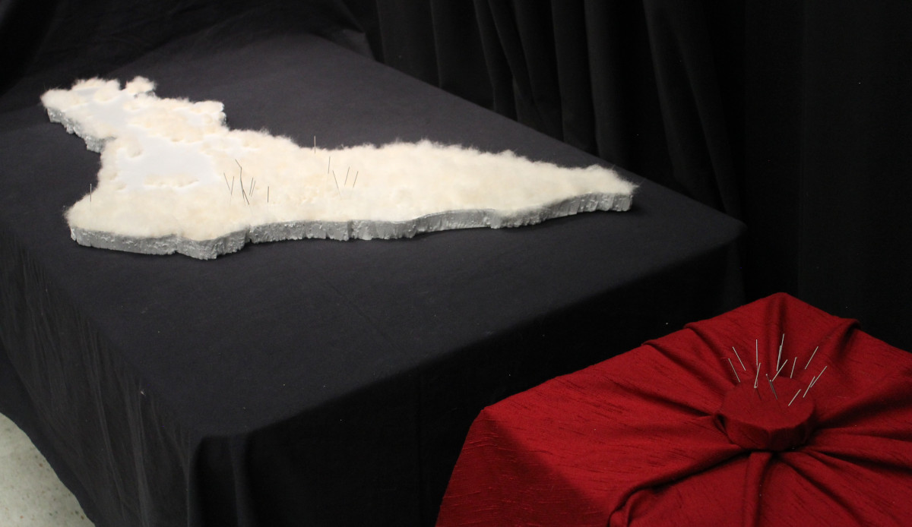
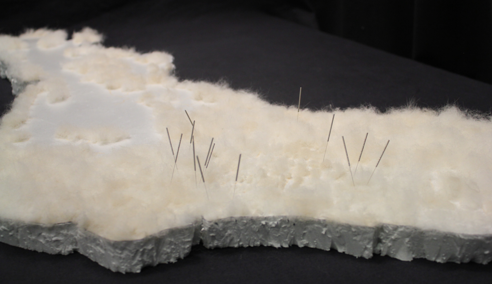

# The Matter of Maps

Lena MK, abstract for the ICC2025 submitted in January 2025

## Abstract

From critical cartography to counter-mapping, the matter of maps has been increasingly analysed, questioned, and experimented with. Their definition, context and means of production, as well as their materiality have radically evolved in the last century, from hand-drawn “official” maps to encompassing a wide variety of practices such as self-published digital visualisations or collective textile cartographic abstractions. This paper aims to contribute to this diverse contemporary mapping landscape from an art historical perspective with *\[…\] and counting*, a research-creation project on public art in Tiohtià:ke · Montréal.

During a doctoral seminar on restitution in museum studies (Abigail E. Celis, Fall 2023, Université de Montréal), I wanted to make a map that told a different story about public art. As a researcher of mixed transnational origins who settled in Tiohtià:ke · Montréal, working with cartography on unceeded territory has heavy historical and contemporary implications. While the western, colonial and imperial uses of maps is strongly critiqued in critical, radical, and decolonial cartography as documented in , I wanted to experiment with counter-cartography to reverse the power dynamics and produce new epistemologies, especially as from *Not an Atlas* shed light on “Indigenous cartography \[serving\] as inspiration for non-hegemonic and emancipatory practices.” Though restitution is always about the land, as an art historian, restitution also emerges in the question of narratives, in the stories and the histories that are told on a topic such as public art. Public art is an art form that is particularly subject to over-representation of normativity, such as domination of *men* artists of European or colonial origins, of colonial topics favored by institutional powers, of capitalistic vision of society, and of thinking about land through extractivism. These narratives form the current imaginary on art in public space and marginalize a diversity of contributions, for example those by womxn, queer and BIPOC artists. I thus envisioned restitution in this project as thwarting these norms of visibility to renew the imaginaries of public art. Upon analyzing my dataset[^2], I chose a feminist angle for the theme of the map and decided to focus on the entry of womxn artists in the public art sphere.

Two artworks tackling decolonial narratives and monuments, as documented and analyzed by and , particularly inspired me. *PeoPL* (2018) by Laura Nsengiyumva is a reproduction of the Léopold II’s equestrian statue made of ice. The pedestal, placed upside-down above the sculpture, is fitted with incandescent lamps that slowly melt the sculpture during its exhibition at the Nuit Blanche 2018 in Brussels. *On Monumental Silences* (2018) by Ibrahim Mahama presents reinterpretations of a monument to the missionary-father De Deken, including a collective and participatory performance in which the public was invited to interact – mutilate, destroy, remodel – a clay reproduction of the monument. Both artists used careful consideration to reflect the stakes of their narrative in the materials chosen to enact them. These artistic strategies and decolonial methods guided me toward the conceptual and material choices I made for this public art counter-cartography experiment. To offset the god’s eye view, its imperial paradigm and visual technologies denounced by , I was inspired by ’s proposal for indigenous epistemologies of “tactile data visualisation”. Tactility makes space for different interaction with cartography: the “viewer” is invited to physically interact with the map, going beyond the visual sphere to experience a sensory implication with the mapped territory. argues that using an organic material both “combats the normal ‘hands-off’ protocols of art spectatorship” and “\[blurs\] the distinction between the animate and the inanimate”, which, in a mapping context, can therefore (re-)connect us to the living nature of the represented land. As I was researching this question, it happened to be the bi-annual shedding of my dog, Saphira. Her fluffy and soft fur attracts people to the point I sometimes notice them “discreetly” trying to touch it as we cross paths on the street. This intuitive touch was exactly what I was aiming for, and her shedding seemed an excellent way to use an organic material whilst preserving any waste, destruction or loss of life in its sourcing[^3]. Recycling and waste reduction also motivated the use of an insulation panel as a structural base for the map, as it was an unused byproduct of my partner’s work in construction. I therefore restricted the data in order to map the island of Tiohtià:ke · Montréal, chosing a natural border over the colonial government’s administrative delimitation. As an attempt to forgo the capitalist, extractivist and alienating urban network set by the automotive industry, I used open data on cycling paths to provide a relevant grid to locate each artwork.

Going back to the power of rituals, and yet still thinking about tactility, I found that acupucture needles could well embody both these stakes. Acupuncture is an alternative medicine practice that defies western scientific knowledges. In its practice, needles are used to stimulate selected locations of the body. (Acupuncture) needles can provoke physical reactions: sometimes even just on sight, they are associated with a feeling of them piercing skin and even causing bloodshed. For each public artwork by a womxn, I thus placed a needle on its location. Using the chronological order materialised a narrative of how womxn artists progressively entered public space, emphasising their relation to each other. I only realized the extent of the ritualistic dimension during its practice: carefully placing a needle for each artwork onto the map, I felt an agency both upon the history and the geography of public art made by womxn. It seemed almost necessary to share this feeling with others, and also solved the questions of “how many needles should I place? When is this piece complete or when do I stop?”. While exploring the dataset[^4], I visualised the data chronologically and noticed a subgroup: the first 18. These artworks by womxn defied the odds in a public art sphere blatantly dominated by men. They seemed so lonely and marginalised, I longed to care for them. I therefore chose to begin the map with these 18 needles. The following are still to be activated, just as this history is yet to be made.

<figcaption style="text-align:right ">Photograph of *\[...\] and Counting* (detail), 2024   CC-BY-SA Lena MK</figcaption>

*\[…\] and couting* became an installation focusing on the history of public art made by womxn. Its central component is a map of the Tiohtià:ke · Montréal, cut out from a white insulating panel made of extruded polystyrene a few centimeters thick. It is about 1.5 meters at its longest and half as wide, forming a crescent characteristic of the island’s topography. Its surface is covered in patches of white-beige dog hair. The patches fill the gaps between the pattern formed by the urban cycling paths, hand drawn with a light orange felt pen. Sticking out from the patches are acupuncture needles indicating the location of the first – 18 at the instantiation of the project – public artworks made by womxn. For its participatory activation, the map rests flat, propped up to a table’s height. It is accompanied by a computer and a second screen, displaying respectively the source code and a digital version of the map run on a localhost. Participants are invited to

- add “to the count” in the code,

- search for the new artwork that appeared on the digital map, using the browser console to access its metadata,

- and place a new needle on the equivalent location of the physical map.

To find the location, they can use the other needles/artworks as references while also following the both tactile and visual topographical references of the cycling paths and the fur patches. The title updates the count as each participatory action enriches the map, progressively activating a new narrative on public art and its history [^5]. The participatory process also became a way to reveal my methods: I use data and write code to create digital visualisations and maps. Exhibiting the code and the digital map reinstates this algorithmic approach even when the “end result” is a physical map[^6]. This experiment on the matter of maps aims to challenge how we think about and through maps, how we might “use” them and how they work through us.

#### Acknowledgements

This proposal is an extension of the research project *Towards a digital commons of public art* (funded by the Canada Arts Council) lead by at Maison MONA, a cultural non-profit based in Tiohtià:ke · Montréal. In this pilot project tackling public art and its visibility in the digital space, we worked on the identification and the referencing of public art artists active in Québec and who have at least one artwork in the MONA database[^7]. This dataset therefore contains 1528 artworks, described with properties such as title, artiste, production date, and geolocation. We intially had very little previous data on the 781 artists that produced these artwork. During the project, we identified artists who are yet to be added to Wikidata, and chose our participants amonst them based on EDI criteria, favoring womxn, BIPOC artists and artists who have an artwork outside of the cultural metropolis of Tiohtià:ke · Montréal. For the artists’ gender identity, we researched their mediatic gender identity, using available biographies from galleries and their personal websites. Participating artists were then contacted and could choose which information they wanted to make public, including their gender identity, while for the rest we used the available mediatic identity in Fall 2023. The public artworks in our database are dated between 1750 (even though it was only moved much later to its current location) and 2022, and most were produced between 1960 and 2022. Geographically speaking, they are on the territory commonly called the province of Québec, though most are located on the island of Tiohtià:ke · Montréal.

#### References

- Bisschop, Allisson. 2022. ‘La force de l’art actuel face à la statuaire coloniale : les artistes et la question de la décolonisation de l’espace public en Belgique – Journal NaKaN’. 2022. https://nakanjournal.com/la-force-de-lart-actuel-face-a-la-statuaire-coloniale-les-artistes-et-la-question-de-la-decolonisation-de-lespace-public-en-belgique/.
- Bryan-Wilson, Julia. 2024. ‘Fibers, Creatures, Furry Beasts: Queer Textile Crittercism’. In *Unravel: The Power and Politics of Textiles in Art*, edited by Lotte Johnson, Amanda Pinatih, Wells Fray-Smith, Barbican Art Gallery, and Stedelijk Museum Amsterdam. Munich London New York: Prestel.
- ‘Call for Papers – No.47 « Counter-Mapping / Contre-Cartographier » – Intermédialités’. n.d. Accessed 1 February 2025. http://intermedialites.com/en/2738-2/.
- Graff, Julie, Lena Krause, Alexia Pinto Ferretti, Camille Delattre, David Valentine, and Simon Janssen. 2024. ‘Vers un commun numérique de l’art public’. *Sens public*, no. 1759 (May). http://sens-public.org/dossiers/1759/.
- Halder, Severin, and Boris Michel. 2018. ‘Editorial – This Is Not an Atlas’. In *This Is Not an Atlas*, 12–25. transcript Verlag. https://doi.org/10.14361/9783839445198-001. 
- Martel, Andréanne, and Lena Krause. 2023. ‘Cartography and Restitution’. Online thematic bibliography. Zotero. https://www.zotero.org/groups/5236090/cartographie-et-restitution/library. 
- O’Connor, January, Mark Parman, Nicole Bowman, and Stephanie Evergreen. 2023. ‘Decolonizing Data Visualization: A History and Future of Indigenous Data Visualization’. *Journal of MultiDisciplinary Evaluation* 19 (44): 62–79. https://doi.org/10.56645/jmde.v19i44.783. 
- Ramaswamy, Sumathi. 2014. ‘The Work of Vision in the Age of European Empires’. In *Empires of Vision: A Reader*. Duke University Press. https://doi.org/10.2307/j.ctv1220q6d. 
- Yakoub, Joachim Ben. 2021. ‘PeoPL’s Bursting Light’. *Third Text* 35 (4): 413–30. https://doi.org/10.1080/09528822.2021.1944531.

[^2]: The data from the MONA research project, further described in the acknowledgments, was too incomplete to use criteria such as artworks created by BIPOC or queer artists. As a team, we felt it would not be appropriate to attempt to highlight such personal data without getting consent from each individual artist.

[^3]: Saphira is an Alaskan Husky breed we adopted a few years ago. I used her shedding of Fall 2023, and ran out while covering West Island.

[^4]: Notebook documenting the data visualisation experiments: https://observablehq.com/@maison-mona/chronologie-et-genre?collection=@maison-mona/gender-analysis.

[^5]: One such participatory activation was organised on April 17th 2024, during a end-of-year student exhibition (CIN7008).

[^6]: The code for the participatory mapping activity is published on Github: https://github.com/lenaMK/doc/tree/main/viz/carte.

[^7]: The MONA database was created as a data source for the MONA app. It unites public art collections to enable *in-situ* outreach and cultural mediation with a free mobile app.