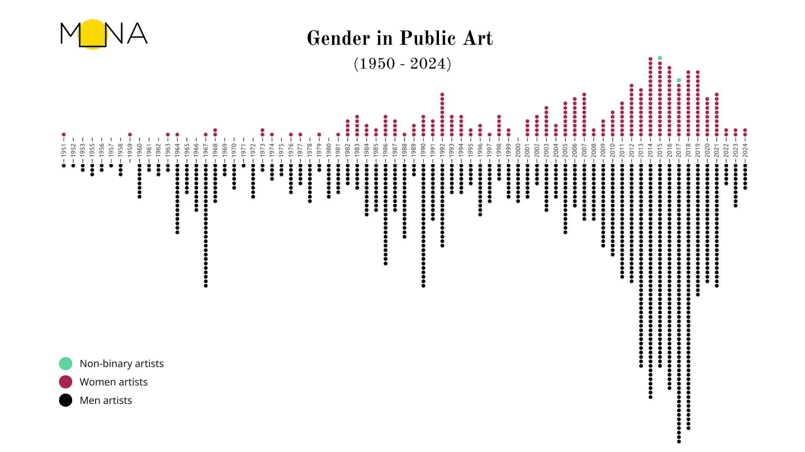

# The Matter of Maps

Lena MK, version (*writing in progress* + notes, images and bibliography coming) after receiving comments from reviewers and the editorial board, december 2025.

## About the article

- Title: *The Matter of Maps. A Public Art Experiment*
- Full name: Lena MK (https://orcid.org/0000-0001-6280-6657)
- Institutional affiliation: Université de Montréal; Maison MONA

### Synopsis

This article recounts and analyses the research-creation process that led to the participatory mapping installation titled *[…] and counting* (2024) in the light of its approach to counter-cartography. The installation space welcomes participants to learn about and contribute to a map about the entry of womxn artists in the public art sphere of Tiohtià:ke · Montréal. Data and algorithms cross with queer textiles practices to embody new and more diverse narratives. Through these situated and sensory interfaces of the map, meaning is embedded into materiality and touch becomes the motor for cartographic interaction as well as knowledge production. 

### Résumé

Cet article relate et analyse les étapes de la recherche-création qui ont mené à l’installation de cartographie participative intitulée *[…] and counting* (2024), à la lumière de son approche de la contre-cartographie. Cette installation invite son public à apprendre et à participer à une carte au sujet de l’entrée des femme·x·s artistes dans l’espace public à Tiohtià:ke · Montréal. Données et algorithmes se mêlent à des pratiques textiles *queer* pour produire de nouveaux récits de la diveristé. À travers les interfaces sensorielles et situées de la carte, la matérialité devient porteuse de sens et la tactilité guide les interactions cartographiques ainsi que la production de connaissances.

### Biographical note

Lena MK is a research-creation doctoral candidate in art history and computer science at Université de Montréal. Her doctoral research, at the crossroads of textility and algorithmics, experiments with the physicalisation of cultural data as a new form of access to collections. Passionate about cultural outreach and mediation, Lena has developed a specialisation in data visualisation and cartography as methods to shape and share situated narratives. As founder and technical director of Maison MONA, she creates, develops and maintain projects aiming to democratise access to art and culture in public spaces in Québec.

## Content

# The Matter of Maps

- **A Public Art Experiment** (initial submission and abstract title)
- A counter-cartographic experiment on public art
- Experimenting with counter-cartography of public art 
- counter-mapping public art 

Lena MK, corrections, December 2025

### Synopsis

This article recounts and analyses the research-creation process that led to the participatory mapping installation titled *[…] and counting* (2024) in the light of its approach to counter-cartography. The installation space welcomes participants to learn about and contribute to a map about the entry of womxn artists in the public art sphere of Tiohtià:ke · Montréal. Data and algorithms cross with queer textiles practices to embody new and more diverse narratives. Through these situated and sensory interfaces of the map, meaning is embedded into materiality and touch becomes the motor for cartographic interaction as well as knowledge production. 

## Article content

### (intro)

From critical cartography to counter-mapping, the matter of maps has been increasingly analysed, questioned, and experimented with. Their definition, context and means of production, as well as their materiality have radically evolved in the last century, from hand-drawn “official” (institutional) maps to encompassing a wide variety of practices such as self-published digital visualisations or collective textile cartographic abstractions. This article explores the matter of maps – as in their materiality, what they are made of –,  and why maps matter – identifying and challenging the theoretical and practical postures they are made from. In the expanded field of thematic mapping, cartographers combine a base map with a thematic overlay to create a georeferenced narrative (Palsky et al 1996:10-11). The article recounts one such narrative on public art by womxn[^1] in Tiohtià:ke · Montréal, through my research-creation titled  *[…] and counting* (2024). 

*[…] and counting* is a participatory mapping installation combining data-driven digital cartography with a materialised sensory interface. When approaching the installation, the physical map likely catches attention first: meeting its fluffy surface and the needles protruding from it conjures distinct sensory and tactile responses. Next to it, a digital workspace is provided by my laptop equipped with a second screen. The laptop displays a script in a coding environment, while the second screen interprets it in a browser, thus presenting a digital map generated in real time. The installation comes together with human presence, when I welcome participants to discover its contents and contribute to the collective cartographic process. With each contribution, the title of the installation updates to reflect the number of needles placed on the map. For its initial public presentation, I had mapped the first 18 artworks, thus the installation announced *18 and counting*. By the end of the event, the title had reached *28 and countin*g.

##### Figure 1: Installation view

The article begins by situating my research on public art. It continues by identifying the cartographic framework within which it operates. I then describe and analyse the research-creation process, weaving together the creative decisions with the theoretical footholds that sustain them. Distributed across three sections, the examination of the base map, the thematic stratum, and the participatory activation, only loosely follow the creation process. These divides were selected to favour a reflective and critical stance: inscribing the elements of *[…] and counting* into an academic narrative presents an opportunity to further the back-and-forth dynamic between research and creation. While theory serves as inspiration, practice provides fertile ground to pursue theoretical advances. Following Myriam Suchet’s advice in *Indiscipline!* when considering the role and impact of research-creation, this article documents my public art experiment to “allow others to see the transformations that alter [my] ways of thinking.”[8](#sdfootnote8sym) By sharing this experience, I strive to challenge how we think about and through maps, how we might “use” them and how they work through us.[9](#sdfootnote9sym)

<!--research on counter-mapping through situated, material and sensory interfaces-->

## Time and space of public art

Narratives in and about public art have tended to the over-representation of normativity, notably due to the fact that is has long been commissioned by those in power[3](#sdfootnote3sym) Monuments and art in public space present many biases, such as toward a dominance of *men* artists,[4](#sdfootnote4sym) favoring settlers or those of European origins[^0], a colonial and capitalistic vision of society, considering the land and people through the lens of power and control.[5](#sdfootnote5sym) However, especially in recent years, public art also began including artworks and artists who challenge these narratives.[6](#sdfootnote6sym) My engagement with public art comes from the work we do at Maison MONA, a cultural non-profit based in Tiohtià:ke · Montréal. Through research-action, artistic residencies and cultural outreach, we work at the crossroads between art and technology to the democratise and broaden access to art, heritage and culture in public spaces in the province of Québec. In a project tackling public art and its visibility in the digital space [7](#sdfootnote7sym), my colleagues and I worked on a dataset of artists who have at least one public artwork in the MONA database. The frame of our project led us to analyze the dataset with a focus including gender identity. After years of experiencing the gender gap while doing research or preparing cultural outreach programs, it was the first time we could take a quantitative insight to analyse the presence of womxn creating in the public art context. This became an opportunity to tell a new story, about the entry of womxn artists in the public art sphere.

- Who were the first womxn to contribute public artworks?
- When and where did they do so?

A quantitative and data-driven analysis of the data offers partial answers to these questions. In the MONA database[^2], the first artwork by a woman was the monument to Queen Victoria, made by her daughter Princess Louise in 1900. The immense challenge for a woman to not only make art, but to make monumental works with durable materials, so that they may be exposed to the harsh conditions of the northern outdoors, is reflected by the social class of our first two artists, [princess](https://en.wikipedia.org/wiki/Princess_Louise%2C_Duchess_of_Argyll) and [heiress](https://en.wikipedia.org/wiki/Gertrude_Vanderbilt_Whitney). Our first local artist is [Alice Nolin](https://fr.wikipedia.org/wiki/Alice_Nolin), who studied at the School of Fine Arts in Montreal. While her commission for her public artwork is also tributary to familial privilege [^3], her presence already marks a change in the regional art scene. *[ajouter une phrase de transition sur les autres œuvres? je pourrais en ajouter une pour chaque ou presque, dans le sens où j’ai accumulé des anecdoctes et faits historiques sur ces œuvres, mais ce serait trop long et relativement arbitraire de décider où et quand s’arrêter]* As they unravel, the stories behind the artworks provide insight into some of the challenges and the constraints that these artists faced, as they defied the odds and set a path towards a feminist history of public art. 

##### Figure : First 10 artworks by women in the MONA database[^5]. 

CC BY Lena MK and Maison MONA, 2025.

This chronological approach to the dataset provided an opportunity to get acquainted with these artists and their works. However, this historical context does not consider their locations in public space. Unlike most visual artworks, public art is mostly immobile, and generally created with its location in mind. In the MONA app, and thus in the MONA database, public art is defined with regard to public access, as it should be accessible for users to discover and collect [^4] . It therefore comprises many types of artworks, indoors and outdoors, such as a sculpture in a park, a mural on a community centre, stained glass in a metro station or a photograph in a municipal building. Most were made for their location, and many are works of art integrated under the provincial *[Politique d’intégration des arts à l’architecture et à l’environnement des bâtiments et des sites gouvernementaux et publics](https://www.quebec.ca/culture/integration-oeuvres-art-public/a-propos-integration-oeuvres)*. As a cultural mediator, I wanted to map the location of these artworks to highlight them during public art tours for example. As an art historian, I was also interested in reflecting on the history of these artworks in relation to their urban surroundings and, especially, to each other. I therefore wanted to map this dataset.

## Framing the map 

The island still know to most as « Montréal » also holds different names such as « Tiohtià:ke » in [Kanien’kéha](https://decolonialatlas.wordpress.com/2015/02/04/montreal-in-mohawk/), « Mooniyang » in [Anishinaabemowin](https://nac-cna.ca/fr/indigenouscities/city/montreal) and « Muliat » in [Innu](https://editions.hannenorak.com/catalogue/muliats/)[^6].  The ways with which we describe, visualise and name a territory that has been colonised bears heavy historical and contemporary implications. As a researcher of mixed transnational origins who settled on this island, it is essential for me to recognise its indigenous past, present and futures. I therefore turned to critical cartography and to counter-cartography as tools to counter colonial ways of thinking and doing.  A first step, or at least the one that sent me down the rabbit hole, is *Deconstructing the map*. The eponym seminal article by J.B. Harley invites us to rethink the nature of maps and especially to « break the assumed link between reality and representation » (1989, 2). Many cartographic writings and tales explore the limitations (and failings) of maps attempting to become the territory. Probably best known for this, and definitely the most wonderfully absurd, is map with a scale of  1:1[^11] imagined by Borges in his short story titled *On the Exactitude in Science* (1946 *[je ne trouve pas la date de la traduction]*). Harley, however, confronts us with this reality regarding just about any map:

> « Pick a printed or manuscript map from the drawer almost at random and what stands out is the unfailing way its text is as much a commentary on the social structure of a particular nation or place as it is on its topography. The map-maker is often as busy recording the contours of feudalism, the shape of a religious hierarchy, or the steps in the tiers of social class, as the topography of the physical and human landscape » (Harley, 1989, p. 6)

We must then revise the definition of thematic maps given in the introduction. The construction of a spatial narrative, fraught with political and social underpinnings, applies to all types of maps. Cartography shares with colonialism and imperialism the pursuit of territory, and agency over it (Edney 1997, Akerman 2009, Ramaswamy 2023). Maps don’t limit themselves to documenting land: they project dominions, establish power relations and serve as platforms for planning actions such as urbanism or extractivism. From this perspective, a map might tell us more about its maker(s) and patron(s) than about the territory itself <!--terrain and topography?-->.

This assessment prompted cartographic uprisings, notably in radical, decolonial, indigenous, and participatory cartography (see thematic bibliography [10](#sdfootnote10sym)). Many of these instances rally around the broader framework of counter-cartography. As demonstrated among the wide range of examples provided in *This is not an Atlas* (2018), underlying conditions for counter-cartography are to reverse mapping’s historical power dynamics. By turning cartography against the dominant or normative power structures, counter-mapping practices are a tool for social liberation, making space for more diverse perspectives. For instance, Indigenous activists and researchers have contributed powerful rebellions against the dominant and colonial cartographic institution. Among some of their documented strategies, they oppose colonial maps and reclaim their relations to the territory by using indigenous toponyms or using visual strategies that stem from their perspectives (Chartier 2020). Counter-mapping discourses led by indigenous artists and writers have also been shown to mobilise Indigenous epistemologies: creating theoretical frameworks from personal, collective, and mythological stories, they reactivate the kinship networks that also shape ancestral laws, land management practices and modes of identity formation (Marcoux 2024 [12](#sdfootnote12sym)). Indigenous cartographic practices hence offer great teachings to counter-cartography through their « non-hegemonic and emancipatory practices » [11](#sdfootnote11sym), where the maker consciously chooses to embed their positionality into the process making of a map. In terms of public reception, the resulting map situates the set of values that uphold it to its audience, instead of masquerading as neutral (Haraway 1988). Counter-cartography thus tackles ways of thinking and as much as ways of making, all the while considering the maker’s positionality.

In practice, I approach counter-cartography as a critical state of mind, questioning *what* and *who* are or aren’t part of a map, *why* and *how* they are represented, in addition to *who* participates *when* and *how* in the process of map-making. There is no exhaustive checklist, yet here are some steps that have been recurrent in my experience [^13]. First of all, the motive: *why* am I (or we) making a map? Its topic must be situated within the wider socio-political context and the narratives that derive from it. Forms of collaboration and participation may provide relevant ways to distribute and share agency over the mapping process (Palsky 2013). Then arise numerous choices when building the contents of a map. With GIS technologies and the cartographic base layers available today, there is an inherent risk of taking the base map for granted, especially in thematic mapping. Despite these abundant resources, there is an even broader spatial thinking that can be considered, ranging from topography to more abstract or sensibility-based representations (Olmedo 2015). To chose the base layer, I often turn to the motive and analyse what kind of spatial knowledge I (or we) are trying to produce. As spatial relations are most commonly expressed in maps through visual means, all graphical and textual components must be carefully considered. Each shape, color, and label takes part in building the map’s discourse, or though it may become more evident once carefully deconstructed (Harley 1989). Using a trial-and-error approach, I experiment the outcome of a map with and without an element, to pry out meanings and evaluate if they were intended or not. If using data, critical data studies and data feminism recursively bring up the same critical questions onto the data: *who* gathered it and produced it, *when* and with *what* intentions or goals, *how* might some perspectives be absent or erroded, especially when visualising it (D’Ignazio and Klein 2020; Dávila and Hall 2023). 

Envisioning the map’s « biography » [^12] brings about another set of critical questions about display, conservation and documentation. *Who* is this map for and how will they have access to it? This is not a topic to be left for last as it, for example, could impact the choice of medium. A map printed on textile rather than paper might be easier to travel with. Maps hosted on the web may seem more accessible on a global scale, yet their digital components may require powerful computers, rapid internet access, or time/resource-consuming maintenance. Material approaches to mapping therefore imply different modes of circulations. Moreover, they also afford different interactions: while the digital realm offers ever-growing possibilities for interactivity, engagement with physical maps is enhanced by touch when pointing to a detail or tracing a path upon it. Hybrid means of production, such as 3D-printing, can convey tactile semantics by associating different meanings to textures or by providing braille inscriptions(Wabiński and al. 2025; Hwang and al. 2025). The range of interactions with or within a map make it an environment where the production of meaning and knowledge is co-constructed between the conceptual and material choices made by the mapmaker(s), and the involvement of the person experiencing it. Finally, few (if any) maps can journey through space and time unaffected or can claim to be universally accessible. I therefore find that creating diverse forms of documentation can offer relevant strategies in terms of accessibility. Diversity in documentation can address different senses (Lupton and Lipps 2018). For instance, text or audio descriptions can relieve dependency on visual documentation. In terms of scale, digital documentation can be shared openly or adapted to respect cultural protocols. Layering multiple perspectives in documentation is particularly relevant for research-creation, as the complex entanglements between theory and creative practice may not manifest wholly in the map itself.

I therefore conceive counter-cartography as a frame. On the theoretical end, it inscribes map making into a critical framework. In its practice, it recognises and inscribes cartographic processes into the map, making it self-conscious and (hopefully) self-critical. In the following sections of this article, I address how certain elements of *[…] and counting* relate to counter-cartography. 

~~~
Mapping of public art by womxn situated on colonised territory calls for an intersectional approach that extends to 

- decolonial practices. with regards to the territory
- feminist → domination of men both in the art and in the public sphere 
  - thwarting the dominant narratives in order to share a more diverse history of public art
- anticapitalist → **public** art
- ecology → material relation to the earth

counter-cartographic approaches seem particularly relevant to bring often overlooked narratives to the spotlight
~~~

---

### Deep within the soft creases

>  “*matter matters*: the material matters because it bears meaning.”[15](#sdfootnote15sym) (Vitali-Rosati 2024 paraphrasing Karen Barad)

New materialisms and authors such as Karen Barad argue that “*matter matters*: the material matters because it bears meaning.” (Vitali-Rosati 2024) Considering that ideas, thoughts and concepts are expressed in a physical, material instance, the medium I chose for my map needed to effectively defy colonial mindsets about the territory. I drew inspiration from the treatment of materiality in two decolonial monuments. *PeoPL* (2018) by Laura Nsengiyumva is a reproduction of the Léopold II’s equestrian statue made of ice. The pedestal, placed upside-down above the sculpture, is fitted with incandescent lamps that slowly melt the sculpture during its exhibition at the Nuit Blanche 2018 in Brussels.[13](#sdfootnote13sym) *On Monumental Silences* (2018) by Ibrahim Mahama presents reinterpretations of a monument to the missionary-father De Deken, including a collective and participatory performance in which the public was invited to interact – mutilate, destroy, remodel – a clay reproduction of the monument.[14](#sdfootnote14sym) Both artists used careful consideration to reflect the stakes of their narrative in the materials chosen to enact them.

For my map, instead of the virgin *terra nullius* symbolised by a blank sheet of paper, *the* bureaucratic medium, I thought that raw organic material [16](#sdfootnote16sym) could convey the living nature of the land. As I was researching this question, it happened to be the bi-annual shedding of my dog Saphira. Her fluffy and soft fur attracted people to the point I sometimes noticed them “discreetly” reaching to try to touch it as we cross paths on the street. This intuitive touch was exactly what I was aiming for, and her shedding seemed an excellent way to use an organic material whilst preserving any waste, destruction or loss of life in its sourcing.[17](#sdfootnote17sym) Far from disposing of the shedding, I often used to leave little bundles out and about for animals to pad their nests with. It is the fabric of homes, bringing insulation and comfort in both its origin and reuse in the wild.

##### Figure : *[...] and couting*, preparation of the map texture

CC BY Lena MK 2024

Thus I created my base map by covering a white insulation panel[18](#sdfootnote18sym), the structural base for the map, with the off-white shedding. From the originally rectangular shape of the panel–, I cut out the shape of the island of Tiohtià:ke · Montréal, choosing a natural border over the colonial government’s administrative demarcations. The rough edges of the hand-trimmed Styrofoam contrast with the rectangular, glossy or slick sheets of paper commonly used for maps. As an attempt to forgo the capitalist, extractivist and alienating urban network set by the automotive industry, I chose a reference grid formed by the open data on cycling paths.[19](#sdfootnote19sym) Using a projector, I superimposed the digital map and traced the routes with a light orange felt pen. To affix the shedding to the panel, I drew upon my drag experience: to make an artificial beard, one glues patches of hair to the intended area. Though the first bushes rarely seem convincing, persevering usually leads to a satisfying result. I therefore proceeded to glue little balls of fur to the surface, following the pathways. Some areas are detailed enough to reveal the urban grid, while others are visually covered in off-white fur. In a western section of the island, the insulation panel remains visible as I ran out of shedding.

In her essay *Fibre Creatures, Furry Beasts: Queer Textile Crittercism*, art historian Julia Bryan-Wilson provides an interesting lens on the use of organic materials in art practices: “Textile crittercism attends to work that takes critterly form, to practices that use animal and insect by-products, and to art that stages creatureliness (embracing touch and the body’s base necessities for survival) as an oppositional tactic in the face of masculinist demands to prioritise logic and rationality.”[20](#sdfootnote20sym) In the case of Peruvian American artist Sarah Zapata, Bryan-Wilson highlights how her furry sculptures wield tactility and pleasure as political tools, “refuting the ‘hands-off’ protocols of art spectatorship.”[21](#sdfootnote21sym) Using materials that cry out for touch nurtures a relational approach. It queers the field of possibilities and “connects the human and the non-human”[22](#sdfootnote22sym) which, in a mapping context, can therefore (re-)connect us to the living nature of the represented land. Furthermore, the fuzzy fibre offsets the god’s eye view and the visual process of knowledge-making (Haraway 1988). The formidable instrument of power, usually enhanced by an imperial paradigm and visual technologies,[23](#sdfootnote23sym) turns to fluff.

~~~
interesting development of posthumanism in a cartographic context, but needs a bit more explanation and development. Fuzz, by itself, does not necessarily carry the signification of living nature, nor does it automatically offset the “god’s eye view,” without first looking at what is being offset. More citations are needed in general… the phrase “god’s eye view” for instance echoes Haraway’s Situated Knowledges, or de Certeau’s “Walking in the City”, but the phrase is used without explanation. There needs to be a bit more around the change from the visual focus (god’s eye view) to the sensual and tactile, and overall more attention to situating the work within the field(s)

describe tactile vs visual discovery and exploration
~~~

### Tactile findings

As we slowly emerge from the fuzzy patches, we might wonder:  

~~~
- Page 5/6. Under the heading of “Tactile findings,” the author considers Ingold’s work but the relation to the fluff-map is not clear. Ingold speaks of the difference between lines made by wayfarers and “destination-oriented transport” (commuters?). The author uses lines made by tracing cycling paths. What is the connection between Ingold, cycling paths and women artists?
- The discussion of tactility and fuzz on the map has potential, but it is not clear how the physical interaction transmits cartographic knowledge How does the viewer “know” where on the map they are through feeling the fur? Is there correlation between real place and representation on this fuzzmap? How is tactility related to the visual map? It would be worthwhile to explore these questions with greater specificity.
- more direct engagement with the questions of touch, tactility and positionality that drive this research creation project, within the wider frame of counter-cartographies.
~~~

where am I? In *Lines: Brief history*, Tim Ingold analyses maps by considering their relationships with both the traveler and the land.*[24](#sdfootnote24sym)* The anthropologist highlights two knowledge systems of habitation and occupation, and opposes wayfaring and travel as ways of moving within the land. On the one end of the spectrum, paths across the land are shaped by its inhabitants. Tangled trails follow the path of the wayfarer. They have no beginning nor end, as they are continually woven into a reticulate meshwork by the ways of life.[25](#sdfootnote25sym) On the other end, in the colonial project of occupation, travel and transport form a network of connections between select locations. “The traveler who departs from one location and arrives at another is, in between, nowhere at all.”[26](#sdfootnote26sym) Looking at maps, these antagonistic modalities of travel can be distinguished by the shape of their lines : wayfarers draw fluid streaks that compose a sketch. In the case of destination-oriented transport, the line become jerky. It jolts on the surface, fragments into a series of connected dots to form a route-plan. In terms of narrative, pre-composed plots replace the storytelling that accompanies the hand-drawn sketch.[27](#sdfootnote27sym) Tim Ingold’s theoretical insights strengthen counter-cartographic practices to think and make from our positionality within the land, building knowledge as we experience it rather then from afore-collected information and materials. It also provides an additional layer of interpretation to *[…] and counting*. As the fuzzy hair can’t quite be tamed, the surface of the map only evokes the built infrastructure. The hand-drawn serpentine paths are present throughout the map but invisible at a distance. The only way to move across the map is by wayfaring. Fingers gently parse the fur to find and follow the arteries, touch becomes the guiding sense through the interface. 

##### Figure : *[...] and counting*, map view

CC BY Lena MK 2024

Tactile epistemologies have long been sidelined by western knowledge production. Tactile data visualisation, such as “incorporat[ing] stories (qualitative data) and numbers (quantitative data) into [indigenous] textiles, fabrics, governments and ceremonies”[28](#sdfootnote28sym) was long disregarded by western powers, both as representations of legal agreements and as historical approaches that would include indigenous epistemologies in data visualisation <!--Ceci fait un peu plaqué: est-ce vraiment nécessaire?-->. Textile practitioners and their tactile knowledge were also sidelined. Anni Albers remarks already in 1965 how we have increasingly grown insensitive in our perception by touch. Modern industry saves us time and manual labor, but “it also bars us from taking part in the forming of material and leaves idle our sense of touch and with it those formative faculties that are stimulated by it.”[29](#sdfootnote29sym)

In the context of cartography, reinstating a sensory-driven narrative relinquishes control over to land to favor an embodied relationship to it. Tactility allows for different interactions with cartography: the “viewer” is invited to physically interact with the map, going beyond the visual sphere to experience a sensory implication with the mapped territory. Going beyond vision makes space for tactile ways of knowing, responding to Bruce Mau’s call “to explore, experiment, and invent new formats and combinations of sensory experience, new ways of telling stories.”[30](#sdfootnote30sym) Multisensory design practices are also more inclusive, as they “[support] everyone’s opportunity to receive information, explore the world, and experience joy, wonder, and social connections, regardless of our sensory abilities.”[31](#sdfootnote31sym)

### Piercing narratives: thematic  mapping

~~~
Les trois premiers paragraphes de cette section sont "confusants": manque d'ordre et explications un peu lacunaires. Il me semble que ces explications (améliorées) devraient venir plus tôt. La suite, au sujet de la participation, peut rester en place, le lien se fait bien

- try and find a better angle to bring up the topic of acupuncture needles
- And what does it mean that a woman’s artwork is represented by a needle? Is the land therefore skin that can be punctured? Some development of the iconography would enrich the narrative here.
~~~

Thinking about tactile care practices, I found that using acupuncture needles in the map could provide a form of ritual. Acupuncture is an alternative medicine practice that defies western scientific knowledges. Following ancient asian traditions, needles are used to stimulate selected locations of the body. (Acupuncture) needles can provoke physical reactions: sometimes even just on sight, they are associated with a feeling of them piercing skin and even causing bloodshed. I therefore decided to use needles to activate the location of each artwork by a woman on my map.

##### Figure : *[...] and couting*, map close-up view

CC BY Lena MK 2024

Using a chronological order materialises a narrative of how womxn artists progressively entered public space, emphasising their relation to each other. While exploring a chronological view of the data where each dot is a public artwork (Figure 1), I noted several phases. First, the outliers, sparsely distributed on the timeline up to 1981. Then, a first cluster forms between 1982 and 1987. It felt like some of them were finally able to stand together. More clusters come after that, following waves of public art production. I chose to begin the map with the first 18 artworks by womxn, those that defied the odds in a public art sphere blatantly dominated by men [32](#sdfootnote32sym).

[enrich this section]

> Figure : Timeline of artworks in MONA database. 
> This view starts in 1951, when a yearly production cycle becomes apparent in our data.
> CC BY Lena MK and Maison MONA, 2025.

To place each needle, I used a digital map generated on my laptop with a d3.js script. Then I visually followed the cycling paths to find the artwork’s location. Between every needle, i “upped” the count, updating the title that was generated on the digital map. In a minimal, almost “bare” computing approach, I did not go beyond the basic UI/UX for the digital map. Instead, I wanted to take the time to search for the each new dot as it appeared on the screen, accessing the artwork details through the browser console to learn about it and foraging around the fur patches to find my way.

> Figure : *[...] and counting*, installation view
> CC BY Lena MK 2024

As if performing a ritual, the experience of carefully placing each of the 18 needles brought a feeling of agency, both upon the history and the geography of public art made by womxn. It seemed almost necessary to share this feeling with others, embracing the collective approach to promote a history in the making 

#### Participatory mapping

*[…] and counting* became an installation intended for participatory activation. In such setting the map rests flat, propped up to a table’s height. It is accompanied by a computer and a second screen, displaying respectively the source code and a digital version of the map run on a localhost.[33](#sdfootnote33sym) Participants are invited to 

1. add “to the count” in the code,
2. search for the new artwork that appeared on the digital map, using the browser console to access its metadata,
3. and place a new needle on the equivalent location of the physical map.

##### figure … Lines 110 to 139 of the script 

→ **make github repo for clean reference**

The first step,  reveals the data-driven approach to the map by asking the participant to look into the code I wrote to create the digital map. In the excerpt of the code provided in the figure [..x..], the `Promise` loads the json files with the cycling network (*réseau cyclable*), the simplified outline of the island and the artworks by womxn exported from the MONA data (`femx`). However, not all artworks are mapped (function `map`, toward the end, right before the error catch): `data` takes after `femx`, which are ordered by year of production ( lines 119 to 121), and it only copies the number of entries defined by `count`. Therefore, if `count = 1`, data would only have the first artwork in the chronologically-ordered database. In the figure, the count (line 117), is at 28. The title of the digital map is dynamically updated (line 123) to reflect the count: « 28 and counting ». When a participant is invited to « up » the count, they change the value of « count » (i.e. from 28 from 29), which in turn updates the title, and shows an additional artwork on the digital map.

##### figure … screenshot of the digital map at *28 and counting*

The digital map is very minimalistic. Its only visible text is the title. Below, a black background provides contrast for the simplified outline of the island’s shape, filled in white to mimic the physical map. The cycling paths add an uneven grid. To the familiar eye, some elements of the urban landscape can be distinguished, such as the dense neighbourhood of Rosemont and the Plateau. As urban cycling infrastructure often takes advantage of the safety and greenery of parks, one might make out the large loop going around the Parc Frédéric-back or the sinous path to climb up the Mont Royal. This grid also reveals gaps, areas where commuters have fewer access to bicycle lanes. Though several maps, both physical and digital, show the city’s cycling network, I have never seen it on a map without road network. The cycling network map layer provides recognisable features of the city while offering an critical perspective on its built infrastructure. Since this context doesn’t comprise a functional commuting purpose, this alternative way to map an urban area suits the aim of *[…] and couting*, which is to situate artworks on the island and to visualise their spatial relations. 

Small black dots form the last layer of the map[^8], indicating the locations of the artworks « in » the count. However, I consciously opted for this almost barren approach rather than providing a « dumb-proof » or « brainless » interface. I believe that collectively writing a new page of public art history calls for work, and active participation.  The challenging nature of this task was, however, mediated by my presence. I provided assistance to people who were less familiar with the territory, or who experienced challenges reading the map. These interactions proved often fruitful to pursue longer and deeper conversations, about maps, about the land, about the artworks, etc.

##### Figure … screenshot of the browser console

Placing a new needle onto the physical map could, in theory, be done simply by comparing it with the digital map and figuring out which dot was yet to be materialised by a needle. However, all participants (including myself) were invested and wanted to know more about the artwork being added. Since the digital map is generated by a local script executed in a browser [^9], I decided to us the console – one of the many developer tools provided in contemporary browsers –  not just to debug my code but also to log the data. One could therefore view the data associated with each dot, first as a brief summary with their title, artist, and date, then as a complete `Object`, with many more properties such as `owner` and their respective values: `Université McGill`, `Centre de services scolaire de Montréal`, or `Ville de Montréal`. Matching each dot with an artwork therefore also revealed my methods and the data behind the map. For some participants, this was their first time looking at data, and/or a browser console. As many interfaces today are enriched with photographs, being exposed to a technical description of an artwork without a visual representation sometimes proved an unsettling experience. At times, this sparked curiosity and topics linked to digital literacy, while others immediately reclaimed the browser as a tool to further research an artwork or an artist. 

~~~
unfinished re-rewriting here
~~~

 required collaboration. I had placed the first 18, so I generally remembered their locations. As participants contributed, the number of artworks grew.

The participatory process also became a way to reveal my methods: I use data and write code to create digital visualisations and maps. Exhibiting the code and the digital map reinstates this algorithmic approach even when the “end result” is a physical map. The digital map is accessible at: https://lenamk.site/doc/viz/carte/ and the code is published on Github: https://github.com/lenaMK/doc/tree/main/viz/carte.

To find the location, they can use the other needles/artworks as references while also following the both tactile and visual topographical references of the cycling paths and the fur patches. The title updates the count as each participatory action enriches the map, progressively activating a new narrative on public art and its history. One such participatory activation was organised on April 17th 2024, during a end-of-year student exhibition [34](#sdfootnote34sym). Since then, the map states *28 and counting*. The following are still to be activated, just as this history is yet to be made.

### Emerging unscathed? 

*[…] and counting* presents as a spatial installation but it was (and is) a temporal journey. This article documents several steps of the creative process that led research on counter-mapping through situated, material and sensory interfaces. It shares strategies for embedding meaning into materiality, embracing touch for knowledge production, nurturing collective agency, and bridging the gap between algorithmic and textile maker spaces. If many of these ideas occurred at different times, they are only brought together into a linear narrative through the writing process. I experience research-creation as a particularly meandering process: the ramifications of a thought or a creative decision, both of which might have emerged as intuition, can later shape a large portion of the outcome. And by outcome, I mean as much the participatory mapping installation as this article. Time might still reveal new layers of meaning-making in this proposal, especially as further activations of the installation may continue *counting*.

If this article already tackles some elements of documentation, different directions could continue adding depth to this experiment. For example, considering further activations brings to light a possible object or installation biography. How might we document *[…] and counting*’s journeys? We can turn our critical inquiries onto the production of documentation, considering which voices should or can be heard, what formats to record them with, and how and where to share them. Moreover, when considering the layers of narratives, this article focused on the experimental counter-mapping process. However, the story of the entry of womxn artists in the public art sphere on the island of Tiohtià:ke · Montréal that was central to the installation may seem relegated to the sidelines of this publication. This is in part due to the aforementioned questions regarding the documentation of the lived experience. During the first year of my thesis, I was discovering many aspects of research-creation, and while enthralled by the creative possibilities, I was not as attentive to the production of documentation. Even now, I am not sure how to share the many thoughts, feelings and conversations that occurred while considering each artwork we mapped. Writing about such a narrative would feel more considerate in a publication dedicated to the topic, such as Valentine Desmorat’s thesis on the entry of women artists into Montreal’s Contemporary Art Museum (2024). In this regard, I hope for this article to motivate further diverse writings on counter-cartography, and on public art.

<!--incredulous look from a child asking: why would you have to do that?-->

---

##  

## Acknowledgments

My doctoral research is funded by the Social Sciences and Humanities Research Council (Canada Graduate Research Scholarship – Doctoral program 2024-2027).

This proposal is an extension of the research project *Towards a digital commons of public art[35](#sdfootnote35sym)* (funded by the Canada Arts Council) lead by at Maison MONA, a cultural non-profit based in Tiohtià:ke · Montréal. In this pilot project tackling public art and its visibility in the digital space, we worked on the identification and the referencing of public art artists active in Québec and who have at least one artwork in the MONA database[36](#sdfootnote36sym). This dataset therefore contains 1528 artworks, described with properties such as title, artist, production date, and geolocation. We initially had very little previous data on the 781 artists that produced these artwork. During the project, we identified artists who are yet to be added to Wikidata, and chose our participants among them based on EDI criteria, favoring womxn, BIPOC artists and artists who have an artwork outside of the cultural metropolis of Tiohtià:ke · Montréal. For the artists’ gender identity, we researched their mediatic gender identity, using available biographies from galleries and their personal websites. Participating artists were then contacted and could choose which information they wanted to make public, including their gender identity, while for the rest we used the available mediatic identity in Fall 2023. The public artworks in our database are dated between 1750 (even though it was only moved much later to its current location) and 2022, and most were produced between 1960 and 2022. Geographically speaking, they are on the territory commonly called the province of Québec, though most are located on the island of Tiohtià:ke · Montréal.

---

## References (to be updated)

- Alvarez Hernandez, Analays. 2021. « Le monument dans un champ élargi : les pratiques performatives de Giorgia Volpe, Claudia Bernal et Constanza Camelo Suarez », *Espace art actuel*,  dossier thématique « Sortir/Come out », Laurent Vernet (rédacteur invité), no 127, hiver 2021, p.  14-21. https://www.erudit.org/en/journals/espace/2021-n127-espace05876/95142ac/
- Hernandez, Analays. 2019. « The Other(’s) Toronto Public Art: The Challenge of Displaying Canadians’ Narratives in a Multicultural/Diasporic City ». *RACAR : Revue d’art Canadienne / Canadian Art Review* 44 (1): 42‑53. https://doi.org/10.7202/1062151ar.
- Bisschop, Allisson. 2022. « La force de l’art actuel face à la statuaire coloniale : les artistes et la question de la décolonisation de l’espace public en Belgique », *Journal NaKaN*. https://nakanjournal.com/la-force-de-lart-actuel-face-a-la-statuaire-coloniale-les-artistes-et-la-question-de-la-decolonisation-de-lespace-public-en-belgique/.
- Bryan-Wilson, Julia. 2024. « Fibers, Creatures, Furry Beasts: Queer Textile Crittercism ». In *Unravel: The Power and Politics of Textiles in Art*, edited by Lotte Johnson, Amanda Pinatih, Wells Fray-Smith, Barbican Art Gallery, and Stedelijk Museum Amsterdam. Munich London New York: Prestel.
- Graff, Julie, Lena Krause, Alexia Pinto Ferretti, Camille Delattre, David Valentine, and Simon Janssen. 2024. ‘Vers un commun numérique de l’art public’. *Sens public*, no. 1759 (May). http://sens-public.org/dossiers/1759/.
- Halder, Severin, and Boris Michel. 2018. ‘Editorial – This Is Not an Atlas’. In *This Is Not an Atlas*, 12–25. transcript Verlag. https://doi.org/10.14361/9783839445198-001. 
- Martel, Andréanne, and Lena MK. 2023. ‘Cartography and Restitution’. Online thematic bibliography. Zotero. https://www.zotero.org/groups/5236090/cartographie-et-restitution/library. 
- O’Connor, January, Mark Parman, Nicole Bowman, and Stephanie Evergreen. 2023. ‘Decolonizing Data Visualization: A History and Future of Indigenous Data Visualization’. *Journal of MultiDisciplinary Evaluation* 19 (44): 62–79. https://doi.org/10.56645/jmde.v19i44.783. 
- Ramaswamy, Sumathi. 2014. ‘The Work of Vision in the Age of European Empires’. In *Empires of Vision: A Reader*. Duke University Press. https://doi.org/10.2307/j.ctv1220q6d. 
- Yakoub, Joachim Ben. 2021. ‘PeoPL’s Bursting Light’. *Third Text* 35 (4): 413–30. https://doi.org/10.1080/09528822.2021.1944531.
- Vitali Rosati, Marcello. 2024. *Éloge du bug. Être libre à l’époque du numérique*. La Découverte. Zones. 
- Walsh, Patricia, Amina Cooper, Chris Guerra, Susan Lambe, Julia Muney Moore, et Ruri Yampolsky. 2020. *Cultural Equity in the Public Art Field*. Americans for the Arts, Public Art Network. [bit.ly/3mWulhK](https://doi.org/bit.ly/3mWulhK).

### ↓ list of bibliographic references from document conversion

[1](#sdfootnote1anc) Kollektiv Orangotango+ (ed.), *This Is Not an Atlas. A Global Collection of Counter-Cartographies,* Bielefeld, transcript Verlag, 2018.  

[2](#sdfootnote2anc) This project originated during a doctoral seminar on restitution, repatriation and return in museum studies by Prof. Abigail E. Celis, Fall 2023, Université de Montréal.

[3](#sdfootnote3anc) Laurent Vernet, “L’art public à l’épreuve du vivre ensemble,” *Espace : art actuel*, no 127, 2021, p. 10‑13.

[4](#sdfootnote4anc) I use *men* artist, a purposefully odd-sounding turn of phrase, to accentuate the double standard with women artists.

[5](#sdfootnote5anc) Analays Alvarez Hernandez, “The Other(’s) Toronto Public Art: The Challenge of Displaying Canadians’ Narratives in a Multicultural/Diasporic City”, *RACAR : Revue d’art Canadienne / Canadian Art Review* 44 (1): 42‑53, 2019. https://doi.org/10.7202/1062151ar (accessed August 2nd 2025)
  Patricia Walsh, Amina Cooper, Chris Guerra, Susan Lambe, Julia Muney Moore, and Ruri Yampolsky, *Cultural Equity in the Public Art Field,* Americans for the Arts, Public Art Network, 2020

[6](#sdfootnote6anc) Analays Alvarez Hernandez, “Le monument dans un champ élargi : les pratiques performatives de Giorgia Volpe, Claudia Bernal et Constanza Camelo Suarez” Espace : art actuel, no 127, 2021, p. 14‑21.

[7](#sdfootnote7anc) *Towards a digital commons of public art* was a Maison MONA project funded by the Canada Arts Council. Between 2023 and 2024, our team experimented with the potential, viability, and usefulness of linked open data (LOD), while also aiming to generate interest in the semantic web within the artistic and cultural community. The main focus was to increase the visibility of artists involved in public art on the Wikidata, Wikimedia Commons, and Wikipedia platforms. By identifying the current initiatives, needs, and issues specific to the visual arts sector, this project intends to equip artists with good wiki practices and thus to foster the development of a digital commons of public art.

[8](#sdfootnote8anc) “éprouver et donner à voir les transformations qui modifient nos manières de réfléchir” (my translation). Myriam Suchet, *Indiscipline! tentatives d’univercité à l’usage des littégraphistes, artistechniciens et autres philopraticiens,* Montréal, Nota bene, 2016, p. 69.  

[9](#sdfootnote9anc) Part of this research-creation was presented at the International Cartographic Conference 2025 in Vancouver and was followed by the publication of an abstract: https://doi.org/10.5194/ica-abs-10-199-2025.

[10](#sdfootnote10anc) Andréanne Martel and Lena MK. 2023. “Cartography and Restitution”. Online thematic bibliography, Zotero. https://www.zotero.org/groups/5236090/cartographie-et-restitution/library (accessed August 7th 2025)

[11](#sdfootnote11anc) Severin Halder and Boris Michel, “Editorial – This Is Not an Atlas” in Kollektiv Orangotango+, *This Is Not an Atlas,* Bielefeld, transcript Verlag, 2018, p. 12-25.

[12](#sdfootnote12anc) Gabrielle Marcoux, “Modes de gestion et de représentation du territoire dans l’art autochtone actuel au Canada : souveraineté territoriale, souveraineté rhétorique et souveraineté mémorielle”, Phd thesis, Université de Montréal, 2024 https://papyrus.bib.umontreal.ca/xmlui/handle/1866/33386 (accessed June 22nd 2025)

[13](#sdfootnote13anc) Allison Bisschop, “La force de l’art actuel face à la statuaire coloniale : les artistes et la question de la décolonisation de l’espace public en Belgique”, *Journal NaKaN*, 2022. https://nakanjournal.com/la-force-de-lart-actuel-face-a-la-statuaire-coloniale-les-artistes-et-la-question-de-la-decolonisation-de-lespace-public-en-belgique/ (accessed October 23rd 2023)*
\* 	 Joachim Ben Yakoub, “PeoPL’s Bursting Light”. *Third Text* 35 (4), 2021, p. 413‑30. https://doi.org/10.1080/09528822.2021.1944531. (accessed October 23rd 2023)

[14](#sdfootnote14anc) Allison Bisschop, “La force de l’art actuel face à la statuaire coloniale : les artistes et la question de la décolonisation de l’espace public en Belgique”, *Journal NaKaN*, 2022.

[15](#sdfootnote15anc) “M*atter matters*: la matère compte car elle porte du sens” (the author paraphrases Karen Barad, my translation of the french part of the citation) Marcello Vitali Rosati. *Éloge du bug. Être libre à l’époque du numérique,* Paris, La Découverte, Zones, p. 93

[16](#sdfootnote16anc)By “raw material”, I mean untreated nor industrially produced and transformed.

[17](#sdfootnote17anc) Saphira was an Alaskan Husky breed we adopted a few years ago. I used her shedding of Fall 2023, and ran out while covering West Island. She passed away in May 2025 and we miss her very much.

[18](#sdfootnote18anc) An unused byproduct of my partner’s work in construction.

[19](#sdfootnote19anc) https://www.donneesquebec.ca/recherche/dataset/vmtl-pistes-cyclables 	

[20](#sdfootnote20anc) Julia Bryan-Wilson “Fibre Creatures, Furry Beasts: Queer Textile Crittercism” in *Unravel: The Power and Politics of Textiles in Art*, Lotte Johnson, Amanda Pinatih, Wells Fray-Smith (eds.), Barbican Art Gallery, et Stedelijk Museum Amsterdam, Prestel, 2024, p. 25.

[21](#sdfootnote21anc) *Ibid.* p.23

[22](#sdfootnote22anc) *Ibid.*

[23](#sdfootnote23anc) Sumathi Ramaswamy, “The Work of Vision in the Age of European Empires », in *Empires of Vision: A Reader*, Martin Jay and Sumathi Ramaswamy (eds.), Duke University Press, 2013, p. 1-22. https://doi.org/10.2307/j.ctv1220q6d (Accessed October 15th 2023)

[24](#sdfootnote24anc) Tim Ingold, “Up, Accross and along” chapter 3 in *Lines: A Brief History*. London and New York, Routledge, Routledge Classics, 2016 [2007], p. 74-106.

[25](#sdfootnote25anc) *Ibid.* p.85

[26](#sdfootnote26anc) *Ibid.*

[27](#sdfootnote27anc) *Ibid.* p. 77

[28](#sdfootnote28anc) January O’Connor, Mark Parman, Nicole Bowman, and Stephanie Evergreen, “Decolonizing Data Visualization: A History and Future of Indigenous Data Visualization”, *Journal of MultiDisciplinary Evaluation,* 19 (44), 2023, p. 68. https://doi.org/10.56645/jmde.v19i44.783 (Accessed on October 15th 2023)

[29](#sdfootnote29anc) Anni Albers, *On Weaving*. Middletown, Connecticut, Wesleyan University Press, 1974 [1965], p. 62.

[30](#sdfootnote30anc) Bruce Mau, “Designing LIVE: A New Medium for the Senses” in *The Senses: Design beyond Vision*, Ellen Lupton and Andrea Lipps (eds), New York, Smithsonian Design Museum and Cooper Hewitt, Princeton Architectural Press, 2018, p. 20.

[31](#sdfootnote31anc) Ellen Lupton and Andrea Lipps, “Why Sensory Design” in *ibid* p. 9.

[32](#sdfootnote32anc) The timeline published in this article covers the years 1950 until 2024. In the notebook documenting the data visualisation experiments, I created several other views to better understand the entire time frame. https://observablehq.com/@maison-mona/chronologie-et-genre?collection=@maison-mona/gender-analysis

[33](#sdfootnote33anc) The participatory process also became a way to reveal my methods: I use data and write code to create digital visualisations and maps. Exhibiting the code and the digital map reinstates this algorithmic approach even when the “end result” is a physical map. The digital map is accessible at: https://lenamk.site/doc/viz/carte/ and the code is published on Github: https://github.com/lenaMK/doc/tree/main/viz/carte.

[34](#sdfootnote34anc) Exhibition of the research-creation doctoral students of the art history, cinema and media studies department (Prof. Frédéric Dallaire, CIN7008, Winter 2024), public activation on April 17th 2024 at Université de Montréal.

[35](#sdfootnote35anc) Camille Delattre, Julie Graff, Simon Janssen, Lena MK, Alexia Pinto Ferretti, and David Valentine, “Vers un commun numérique de l’art public, *Sens public*, no. 1759 (May), 2024. http://sens-public.org/dossiers/1759/ (Accessed on August 27th 2025)

[36](#sdfootnote36anc) The MONA database was created as a data source for the MONA app. It unites public art collections to enable *in-situ* outreach and cultural mediation with a free mobile app.

---

## Footnotes

[^1]: I situate this article in a queer and more-than-binary approach to feminism. I chose the term « womxn »  to include and make visible the presence of Jessica Sabogal, an artist who identifies as non-binary artist and has actively championed women in their art.
[^2]: The MONA database was created as a data source for the MONA app. It unites public art collections to enable *in-situ* outreach and cultural mediation with a free mobile app. Its territorial extent is set to match the province of Quebec, while recognising that this mostly covers the unceed and ancestral lands of many indigenous nations. *[…] and Counting* centers on the island of Tiohtià:ke · Montréal. Therefore, it does not include works such as *Notre-Dame de la Garde* (1939) by Soeur Marie de l'Eucharistie, which appears fourth on the list of 10 first artworks by women in the MONA database, but is located on the Magdalen Islands.
[^3]: Her father was on the board that commissioned the work (« Non titré», s.d.)[article sur Art public Montréal](https://artpublicmontreal.ca/oeuvre/non-titre-52/)].
[^4]: We know of more artworks that are yet to be added to our database. Access to data and documentation is the main restriction to completing the MONA database. Its content is a constant work of updating documentation and diversification of sources. We are very grateful to the open data policies and open data platforms such as [donnéeesquebec.ca](https://www.donneesquebec.ca/recherche/dataset?organization=&q=art+public) that made a lot of this work possible.
[^5]: These are the first ten artworks when the data is sorted chronologically. It happens that the 11th artwork (*Verre-écran* by Marcelle Ferron) is also from 1968, therefore it is the first year that we could attest to the creation of two public artworks by women. Just as 1967 left a heritage of artworks from Expo 67, the second half of the 60s (of which 1968 is a good example) were important years in early municipal public art, with the inauguration of several artworks in metro station and the construction and expansion of university campuses.
[^6]: Throughout the article, I will use the name Tiohtià:ke · Montréal to explicitely refer to the island as unceeded territory.
[^8]: The map can be zoomed in, making it somewhat more accessible.
[^9]: What I mean by a « local script executed in a browser » is that even though the map appears in a browser window, the code that generates it isn’t hosted on the web but locally, on my computer. The digital map is produced in real time: a change such as « adding to the count » made in the coding environment has a direct impact on the output.

[^10]: I hope that one day, any and all maps will be openly situated by their makers and producers. However, as long as such situated practices remain subversive, I consider them within the expansive field of counter-cartography.
[^12]: This line of thought is inspired by « object biographies » in tmuseum studies: [refs]
[^0]: In the context of North America
[^11]: A scale of 1:1 means that the map is at the same scale as the territory, and therefore attempting to become it as covers the entire territory.
[^13]: The order the steps are presented doesn’t reflect a chronology of making.
