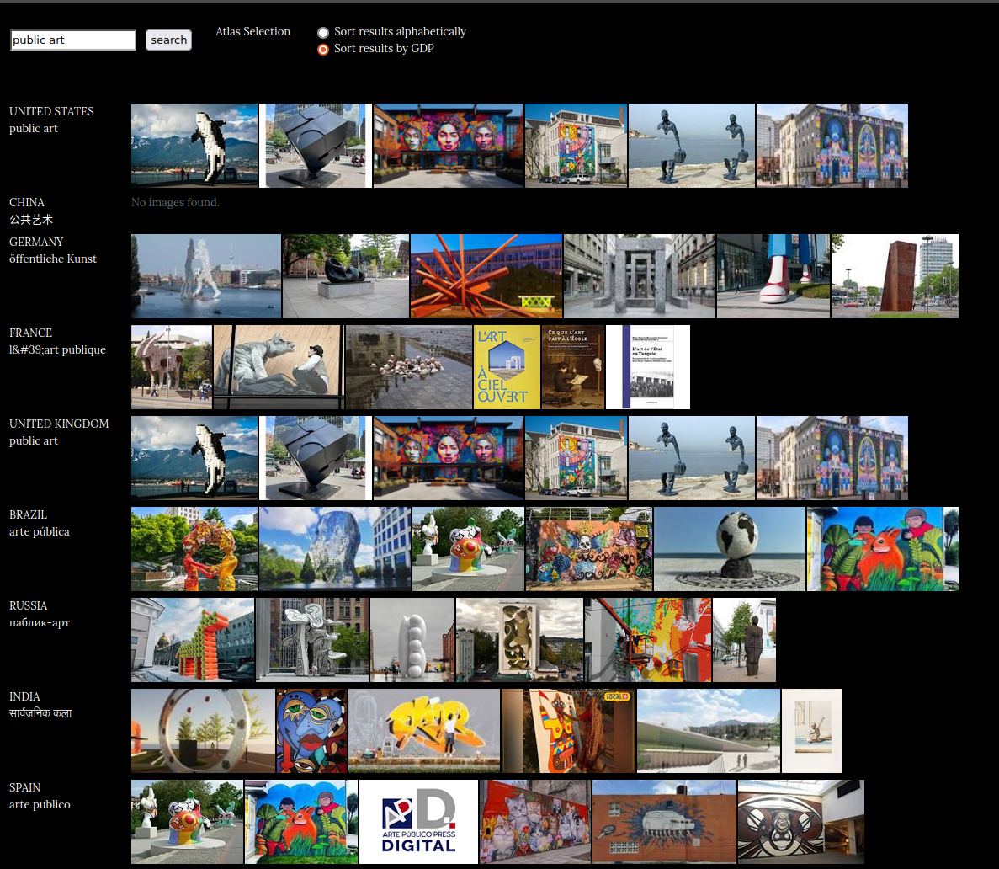

# Imagining public art : feminist and algorithmic cartographies

Lena Krause, Université de Montréal, last updated on May 26th 2026 <a href="./project.pdf" download>Download PDF</a>
XXIInd Spring School of Art History, « Social imagining and the role of images, artworks and buildings », Weimar, Germany, 17-21 June 2024

[toc]

## Abstract

In my doctoral research, I experiment with visual and algorithmic creations to give a new form of access to cultural data. GLAM (galleries, librairies, archives and museums) institutions are currently creating data about their collections and my research aims to exemplify the use of counter-curation and of interactive data visualisation as æsthetic, sensitive and non-hierarchical ways to access cultural contents. The production of charts or of new visual forms not only creates representations of these collections, but in the case of interactive visualisations, they also enable the discovery of their contents. In a complementary way to cultural mediation and to curation, it becomes possible to give access to art through serendipity and sensibility.

During the Spring School, I would like to present a case study on public art in Montreal (Qc, Canada). Public art is an art form that is particularly subject to over-representation of normativity: men artists of European or colonial origins, colonial topics favoured by institutional powers, capitalistic vision of society, and thinking about land through extractivism. These narratives form the current imaginary on art in public space and marginalise a diversity of contributions by women and BIPOC artists for example.

My research aims to renew this imaginary of public art by thwarting these norms of visibility. I use data on public art[^1] to suggest counter-narratives, focused on the entry of women·x artists in public space. I will illustrate this practice with three examples from my algorithmic counter-curation experiments: an interactive map accessible on the web, an algorithmic artwork, and a physical map [^2] .

[^1]: This research is part of « Towards a digital common of public art » research project by Maison MONA and funded by the Canadian Arts Council), lead by Julie Graff, Camille Delattre, Alexia Pinto Ferretti, Simon Janssen, David Valentine and myself. In this large undertaking on public art and its visibility in the digital realm, we have collected data identifying and referencing public art artists active in Quebec and who have at least one artwork in the MONA database. This database was initially created as a data source for the MONA mobile app. It brings together public art collections in Quebec to facilitate their in situ cultural mediation with a mobile app.
[^2]: The map will be presented through photographs as it is too fragile to be transported.

## Presentation

Introduction

- PhD at UdeM, research-creation (practice-based research) project in art history, and more specifically in data visualisation (BA & MA studies in art history and in computer science)
- GLAM (galleries, librairies, archives and museums) institutions are currently creating data about their collections and my research aims to exemplify the use of counter-curation and of interactive data visualisation as æsthetic, sensitive and non-hierarchical ways to access cultural contents
- The production of charts or of new visual forms not only creates representations of these collections, but in the case of interactive visualisations, they also enable the discovery of their contents. In a complementary way to cultural mediation and to curation, it becomes possible to give access to art through serendipity and sensibility.

### Social imaginings of public art

What are the social imaginings of public art? And how is it curated online?

- search engine results with *Image Atlas*
- general blogposts (« best of », « top 10… ») about public art 

#### *Image atlas*: searching for « public art »

Exploration of search results for public art using the *Image Atlas* project by [Taryn Simon](http://tarynsimon.com/) and [Aaron Swartz](http://www.aaronsw.com/) (a reflexion on search engines, seemed a fitting starting point for talking about algorithmic imaginaries)

- search engines: what the algorithm and its the devs & companies think you want to see when you enter a search keyword

> Image Atlas investigates cultural differences and similarities by indexing top image results for given search terms across local engines throughout the world.

I initially thought I would do an analysis of how many of the above shown images are artworks by women·x or by men, but I got distracted by the fact that many results are blog posts about public art, which seemed a fitting representation of how public art « in general » is represented in written media. 

(linking imaginaries to narratives)

> Narratives, as conceptualized in the humanities, are social interpretations that are orally and medially transmitted, reproduced, and sometimes reframed in these transmission contexts. (Kathke, Tomann and Uhlig 2022: 76)
>
> Narratives often refer to the past, are passed off as a common story, and may offer people the possibility of temporally framing what they have experienced and thereby lend coherence to their lives.

A brief analysis of the artworks and the gender of the artists illustrating said blog posts : 

- [20 Works of Public Art to See in New York City](https://www.artnews.com/list/art-news/artists/important-public-artworks-new-york-city-1234686243/tony-rosenthal-alamo-1967/) (ARTnews, 2023) (4 out of 19 + 1 mixed)

  - Louise Nevelson, *Shadows and Flags* (1977)
  - Barbara Kass, OY/YO (2015) (who’s name is actually **Deborah** Kass)
  - Isa Genzken, Rose III (2018)
  - (Kristin Jones and Andrew Ginzel, *Metronome* (1999) )
  - Mary Miss, *South Cove* (1984-87)

- [Where to See the Best Public Art](https://www.invaluable.com/blog/best-cities-public-art/) (invaluable, 2017) (2 out of 6 images, without the Douglas Coupland’s "Digital Orca" that’s repeated)

  - [Liz Glynn: Open House](https://vimeo.com/207692697) 
  - Katharina Fritsch's "Hahn/Cock," : her name is not mentionned, the artwork appears in an instagram post
  - mentions: 
    - [Doris Salcedo](https://www.invaluable.com/features/viewArtist.cfm?artistRef=YVK302SN21)

- [38 of the Most Fascinating Public Sculptures](https://www.architecturaldigest.com/gallery/11-most-fascinating-public-sculptures) (Architectural Digest, 2019)

  - (to be completed)

  

Examples in Germany  (if there is enough time)

- [Kunst im öffentlichen Raum. Darum sieht es in Berlin so scheußlich aus](https://www.welt.de/kultur/article194280157/Kunst-im-oeffentlichen-Raum-Darum-sieht-es-in-Berlin-so-scheusslich-aus.html) (Welt, 2019)
  - (to be completed)
- [Kunst umsonst und draußen: Da lohnt das Stehenbleiben](https://www.coolibri.de/magazin/kunst-im-oeffentlichen-raum/) (Coolibri, 2020)
  - (to be completed)

### algorithmic imaginary ─ algorithmic practices?

<!--admit to misunderstanding the word on first reading-->

#### algorithmic imaginary

- Bucher 2018: from algorithmic awareness (studying if/how people are aware of algorithms) to how people become aware of algorithms (situations). algorithmic imaginary (how people perceive algorithms,)

  > The algorithmic imaginary is not to be understood as a false belief or fetish of sorts but, rather, as the way in which people imagine, perceive and experience algorithms and what these imaginations make possible  (Bucher, 2017, p. 31) <!--even when what they believe has nothing to do with the technical workings of the algorithm-->
  >
  > The concept of the “algorithmic imaginary” […] brings into focus […] users’ appropriations of algorithmic processes operating in opacity and their imaginaries of these operations. (Schulz describing Bucher’s article)

- Schulz 2023: cross-platform institutionalization of infrastructure, processes and practices on the side of the platforms and their developers (back end)

  > the algorithm “imagines” the future behavior of the users via so-called “predictor modules” of machine learning, which are supposed to predict the future behavior of the users from all their actions
  >
  > extending the concept of the imaginary to non-human entities

  - Castoriadis

    > central tension between constantly instituting and already instituted society

    →radical imaginary (*instituting*) < peripheral imaginary < central imaginary < social imaginary (*instituted*)

    > the algorithmic imaginary cannot be limited to one of the involved sides, the heterogeneous user groups or the different platform actors, but has to be thought multi-perspectively. The approach to the imaginary can only ever be situated and dependent on the respective position (Natale and Guzman, 2022: 632)

*litterature I might add*

- Low, Bronwen, Christian Ehret, and Anita Hagh. 2023.  « Algorithmic Imaginings and Critical Digital Literacy on #BookTok ». *New Media & Society*, October, 14614448231206466. https://doi.org/10.1177/14614448231206466.
- Striphas, Ted, Blake Hallinan, Cj Reynolds, Mikayla Brown, and Hector Postigo. 2021.  « Algorithmic Imaginations: Rethinking Algorithmic as a Heuristic for Understanding Computationally-structured Culture ».  *AoIR Selected Papers of Internet Research*, September. https://doi.org/10.5210/spir.v2021i0.12131.

#### Algorithmic practices

« imagination » rather than imaginaries? what you can do, in practice, with an algorithm 

- definitions: code, scripts, algorithms. The daily bread of a developer (back to a computer scientist’s definition of an algorithm)
- [Types of Algorithms](https://www.datacamp.com/blog/what-is-an-algorithm#types-of-algorithms-under)
- difference between an algorithm and data
- algorithmic art ([intro](https://www.rightclicksave.com/article/a-longer-history-of-generative-art), link with conceptual art): 
  - part of software engineering, part of digital art world
  - using algorithms to make art, early examples Vera Molnar 1960s
  - principles: (should become clearer when l show the example)
    - generative (need to execute code to get the result)
    - using loops, « blending randomness and structure » (Hobbs 2018)
  -  for many: also a way to explain computers to the world

#### Counter-curation

- Kathke, Tomann and Uhlig 2022	

  > Curating understood as a social practice offers people the opportunity to draw attention to perceived political and social imbalances and to oppose hegemonic narratives. 
  >
  > as an open useful heuristic for the analysis of representations and performances in the public sphere
  >
  > History as a field concerned not only with the facts of the past, but also with how they are made visible, usable, and narrativized for multiple uses and through multiple perspectives,
  >
  > Counter-narratives are […] collectively shared representations and imaginaries that question already established narratives

  counter-culture

  - protest against a dominant displays of … (1960s: capitalism and progress)
- struggle for self determination and attempt to attain for themselves a comprehensive power of interpretation.
  - countering and unsettling the status quo in order to open up new spaces of possibility
- counterculture acts as a mechanism for describing particular points of convergence through which individuals are able to connect temporarily in the pursuit of specific goals (Andy Bennett, “Reappraising ʻCountercultureʼ,” in Whiteley and Sklower, *Countercultures*,17–26.)

I found this literature by thinking about counter-mapping (Orangotango+ 2018) and wondering if it has been applied to curation!)

#### Working with data

data curation → counter-curation of GLAM+ data

> This surplus of possibilities, data, and impressions must somehow be organized, perhaps even domesticated. In such a context, curating proposes the possibility of subjective reassurance and consolidation, as it always encompasses a selection and sorting of material and a presentation of the results of these processes in a narratively meaning-making manner. (Kathke, Tomann and Uhlig 2022: 75-76)

algorithmic curation of data? coherence/convenience of using algorithms to work with data

### Experiments in feminist and algorithmic cartographies

- experiments in data visualisations <!--or digital witchcraft-->
- [Maison MONA](https://monamontreal.org/), *Towards a digital commons of public art* data: researching gender identity for ~700 artists, who’s ~1500 public artworks in the province of Quebec we have in our database
- Bringing care to the forefront of curation

  - *Curation*: deriving from the Latin curationem, meaning “a taking care, attention, management”  (Kathke, Tomann and Uhlig 2022: 72)
  - feminist ethics of care

#### Interactive map - web interface

[interactive data visualisation notebook(s)](https://observablehq.com/@maison-mona/lignes-chronologiques?collection=@maison-mona/gender-analysis)

- more my sketching base
- relatively quick visualisations (thanks to experience), almost no personnalisation but quick visual feedback and analytical insight into the contents
- example: visualising phenomena, elements that stand out such as the [women artists who defied the historical norm](https://observablehq.com/d/96b467b6f063cb55?collection=@maison-mona/gender-analysis#cell-41) 

#### Figures historiques

[demo](http://lenamk.site/art-algorithmique/figures-historiques/)

- algorithmic art course (Benoit Baudry, IFT6251, 2024)
  - data art → first experiment with the MONA data 
    - curation: selecting only the artworks made by women·x : first time ever we could do that (once I matched the artist info with the artwork info)
  - from [experimenting with titles](http://lenamk.site/art-algorithmique/artistes-femmes-MONA/) to a visual form
  - very abstract, far from classical data visualisation 
  
- explanation of some steps: 
  - list of artworks: sorting the artworks by production date; placing them onto the screen using their gelocation (relative placing)
  - constellation:  selecting one at random and link it to a random (between 5 and 12) number of artworks that follow it chronologically speaking 
  - aminamtion : making a big loop that repeats the instructions every <!--250 frames + fade in 50 frames + fade out 50 frames; 60 frames per second--> ~6 seconds (with fade in and fade out times)

#### […] and counting

> *[…] and couting* is an installation focusing on the history of public art made by womxn. Its central component is a map of the Tiohtià:ke · Montréal, cut out from a white insulating panel made of extruded polystyrene a few centimeters thick. It is about 1.5 meters at its longest and half as wide, forming a crescent characteristic of the island’s topography. Its surface is covered in patches of white-beige hair, sourced from my dog’s shedding in the fall of 2023 [^5]. The patches fill the gaps between the pattern formed by the urban cycling paths, hand drawn with a light orange felt pen. Sticking out from the patches are acupuncture needles indicating the location of the first – 18 at the instantiation of the project – public artworks made by womxn. 
>
> For its participatory activation [^6], the map rests flat, propped up to a table’s height. it is accompanied by a computer and a second screen, displaying respectively the source code and a digital version of the map run on a localhost. Participants are invited to 
>
> - add “to the count” in the code,
> - search for the new artwork that appeared on the digital map, using the browser console to access its metadata,
> - and place a new needle on the equivalent location of the physical map. 
>
> To find the location, they can use the other needles/artworks as references while also following the both tactile and visual topographical references of the cycling paths and the fur patches. The title updates the count as each participatory action enriches the map, progressively activating a new narrative on public art and its history.

experiment in (participatory / collective) counter-mapping and in counter-narratives:

- curation of artworks (similar to previous examples: made by women·x and through a chronological lense)
- thinking about materiality
  - deconstructing the colonial map
    - using the land as reference, not the administrative governance of the territory
    - for urban details: not roads but bicycle lanes
    - 3D: less practical, more embodied
    - inspired by indigenous epistemologies of “tactile data visualisation” (O'Connor and al. 2023: 68). Tactility makes space for different interaction with cartography: the “viewer” is invited to physically interact with the map, going beyond the visual sphere to experience a sensory implication with the mapped territory. 
    - organic material (bi-annual shedding of my dog: invites intuitive tactility). Using a medium that echoes the *aliveliness* of the territory
  - symbols and agency: acuptuncture needles
    - activating the artworks by aiming their locations
    - symbol of forms of alternative care 
    - agency of placing them
    - history in the making → *and counting*

### As conclusions go

Though the last example might seem very far from algorithms, still has an algorithmic basis. 

My research also includes considering the medium. The screen: advantage of interactivty, constraint of size (amongst others) that often arises when creating chronologies or when visualising large datasets. Therefore, wanted to experiment with « data physicalisation », hence the map but also this embroidery I am curently working on.

## Bibliography

available as [Zotero library](https://www.zotero.org/groups/4867672/doc-lenamk/collections/BSITH5XU) (including annotations)
