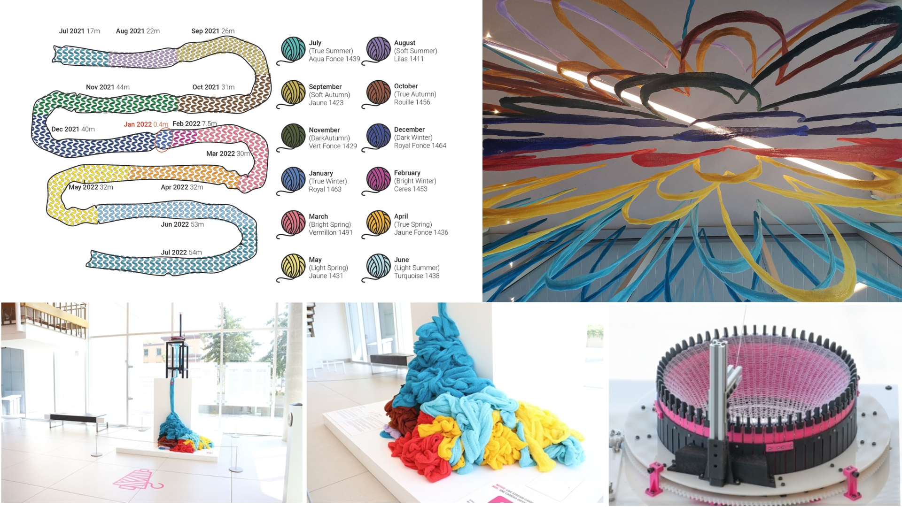
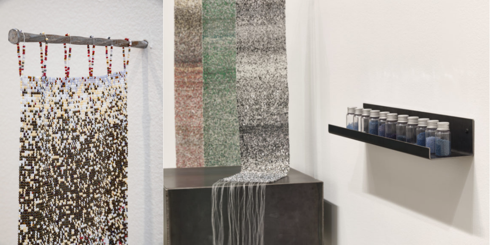
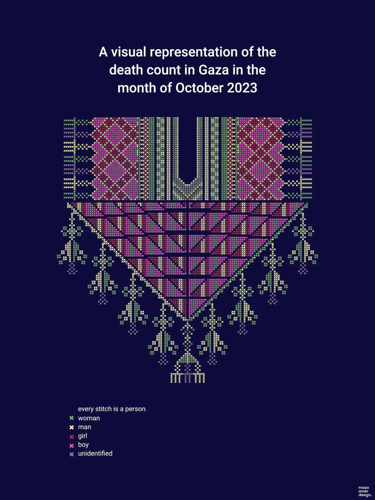
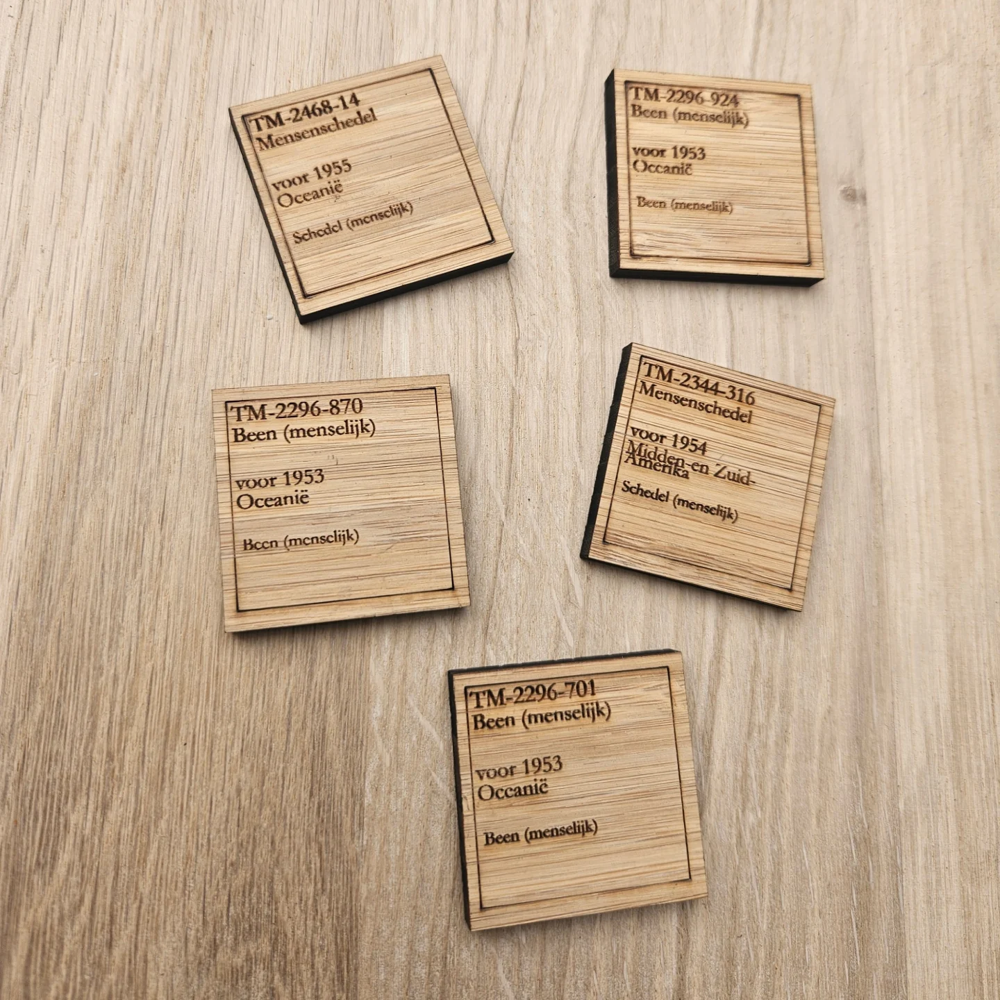

<figcaption style=" text-align: right ">Lena MK, mai 2025</figcaption>

 

# Collections tactiles

**Recherche-création en matérialisation de données culturelles**

 

<figcaption style=" text-align: right "><a href="./LenaMK_examenSynthese_ecrit.pdf" download>Version remise au jury le 13 mai (PDF)</a></figcaption>

 

## Table des matières

- [Introduction](#introduction)
- [Projet de recherche](#projet-de-recherche)
  - [Espace et interactions](#espace-et-interactions)
  - [Questions de recherche](#questions-de-recherche)
- [Représenter des données culturelles : état des lieux](#__RefHeading___Toc996_3281306066)
  - [Fondements et interdisciplinarité en visualisation de données](#fondements-et-interdisciplinarité-en-visualisation-de-données)
  - [Des données à leur représentation](#des-données-à-leur-représentation)
  - [Survol des recherches et des pratiques en matérialisation de données](#survol-des-recherches-et-des-pratiques-en-matérialisation-de-données)
  - [Pratiques d’art, d’artisanat et de design qui incorporent des données](#pratiques-dart-dartisanat-et-de-design-qui-incorporent-des-données)
    - [*Strata* (2018) d’Olivia Whetung](#strata-2018-dolivia-whetung)
    - [*Gaza thob collar* (2023) de Maya Amer](#gaza-thob-collar-2023-de-maya-amer)
    - [*To Make One Particle* (2025) de Pansee ElAtta](#to-make-one-particle-2025-de-pansee-elatta)
- [Cadre théorique](#cadre-théorique)
- [Démarche de recherche-création](#démarche-de-recherche-création)
- [Bibliographie](#bibliographie)
- [Liste des figures](#liste-des-figures)

 

---

 

## Introduction

La mission des institutions culturelles – musées, bibliothèques, centres d’archives, etc. – comporte notamment la valorisation et l’accès public à leurs contenus. L’arrivée des outils numériques dans ces institutions contribue à la transformation de leurs méthodes de travail avec, par exemple, la diffusion numérique des artefacts conservés dans les réserves ou avec les expositions virtuelles. Certaines de ces institutions vont même jusqu’à la mise en ligne de leur données (Casemajor 2012, 82). Ces données décrivent de façon structurée les collections muséales, des archives ou des entités patrimoniales. Dans le cas où elles sont mises à disposition sur des plateformes de données ouvertes, elles contribuent à la documentation institutionnelle accessible et librement réutilisable.

En tant que jeune chercheuse et professionnelle au parcours multidisciplinaire en informatique, en histoire de l’art et en design, je me suis particulièrement intéressée aux interfaces de valorisation et d’exploration de données culturelles (MK 2021 et 2020 ; Graff et MK 2023 ; Fauchié et al. 2024 ; MK et Desmorat, 2025). Les interactions des publics avec ces données passent principalement par l’intermédiaire d’interfaces web permettant, par exemple, de faire des recherches dans une collection muséale. Lorsque la collection numérisée est en libre accès sur les sites web de musées, on peut habituellement l’explorer par le biais d’une barre de recherche ([Figure 1](#fig1)) ou par l’usage d’un formulaire. Ces modes d’accès contraignent toutefois le potentiel de découverte de la collection. En effet, ces deux fonctions requièrent une connaissance préalable des objets, ou du moins de leurs caractéristiques, pour pouvoir les saisir : on ne peut pas rechercher ce qu’on ne connaît pas. De plus, on ne voit jamais qu’une partie de la collection.

<figcaption style=" text-align: right " id="fig1">Figure 1: Capture d’écran d’une recherche dans le [MACrépertoire](https://macrepertoire.macm.org/), le portail d’accès web à la collection du Musée d’art contemporain de Montréal, février 2025</figcaption>

Une première approche possible pour découvrir une collection dans son ensemble émerge d’une méthodologie quantitative. Anne Dymond souligne, dans son ouvrage *Diversity Counts : Gender, Race, and Representation in Canadian Art Galleries* *(2019)*, l’utilité d’indicateurs statistiques dans l’étude des pratiques institutionnelles. Dans une démarche qui reprend les objectifs des études féministes quantitatives en histoire de l’art, Valentine Desmorat et moi avons employé les données publiées par le Musée d’art contemporain de Montréal (MAC) pour étudier l’entrée des femmes artistes dans sa collection[^1]. Les portraits statistiques « permettent, en tant que visualisations de données, de donner à voir les tendances minoritaires, majoritaires, ainsi que les caractéristiques majeures des œuvres ou des artistes pris·es en compte \[dans les collections\] » (Desmorat 2024, 11). Guidées par les données (*data-driven approach*), nous avons effectué des analyses statistiques et révélé des facteurs qui ont contribué à la représentation des œuvres d’artistes-femmes dans cette collection (Desmorat 2024; MK et Desmorat 2025). Cette visualisation ([Figure 2](#fig2)) présente un regard d’ensemble sur la collection du musée, une alternative intéressante à la vue partielle issue de la recherche textuelle.

<iframe width="100%" height="680" frameborder="0"
  src="https://observablehq.com/embed/@artistes-femmes-mac/nb-dachats-dons-acquisitions?cells=graphiqueBarres"></iframe>

<figcaption style=" text-align: right " id="fig2">Figure 2. Nombres d'acquisitions d'œuvres d'artistes-femmes et d'œuvres d'artistes-hommes par année (1964-2020), Desmorat et MK, 2024</figcaption>

Certaines visualisations interactives amplifient le potentiel de découverte des contenus des collections. Contrairement au graphique en barre présenté plus haut, l’utilisation de points (Figure 3) pour représenter les œuvres une à une les rend découvrables : en survolant un élément, on obtient le titre de l’œuvre et le clic redirige vers une page qui lui est dédiée. On peut ainsi découvrir une œuvre dont on ne connaissait ni l’existence, ni l’artiste, ni l’emplacement. Cette forme d’accès à la collection est davantage caractérisée par la sérendipité et une approche sensorielle.

<iframe width="550" height="794" frameborder="0"
  src="https://observablehq.com/embed/27a690d9c785e7cb?cells=minichrono"></iframe>

<figcaption style=" text-align: right " id="fig3">Figure 3.  Chronologie des œuvres de la collection du MAC, vue de 1990 à 2023, MK, 2025</figcaption>

 

## Projet de recherche

Comme je suis intéressée par les modes de visualisation, mon projet de recherche-création doctoral s’inscrit dans l’étude des institutions culturelles par leur données. Dans une continuité avec ma recherche sur les interfaces de valorisation et d’exploration de données culturelles, je souhaite créer des environnements esthétiques, sensibles et non-hiérarchiques pour la découverte et la libre exploration de ces collections. Mon objectif est de renouveler les modalités de présentation des collections auprès des publics afin de déjouer certains effets de pouvoir comme la domination des œuvres et des récits masculins coloniaux normatifs, ou encore l’excès de visibilité médiatique accordée à certains artistes au détriment des autres. Pour ce faire, je me propose d’expérimenter avec l’idée que la création de visualisations de données est une forme de commissariat. Le commissariat, en tant que processus de sélection et de mise en exposition publique d’objets, provient du milieu muséal mais s’est aujourd’hui diversifié en une variété de pratiques sociales. Des comptes Instagram aux listes de lectures Spotify, l’émergence de pratiques curatoriales sur les réseaux sociaux amène un nouveau réseau d’acteur·rice·s à se pencher sur cette pratique.

> *“Have you already curated today ?” read the headline of an article on such varied acts of curation in the Neue Zürcher Zeitung in 2014**.* *(Kathke, Tomann, et Uhlig 2022, 71)*

Torsten Kathke, Juliane Tomann et Mirko Uhlig proposent de rassembler sous le terme de « contre-curation » ou « contre-commissariat » (*counter-curation*) les pratiques sociales de commissariat qui visent à attirer l’attention sur des inégalités politiques et sociales ou à créer une opposition aux récits hégémoniques (2022, 71). Provenant du domaine de l’histoire, les auteur·rice·s rappellent que ce champ d’étude ne concerne pas uniquement les faits, mais aussi la façon dont ils sont rendus visibles, utilisables et mis en récit. On peut ainsi choisir de créer des contre-récits (*counter-narratives*), des représentations et des imaginaires partagés collectivement qui remettent en question les récits officiels ou établis. Je pense que cette posture commissariale peut également être appliquée à des données, particulièrement lorsqu’on en crée des représentations, qu’elles soient visuelles ou multisensorielles.

En créant des interfaces qui invitent à interagir avec les données, j’aurai pour objectif de créer des contre-récits pour déjouer les normes de visibilités qui discriminent la découvrabilité des contenus culturels. La découvrabilité représente le « potentiel pour un contenu, disponible en ligne, d'être aisément découvert par des internautes dans le cyberespace, notamment par ceux qui ne cherchaient pas précisément le contenu en question » ([Grand dictionnaire terminologique](https://vitrinelinguistique.oqlf.gouv.qc.ca/fiche-gdt/fiche/26541675/decouvrabilite)). À l’échelle d’une collection, je propose de considérer la découvrabilité comme le potentiel pour une œuvre d’être découverte parmi les données de l’institution. Ainsi, plutôt que de sélectionner des chef-d’œuvres pour représenter une collection, pourrait-on faire place à la sérendipité et à l’agentivité des publics pour se familiariser avec son contenu ?

### Espace et interactions

L‘espace numérique offre diverses formes d’interactions avec les données, ce qui enrichit considérablement l’accès à la visualisation. Contrairement à un graphique statique, les visualisations interactives permettent d’« en savoir plus » sur un élément, filtrer une partie des contenus ou encore zoomer sur un détail. Cela amène toutefois certaines contraintes, comme la taille de l’écran : téléphone portable, écran d’ordinateur, télévision ou écran géant. Il faut donc prendre en compte le dispositif technique à l’usage pour que la visualisation soit lisible et utilisable.

Jusqu’à présent, j’ai toujours favorisé l’écran d’ordinateur personnel car l’écran de téléphone portable est trop contraignant (trop petit) pour créer des visualisations qui montrent +1000 éléments d’une collection et l’utilisation d’un écran plus grand requiert un contexte de diffusion spécifique. Pour un accès plus général, dans le but que n’importe qui puisse consulter la visualisation sur le web à partir d’un ordinateur, il faut donc cibler environ [~1920 x 1080px](https://gs.statcounter.com/screen-resolution-stats/desktop/worldwide). Dans ce contexte, la plus petite échelle pour tracer une ligne ou pour dessiner un point serait d’un pixel. Il faut cependant que l’élément soit visible et distinguable à l’œil humain. Au minimum, il faut donc quelques pixels pour chaque élément, ainsi que de l’espace entre chacun pour les distinguer. De plus, une visualisation emploie généralement des repères, comme des légendes ou des axes, qu’il faut également prévoir dans l’espace imparti. Même avec des marges et des repères minimalistes (100px en haut et en bas, 150px sur les côtés), il reste 1620 x 880 px. En moyenne (ou dans un contexte moins épuré), on travaille plutôt avec une largeur de 1200px et une hauteur d’environ 750px.

Lors de la création d’une chronologie, un format prisé pour représenter les collections, on peut ainsi rapidement atteindre les limites de la taille de l’écran : une collection dont les œuvres sont datées de 1805 à 2023, comme celle du MAC, requiert la représentation de 218 années. Sur une largeur de 1200 px, cela ne laisse que 5 pixels par élément. Le manque d’espace horizontal peut être pallié par des solutions visuelles où les années sont amalgamées, comme dans l’exemple ci-joint ([Figure 4](#fig4)).

<figcaption style=" text-align: right " id="fig4">Figure 4: Chronologie des œuvres de la collection du MAC, vue de par année de production, MK, 2025. Export de la visualisation interactive disponible [en ligne](https://observablehq.com/@lenamk/experimentations-visuelles-avec-les-donnees-du-mac?collection=@lenamk/exsynth)</figcaption>

On peut sinon choisir d’utiliser uniquement les années pour lesquelles il y a au moins une œuvre acquise ([Figure 5](#fig5)). Cela sauve, dans le cas de cette collection, beaucoup d’espace car une majorité écrasante des œuvres sont produites au XX2 siècle. Il faut, dans ce cas, s’assurer d’expliciter ce choix qui induirait autrement la lecture chronologique en erreur car nous sommes habitué·e·s à une échelle linaire et continue pour les chronologies.

<figcaption style=" text-align: right " id="fig5">Figure 5: Chronologie des œuvres de la collection du MAC, vue de par année de production (sans les années vides), MK, 2025. Export de la visualisation interactive disponible [en ligne](https://observablehq.com/@lenamk/experimentations-visuelles-avec-les-donnees-du-mac?collection=@lenamk/exsynth)</figcaption>

Dans ce cas, le problème le plus important est cependant celui de la hauteur. Le nombre d’œuvre acquises est si grand qu’il dépasse la hauteur moyenne d’un écran. Il y a un pic important d’œuvres produites en 1964, qui requiert une hauteur de 2250 pixels pour visualiser chacune des œuvres. Cela peut être pallié en faisant défiler la visualisation verticalement. On ne peut toutefois obtenir une vue d’ensemble et chronologique de la collection dans un espace de 1200 x 750 pixels.

Une autre limitation de l’écran est le manque de relief ou de profondeur. On ne peut pas faire « ressortir » des éléments ni en faire l’expérience tactile. On dispose de deux dimensions pour agir sur la perception et créer des interactions. Plusieurs chercheur·se·s, designers et professionnel·le·s de la visualisation de données œuvrent sur la création de nouvelles formes visuelles pour diversifier les représentations possibles et pour trouver de nouvelles solutions pour visualiser des données. Le champ (encore jeune) de la matérialisation de données (*data physicalization*) propose une autre avenue, par la création « d’objets (artefacts physiques) dont la géométrie ou la matérialité *encode* des données » (Jansen et al. 2015, 2). La matérialisation amène ainsi une réflexion sur le rôle du sens du toucher dans la perception de données. Cette approche m’intéresse particulièrement pour le potentiel d’interactions que j’entrevois dans l’approche matérielle des données. Les données, qui semblent parfois immatérielles et/ou incompréhensibles pour les profanes, prennent une forme tangible. Dans l’actuelle fatigue qui peut être ressentie face à l’omniprésence des écrans, un objet, particulièrement lorsqu’il est issu d’une production manuelle ou artisanale, peut recevoir une attention plus élevée. L’interaction tactile amène aussi une implication physique, ce qui favorise un engagement actif dans la réception.

De plus, l’une des ambitions de ce domaine est de faire connaître les origines multiples et les apports de différentes cultures à l’histoire de l’encodage et de la transmission de l’information. Parmi les exemples populaires, on retrouve les bulle-enveloppes, des petits objets en argile employés il y a 6000 ans pour la comptabilisation de biens en Mésopotamie ([Wikipédia](https://fr.wikipedia.org/wiki/Bulle-enveloppe)), ou encore les quipus (ou khipus), un système de consignation de données formé de cordes et de nœuds utilisé par l’administration de l’empire Inca et dont les traces remontent à 4500 ans ([Wikipédia](https://fr.wikipedia.org/wiki/Quipu)). Il s’agit ainsi de reconnaître que les données – au sens d’informations enregistrées de façon à en « permettre le stockage, la transmission ou le traitement » ([GDT](https://vitrinelinguistique.oqlf.gouv.qc.ca/fiche-gdt/fiche/8358482/donnee)) – n’ont pas été inventées avec les premiers ordinateurs, ni même par les bureaux de statistiques ou d’autres administrations au fonctionnement centré sur l’écriture. Face à l’amplification exponentielle de la place des données dans notre société, ce travail de reconnaissance historique vise notamment à décentrer le savoir occidental pour faire place à une diversité d’épistémologies. Les recherches en matérialisation de données se développent en ce sens : de nouvelles pratiques émergent en référence aux autres façons (historiques, culturelles) de penser et d’interagir avec les données[^2]. C’est pourquoi je souhaite mener une recherche-création pour explorer la matérialisation de données comme interface de contre-curation pour des données culturelles.

### Questions de recherche

La question qui animera ma recherche est la suivante : comment la matérialisation de données peut-elle offrir une nouvelle forme d’accès pour des données culturelles ? Je mènerai cette recherche à partir de l’hypothèse selon laquelle la création de ces nouvelles formes d’accès passe par une posture interdisciplinaire, en pensant l’artisanat comme une technologie et la technologie comme une pratique artisanale. À la croisée des matérialisations de données et des œuvres ou expériences *sensation*nelles, je vais expérimenter avec la fabrication d’objets qui incorporent des données culturelles.

Mon objectif sera de produire des objets qui présentent des récits alternatifs à propos des collections représentées. Pour ce faire, j’emploierai trois jeux de données culturelles, c’est-à-dire des données qui décrivent de façon systématique le contenu d’une collection, muséale par exemple. Le premier jeu de données mis à l’épreuve porte sur la [collection du MAC](https://www.donneesquebec.ca/recherche/dataset/macrepertoire). Avec un contenu riche de plus de 8000 œuvres et de 1800 artistes, j’aimerais expérimenter avec l’idée d’avoir cette collection à portée de main. Je prévois aussi employer un jeu de données sur l’art public, le patrimoine et les lieux culturels au Québec. Issus du projet d’application mobile et de médiation numérique *in-situ* [MONA](https://monamontreal.org/), dont je suis l’instigatrice, ces riches contenus répartis aux quatre coins du Québec méritent d’être découverts sans la contrainte de la proximité géographique. Finalement, je prévois travailler sur un troisième jeu de données, à définir en collaboration avec un·e artiste ou une institution au sein de laquelle je mènerai une résidence de recherche-création. Je propose donc de travailler avec un corpus de données culturelles et d’explorer de nouvelles perspectives sur ces archives institutionnelles avec la recherche-création.

Pour mener cette recherche, j’ai créé un protocole d’expérimentation (Annexe 1: protocole) qui fournit un cadre à ma pratique. Ce cadre me permet d’expérimenter la réflexion-dans-l’action (*reflection-in-action*), un terme proposé par le philosophe et urbaniste Donald A. Schon pour énoncer une posture dans laquelle « on réfléchit à ce qu’on fait pendant qu’on le fait » (1983, 54). Le protocole est divisé en trois étapes :

1.  ***Faire des choix*** est une étape qui sert à nommer les décisions et les partis pris dans l’élaboration d’une matérialisation de données. Ses trois composantes principales sont les données, l’algorithme de représentation et l’expression matérielle. Chacune requiert des choix et des décisions qui s’influencent de façon itérative. Les tâtonnements, les tests et les différentes versions font partie du processus de la recherche-création.

    - Les **données** sont décrites pour déterminer le sujet à représenter ainsi que pour identifier la source ou l’institution qui les a produites. Elles décrivent, par exemple, le contenu d’une collection muséale de façon structurée. L’analyse de ces données, et donc de la façon dont elles décrivent les objets d’une collection, s’effectue en parallèle du prétraitement des données, une étape préparatoire au cours de laquelle les données sources sont transformées selon les besoins du projet.

    - Un **algorithme de représentation** traduit ensuite ces données d’un format textuel vers une forme visuelle. Par exemple, chaque œuvre d’art dans la collection devient un symbole placé dans l’espace visuel en suivant un ordre chronologique. Cet algorithme lui-même est un protocole, qui applique une logique visuelle et spatiale avec une méthodologie algorithmique. Le choix de symboles et de l’organisation spatiale et visuelle oriente la lecture et contribue à construire un récit à partir des données. Le travail préparatoire et l’esquisse sont algorithmiques. Contrairement à la visualisation de données, le résultat est une étape, une sorte de partition ou de plan de travail.

    - Cette représentation est ensuite incarnée dans une **expression matérielle.** La matérialité, dans les sensations qu’elle évoque et dans le geste même du travail de la matière, exprime également un ou des sens symboliques. La quantité de données exige un geste répétitif, une sorte de travail à la chaîne qu’il faut négocier avec les moyens à disposition, autant techniques que manuels. L’expression matérielle requiert également l’achat ou la collecte de la matière première, imposant des réalités économiques et écologiques au projet.

2.  ***(Dé-)montrer*** questionne ce qui est présent lors de la mise à vue publique. Celle-ci requiert une forme d’aboutissement de la première étape, même si le protocole lui-même peut être utilisé de façon itérative. À cette étape, l’enjeu n’est pas uniquement de montrer le résultat de la matérialisation de données. Il s’agit plutôt de produire une démonstration de la recherche-création. Pour expliciter son fonctionnement, son « mode d’emploi » et ses propriétés, l’objet doit être accompagné d’une sélection d’éléments qui rapportent les choix effectués et le processus suivi.
    La présentation publique est également le lieu de mise en commun et de partage de la recherche-création. La réception peut être participative, au sens où les interactions pensées dans la matérialisation peuvent aller au-delà de l’expérience pour contribuer à l’élaboration de l’objet. Pour toutefois distinguer la présentation d’un projet de l’animation d’un atelier créatif, un cadre de participation est établi au préalable et lui-même présenté dans l’espace. Une question récursive se pose: les expériences vécues par les personnes présentes, leurs actions et leurs rétroactions peuvent-elles / sont-elles exposées elles aussi ?
3.  ***Documenter*** est intrinsèque aux deux étapes précédentes. Chaque élément doit pouvoir être mobilisé pour contribuer à la recherche. Cela requiert la production délibérée d’une documentation des composantes, des itérations, de l’exposition et de la documentation elle-même, c’est-à-dire l’emploi de ce protocole. Celui-ci sera publié sur le web et mis à jour au fur et à mesure de son évolution, afin de partager ouvertement les résultats de l’expérimentation.

---

*Observations à propos du protocole*:

Ce protocole prend le parti qu’il n’y a pas de recherche-création sans (dé-)monstration. Pour que la matérialisation puisse faire l’objet d’interactions, le protocole requiert une présentation ou une forme de partage direct avec un public. Elle peut toutefois se dérouler dans des contextes variés, d’une exposition dans une institution culturelle à un événement de vulgarisation ou de partage de connaissance. L’examen de synthèse peut ainsi être le « lieu » de la démonstration, et son jury le public.

Ce protocole est intrinsèquement algorithmique :

- Il fournit des instructions qui peuvent être répétées

- Il définit des variables

- Il a recours aux boucles et à la récursion

- Il exploite les joies de l’aléa, dans les itérations comme dans la participation publique

- Il doit être exécuté pour avoir un résultat

- Il génère des traces et exige une documentation

---

Des questions connexes seront également abordées dans le cadre de cette recherche. D’une part, il s’agira d’évaluer l’utilisation d’un protocole pour mener une recherche-création. Son usage répété au cours de la thèse permettra un travail réflexif sur le protocole lui-même, sur son usage et sa pertinence pour la démarche envisagée. De l’autre, je considère les données produites par des institutions culturelles comme faisant partie des archives institutionnelles. Cela m’amènera à réfléchir aux méthodologies existantes pour étudier et pour utiliser ces données, en recherche ainsi que dans divers cadres de diffusion alternatifs.

 

## Représenter des données culturelles : état des lieux

La production d’un état des lieux pour cette recherche requiert en amont la définition de certains termes pour expliciter le sujet abordé. La visualisation et la matérialisation de données sont toutes deux des façons de montrer et de donner accès à des données. Le terme anglophone « *display* » offrirait un bon point commun terminologique. Employé par Edward Tufte pour parler de « *designs for display of information* » (Tufte 2018 \[1983\], 191), ce terme porte une polyphonie pour laquelle un équivalent francophone est difficile à trouver; il signifie autant la démonstration de quelque chose, que sa mise à vue ou son exposition (au sens muséal), son affichage (notamment à l’écran) ou son étalage (comme dans une vitrine). En l’attente de trouver une solution terminologique plus riche, je parlerai ici de représentation de données. Je préfère la représentation de *données*, par opposition au terme « visualisation de l’*information* » (*information visualisation*) favorisé par certains spécialistes comme Robert Kosara par exemple (2007), car les données sont au cœur du processus de recherche-création. Dans sa façon de créer des représentations visuelles, un algorithme structure l’image de façon méthodique ; la formulation de règles explicites dicte la couleur de chaque pixel du graphique en fonction des données fournies en entrées. Modifier puis exécuter à nouveau l’algorithme donne la possibilité d’itérer des centaines voire des milliers de fois sur le résultat (Molnar 1984). L’approche algorithmique produit un résultat « *unique, carefully designed \[and\] data-specific* » (Tufte 2018 \[1983\], 179) tout en étant répétable et réutilisable. Cette approche, par opposition avec l’infographie, est donc particulièrement intéressante pour une démarche expérimentale en recherche-création.

### Fondements et interdisciplinarité en visualisation de données

La littérature au sujet de la visualisation de données provient de différents domaines. *The Visual Display of Quantitative Information* du statisticien Edward Tufte est un ouvrage fondamental qui analyse des exemples historiques et contemporain à sa publication en 1983, tout en produisant des recommandations pour la production de graphiques. Au fil des éditions et des nombreux tirages de cet ouvrage, ses recommandations sont encore aujourd’hui au centre de ce que les concepteur·rice·s et enseignant·e·s de visualisation de données nomment les « bonnes pratiques ». Tufte y définit un graphique de données comme la présentation (*display*) visuelle de quantités mesurées par l’usage combiné de points, de lignes, d’un système de coordonnées, de symboles, de mots, d’ombrages et de couleurs (Tufte 2018 \[1983\], 9). En tant que statisticien, Tufte définit les graphiques statistiques comme étant des instruments qui aident à raisonner à propos d’information quantitative (Tufte 2018 \[1983\], 91). La *Sémiologie graphique*, dont les éditions également multiples (1967, 1973, 1998, 2005, 2013) attestent de l’usage en tant qu’ouvrage de référence, provient du cartographe Jacques Bertin. Dans cette théorie de la représentation graphique, Bertin différencie « la » graphique, comme image rationnelle, à la fois de l’image figurative et de la mathématique (Bertin 2013 \[1967\], 6). En distinguant l’information de sa représentation, il établit un système graphique pour décrire l’exercice de la transcription graphique selon l’expression de chaque composante et ses variations. Michael Friendly, statisticien formé en mathématiques et professeur en psychologie, a fait d’importantes contributions à l’histoire de la visualisation de données tout au long de sa carrière, du projet web *Milestones in the History of Thematic Cartography, Statistical Graphics, and Data Visualisation. An illustrated chronology of innovations by Michael Friendly and Daniel J. Denis* publié en 2001, à la publication de l’ouvrage *A History of Data Visualisation & Graphic Communication* avec Howard Wainer (2021).

Le design est un milieu qui contribue de façon importante aux références en visualisations de données, comme l’ouvrage *Design for Information: An Introduction to the Histories, Theories, and Best Practices behind Effective Information Visualizations* (Meirelles 2013) en témoigne. Son autrice, Isabelle Meirelles, a également contribué à la littérature en considérant les défis interdisciplinaires en visualisation de données (Meirelles et al. 2012). Le *Centre for Innovation in Information Visualization and Data Driven Design* dirigé par Sara Diamond expérimente avec ces enjeux en rassemblant des artistes, des designers et des acteurs provenant des milieux des médias, des sciences humaines et des sciences sociales dans un partenariat de recherche interdisciplinaire (2011). Issu du milieu du design industriel, Manuel Lima a contribué d’ouvrages sur la dimension socio-culturelle des visualisations en réseaux, les arborescences et les cercles (2013; 2014; 2017).

Du côté de l’informatique, la visualisation de données est considérée de façon double, d’une part comme théorie et de l’autre comme pratique. *Data Visualisation: A Handbook for Data Driven Design* d’Andy Kirk (2019) cherche à distinguer la pratique de la technique, en évitant l’écueil des outils pour se concentrer sur « *the underlying craft of data visualisation through a tool-agnostic approach* » (Kirk 2019, 4). *Better Data Visualisations: A Guide for Scholars, Researchers, and Wonks* (Schwabish 2021) prend quant à lui une approche plus encyclopédique, en effectuant une typologie détaillée avec plus de 500 exemples de visualisations. Il existe également un grand nombre d’ouvrages techniques, comme le *Handbook of Data Visualization* (Chen, Härdle, et Unwin 2008) ou encore *Hands-On Data Visualization* (Dougherty et Ilyankou 2021). Ces ouvrages, publiés par des éditeurs spécialisés en science, en technologie et en informatique (Springer pour le premier et O’Reilly pour le second), sont des manuels qui transmettent la théorie par la production de solutions techniques. Certains se dédient spécifiquement à l’usage d’un langage ou d’une librairie de programmation, comme *Visualizing data* (Fry 2008) dont l’auteur a co-développé *Processing,* ou *Interactive data visualization for the Web : an introduction to designing with D3* (Murray 2017) qui présente l’utilisation de la librairie *D3.js*. J’utilise ces deux librairies, *D3.js* et *P5.js* (la version en javascript de *Processing*), pour mener mes recherches car elles sont dédiées à la création visuelle et algorithmique.

*Critical Visualization* de Peter Hall et Patricio Davila (2023) est une publication plus thématique qui énonce les enjeux critiques sous-jacents à la visualisation de données, un aspect lacunaire ou manquant dans les nombreux ouvrages techniques. Les auteurs présentent un cadre conceptuel pour la production de visualisations critiques, en commençant par situer le fait que les décisions par rapport aux données et à leur représentation ne sont jamais neutres. Pour ce faire, ils relèvent l’importance de questionner qui a créé la visualisation, quand et pourquoi, mais surtout dans quel contexte culturel, avec quels systèmes de croyance et en se demandant qui est exclu (ou ce qui est exclu) dans la visualisation (Hall et Dávila 2023, 13‑14). Dans le chapitre « *Disruptive Histories* », Hall et Davila cherchent également à perturber les approches dominantes en visualisation et proposent une histoire alternative de la visualisation critique (Hall et Dávila 2023, 45‑75).

Parmi les exemples de visualisation de données culturelles, les thèses d’Olivia Vane (2019) et de Florian Kräutli (2016) – tous deux sous la direction de Stephen Body Davis, professeur en design au Royal College of Art – se démarquent par leurs recherches et leurs créations de visualisations spécialisées pour les collections muséales. Par le biais d’une approche de recherche appliquée collaborative (*practice-led and collaborative approach*), Kräutli produit d’abord huit prototypes à partir desquels émergent des principes de design propres à la visualisation de données culturelles, puis deux implémentations pour les mettre en pratique et démontrer comment ces outils peuvent contribuer à la production de connaissances dans les collections culturelles. Alors que Kräutli œuvre avec les professionnel·le·s des musées pour outiller leur travail avec les collections numérisées, Vane explore les visualisations comme moyen pour rendre les collections accessibles, découvrables et compréhensibles pour les publics. Elle présente ainsi un portefolio de cinq projets de visualisations réalisés dans des institutions culturelles comme des musées et des bibliothèques. Les contributions théoriques et appliquées de ces deux thèses offrent une base solide pour situer la visualisation de données consacrée aux institutions culturelles.

### Des données à leur représentation 

Dans la veine de la *Critical Visualization* de Hall et Davila (2023), il me semble essentiel d’avoir une approche critique des données : qui les a produites et à quelles fins, et quelle est notre posture par rapport à ces données ? Dans *Graphesis : Visual Forms of Knowledge Production* (2014), Johanna Drucker propose de changer le vocabulaire, en soulignant que les données ne sont pas *données* mais *captées*. Ainsi, l’aspect constructiviste des graphiques se révèle en dépit de l’illusion de leur « simple » valeur quantitative. Le but est alors de créer des visualisations qui exposent le principe interprétatif du savoir au lieu de le dissimuler dans une prétendue objectivité (Drucker 2014, 128). Catherine d’Ignazio et Lauren F. Klein ajoutent une perspective féministe et intersectionnelle sur les données avec *Data Feminism* (2020). En situant l’éthique au cœur des sciences de l’information, les autrices mettent de l’avant des principes autour de l’identification et la remise en question des enjeux de pouvoir, la place de l’émotion, de l’affect et l’expérience incarnée (*embodiment*). Elles cherchent à déconstruire les biais dans les systèmes de classification comme la binarité et les hiérarchies et proposent de cultiver une pensée plurielle dans la conception de modèles de données comme prévention contre la violence épistémique. La documentation prend également un rôle essentiel pour nommer et créditer les besognes trop souvent sous-estimées et invisibilisées, ainsi que pour révéler le coût réel et planétaire de la production de données. Mon utilisation des données et l’importance accordée à la documentation dans mon protocole s’inscrivent dans les propositions de ces chercheuses.

Une approche davantage axée sur la matérialité des données est apportée par Julie Freeman dans sa thèse intitulée *Defining Data as an Art Material* (2018). En tant qu’artiste, elle y explore la définition, le rôle et l’emploi de données dans le *data art* – une appellation proposée pour regrouper les pratiques artistiques utilisant les données comme médium. Étudier l’emploi de données dans des pratiques artistiques requiert un cadre d’analyse plus précis, ce qui a mené l’autrice à co-créer une taxonomie pour décrire les données qui servent de médium artistique (Freeman et al. 2018). Face à la grande variété de types de données, la classification permet d’expliciter ainsi ce qui est entendu par le terme « données », d’en définir la matérialité, la source, les principes (système de représentation) et les qualités (format, licence). Cette taxonomie émane des questions classiquement posées lorsqu’on étudie un médium artistique plus traditionnel : « *where it was made, who made it, where it is from, what does it comprise, who owns it, how does it need to be stored, does it transform or degrade ?* » (Freeman et al. 2018, 76). J’emploierai cette taxonomie afin d’étayer la description des données mobilisées dans ma recherche, et pour voir si une forme de cette taxonomie pourrait décrire les « données culturelles ».

Cette veine matérialiste est amenée encore plus loin par Dietmar Offenhuber dans son ouvrage *Autographic design. The Matter of Data in a Self-Inscribing World* (2023). Le professeur du département d’art et de design à la Northeastern University remonte aux sources et aux manifestations matérielles à l’origine de certaines données, météorologiques par exemple. Il identifie des mécanismes et des lieux qui conservent « naturellement » des traces du passé, là où l’environnement physique forme et contient une archive. Le design autographique est ainsi une pratique de monstration des conditions qui permettent aux traces d’émerger ; il sert de guide pour leur interprétation, démontrant la causalité et la preuve qui y est contenue (Offenhuber 2023, 49). Je ferai appel à son analyse des opérations de design, comparant la visualisation de données au design autographique, tout en prenant en compte des pratiques alternatives comme la matérialisation de données, pour décrire les étapes de la création dans mon protocole.

### Survol des recherches et des pratiques en matérialisation de données

Le champ de la matérialisation de données étudie la façon dont les représentations physiques de données, créées avec l’assistance d’un ordinateur, peuvent soutenir la cognition, la communication, l’apprentissage, la résolution de problèmes et la prise de décision (« *examines how computer-supported, physical representations of data (i.e., physicalizations), can support cognition, communication, learning, problem solving, and decision making »*) (Jansen et al. 2015, 8). Parmi les chercheur·se·s les plus cité·e·s sur le sujet, Yvonne Jansen et Pierre Dragicevic sont particulièrement reconnus, avec l’article « *Opportunities and Challenges for Data Physicalization* » (Jansen et al. 2015), la thèse d’Yvonne Jansen (2014) et leur chapitre sur la matérialisation de données dans le *Springer Handbook of Human Computer Interaction* (Dragicevic, Jansen, et Vande Moere 2021). Iels maintiennent aussi la « [*Gallery of Physical Visualizations and Related Artifacts*](http://dataphys.org/list/gallery/) » (Dragicevic et Jansen 2023). Également très actif sur le sujet depuis la même période, Trevor Hogan publie sa thèse « *Data and dasein* » en 2016 et il collabore avec Uta Hinrichs, Samuel Huron, Jason Alexander et Yvonne Janssen au numéro spécial de la revue *IEEE Computer Graphics and Applications* dédié à la matérialisation de données (Trevor Hogan et al. 2021). Ces publications sont des références fondamentales, citées presque systématiquement dans les autres articles sur le sujet. Parmi ces auteur·rice·s, Eva Hornecker, Trevor Hogan, Uta Hinrichs et Rosa Van Koningsbruggen viennent également de publier un vocabulaire de design de matérialisations de données, dans le but de produire un équivalent aux variables visuelles de Bertin (2013 \[1967\]), applicable à la matérialisation de données (2024). Les références aux fondements de la visualisation de données, et particulièrement aux recherches de Jaques Bertin, sont récurrentes dans le domaine, allant même jusqu’à réexaminer et réactualiser ses propositions comme dans l’article « *Revisiting Bertin Matrices : New Interactions for Crafting Tabular Visualizations* » (Perin, Dragicevic, et Fekete 2014).

Il existe également une littérature qui se concentre davantage sur certaines spécificités de la matérialisation de données. Certaines publications explorent par exemple les variables haptiques de la résistance et de la friction (Dullaert et al. 2024), ou encore vont au-delà de la surface matérielle pour expérimenter avec la *squishicalization* ou l’élasticité des volumes (Pahr et al. 2024). La fabrique des matérialisations de données revient également dans les publications : les étapes de production (*pipline*) pour créer différents types de matérialisations (de Freitas et al. 2022), les défis actuels, notamment le passage de la théorie à la pratique (Sauvé et al. 2024) et les moyens disponibles, comme créer une boîte à outil pour construire et manipuler un diagramme de réseau (Pahr et al. 2025).

Si le terme « matérialisation de données » (*data physicalisation*) revient souvent dans la littérature, il ne fait cependant pas consensus. Plusieurs autres appellations ont été proposées pour accentuer certaines spécificités méthodologiques ou pour mettre de l’avant un aspect particulier de l’approche matérielle employée[^3] :

- Trevor Hogan et Eva Hornecker choisissent parfois l’expression « représentations multisensorielles de données » (***Multisensory Data Representation***) afin d’aller au-delà du paradigme visuel (2016) , expression également favorisée dans la thèse de Hogan&nbsp;

- Trevor Hogan emploie par la suite le terme ***data sensification*** (2018) pour décrire la forme de représentation qui encode des données dans le comportement, la performance, les affordances et les expériences qui résultent d’une représentation de données.

- Les sculptures de données sont introduites dans les milieu académique par Jack ⁨Zhao⁩ and ⁨Andrew Vande Moere⁩ avec l’article *Embodiment in **data sculpture**: a model of the physical visualization of information* (2008). Doris Kominski et Douglas Thomaz de Oliveria décrivent la sculpture de données comme davantage centrée sur le processus créatif de négociation entre le concept et sa représentation matérielle (2021, 65).
- Courtney Starrett, Susan Reiser et Tom Pacio distinguent quant à eux la ***data materialization*** de la *data physicalization* pour présenter le premier comme un « *workflow developed to create 3D objects from data-informed designs* » (2018, 381). Iels effectuent une distinction entre la priorité accordée aux données en visualisation de données, en mettant davantage l’accent sur le design en *data materialization*.

- Alice Thudt préfère, dans sa thèse, parler de « ***visualization mementos*** » car il s’agit de « *Visualizations of personally relevant data kept as reminders of significant experiences and used for the purposes of reminiscing and sharing of these experiences* » (Thudt 2018, xix). Cette proposition s’inscrit dans l’idée plus large du « ***data craft** — the manual crafting of functional objects that incorporate personal visualizations — as an opportunity to create meaningful physical objects.* » (Carpendale, Hinrichs, et Thudt 2017, 1)

- Ces propositions se rapprochent également de la fabrication des « ***Data-Things*** » de Bettina Nissen et John Bowers, qui souhaitent aller au-delà de la *data materialization* pour mettre l’accent sur le geste de traduction (2015). La notion de « traduction » (*data translation*) valoriserait davantage le rôle actif de la personne qui crée l’artefact et sa signification, alors que la matérialisation encouragerait une perception trop simplificatrice des processus encourus. (Nissen et Bowers 2015, 9)

J’emploie, pour l’instant, le terme de « matérialisation de données », non pas par référence à la *data materialization,* mais plutôt parce que c’est celui qui est suggéré comme traduction de *data physicalisation* par l’Office québécois de la langue française ([GDT](https://vitrinelinguistique.oqlf.gouv.qc.ca/fiche-gdt/fiche/26577168/materialisation-des-donnees))[^4]. Je pense que ma définition et mon interprétation, ainsi que les références les plus influentes lors de l’étape de création, pourront ensuite m’aider à préciser ou à modifier ce terme pour décrire ma recherche-création.

Les recherches en matérialisation de données ciblent également des thématiques particulières, comme l’accessibilité, la mise en récit de données et la pédagogie. Tout un pan de la littérature aborde également les manières de faire (Nissen et Bowers 2015; Forlini, Hinrichs, et Brosz 2018; Hinrichs, Forlini, et Moynihan 2019; Berger, Eichmann-Kalwara, et al. 2024; Berger, Dombrowski, et al. 2024) ; la notion de *faire* sera abordée dans la section qui présente le cadre théorique de ma recherche. Le potentiel pédagogique de la matérialisation de données est relevé par plusieurs équipes, lors d’ateliers créatifs destinés à des adultes (Carmini et Wong 2024) comme dans la conception d’activités pour les enfants (Ambrosini et Meyer 2022). Laura Devendorf, Jordan Wirfs-Brock et Mikhaila Friske abordent la production de représentations matérielles de données (*physical data representations*) sous l’angle de la collaboration entre les matériaux, les données et les humains. Inspirée par la démarche présentée dans *Dear Data* (Lupi et Posavec 2016), leur expérience d’échanges d’artefacts les place à tour de rôle dans une posture de créateur·rice et d’interprète, soulignant la multiplicité des récits qu’un objet peut ainsi contenir (Devendorf, Friske, et Wirfs-Brock 2020). L’importance de l’interactivité et du récit est également au cœur de la proposition *Narrative Physicalization: Supporting Interactive Engagement With Personal Data* (Karyda, Wilde, et Kjærsgaard 2021). L’approche centrée sur l’expérience qui y est proposée permet aux participant·e·s d’interagir de façon physique et ludique avec leurs données, impliquant ainsi leurs corps dans la réflexion.

Dans sa thèse, Marion Lean emploie également la matérialisation de données appliquées aux données personnelles, comme celles produites par des capteurs d’activités physiques et donc sur des données personnelles et (presque ?) intimes (2020). Elle vise par ce moyen de connexion « physique », de contact avec les données, à accroître la littératie numérique et particulièrement à rendre ces données qui nous concernent et nous décrivent plus tangibles. Les approches tactiles sont également utilisées pour concevoir des dispositifs de consultation et d’analyse de données pour des personnes aveugles ou malvoyantes (Ebermann et Keck 2024; Pittarello et Semenzato 2024). Ce lien entre tactilité, multisensorialité et accessibilité provient notamment du design sensoriel (*sensory design*), la thématique centrale de l’exposition *The Senses: Design Beyond Vision* au Cooper Hewitt Smithsonian Design Museum (Lupton, Lipps, et Cooper Hewitt 2018). La démultiplication des sens visés lors du design d’un objet permet de « recevoir de l’information, explorer le monde, ressentir de la joie, de la fascination et des connexion sociales, quelles que soient nos capacités sensorielles » (Lupton et Lipps 2018, 9). Ellen Lupton et Andreas Lipps dénoncent ainsi la domination du sens visuel dans la production de connaissances occidentales, tout en valorisant le savoir sensoriel (*sensory knowing*) qui fait qu’un objet gagne en signification et en valeur par son expérience incarnée (Lupton et Lipps 2018, 18). Cette approche du design augmente l’accessibilité, tant physique qu’intellectuelle, des objets produits. Les principes énoncés par Bruce Mau pour un « *all senses design* » (Mau 2018, 21‑23) feront donc partie de ma démarche.

L’exemple en matérialisation de données le plus proche de mon sujet s’intitule *The Life of a Building* (2021-2022) ([Figure 6](#fig6)). Commanditée par la Galerie d’art d’Ottawa (OAG – *Ottawa Art Gallery*), cette collaboration entre l’artiste textile Greta Grip et la chercheuse spécialisée en textiles électroniques, en fabrication et en pratiques artisanales hybrides (*hybrid crafts*), Lee Jones, s’est déroulée en deux parties. Tout d’abord, entre juillet 2021 et juillet 2022, une machine à tricoter matérialisait en temps réel l’achalandage physique et numérique de la Galerie. Par le biais d’un capteur à l’entrée du bâtiment, ainsi qu’à travers l’utilisation d’un bouton virtuel présenté sur un microsite dédié, chaque visite déclenchait la production d’une rangée du tricot circulaire, tandis que le passage du temps était marqué mensuellement par le changement de couleur de la laine employée. En mai 2023, l’œuvre a été redéployée pour présenter cette fois le résultat de cette fabrication performative et participative, afin de mettre l’emphase sur l’observation et l’analyse des données ainsi recueillies. « *The data was hung from the ceiling in a way that individuals could see the data spread out* » (Jones et al. 2024, 9).

<figcaption style=" text-align: right " id="fig6">Figure 6:  *The Life of a Building*, Greta Grip et Lee Jones, 2021-2022. Montage d’images disponibles dans l’article de Jones et al. 2024</figcaption>

Ce projet a également été le lieu d’une recherche-à-travers-le-design (*research through design*) sur la réception des matérialisations de données, présenté à la conférence internationale sur les Interactions Tangibles, Incarnées et Incorporées TEI (*International Conference on Tangible Embedded and Embodied Interaction*) et documenté dans les actes de la conférence (Jones et al. 2024). Les retours des participant·e·s, de même que les remarques réflexives des artistes partagés dans cet article me seront particulièrement utiles pour mener la recherche-création ici présentée. La publication systématique des actes de colloques spécialisés comme celui-ci font état d’un domaine de recherche foisonnant et très diversifié. J’enrichirai donc progressivement l’état de la question entamé ici, en relevant plus particulièrement les articles en lien avec le milieu de l’art, au sujet de pratiques artisanales et textiles, ou encore liées aux autres thématiques abordées dans ma recherche comme l’accessibilité et la littératie numérique.

### Pratiques d’art, d’artisanat et de design qui incorporent des données

Depuis le début de mon doctorat, je documente les pratiques à la croisée de la textilité et de l’algorithmique sous la forme d’un [corpus d’œuvres et de projets](https://www.canva.com/design/DAGeuw-pplg/xXzotJr7T8XvWcPHvk2eSw/view?utm_content=DAGeuw-pplg&utm_campaign=designshare&utm_medium=link2&utm_source=uniquelinks&utlId=hef9b400c70). Ce corpus agit comme un ensemble de références transdisciplinaires qui m’aident à développer et à affiner ma pensée et ma pratique. Les trois exemples présentés ci-dessous illustrent en particulier le potentiel politique du contre-récit de données (ou de la contre-curation de données ?) dans des pratiques dites « hybrides ».

#### *Strata* (2018) d’Olivia Whetung

Olivia Whetung est une artiste anishinaabekwe et membre de la première nation de Curve Lake. Dans le cadre de l’exposition *Soundings*, Whetung joue avec les médiums et les données pour répondre à la question « comment une partition peut-être être un appel et un outil pour la décolonisation ? » posée par les commissaires Candice Hopkins and Dylan Robinson (« Soundings : An Exhibition in Five Parts » 2020). L’artiste invite tout d’abord le public de la galerie à verser des perles de différentes couleurs – mises à leur disposition dans des petits bocaux individuels – dans un pot mason. Une fois qu’il est rempli, Whetung s’en sert pour créer un perlage rectangulaire (Figure 7). Le motif est dicté par les actions aléatoires du public, puis est revisité comme notation musicale, une partition prête à être lue, jouée et interprétée par des interprètes qui activeront les cloches de la tour horloge de l’Université de Colombie Britannique (UBC) (« Soundings : Olivia Whetung and the Ladner Clock Tower Carillon » 2020). Alors que les perles incarnent la tradition passée et présente de l’art et de l’artisanat autochtone, les cloches ont une symbolique double selon le musicologue Patrick Nickelson: symbole d’une communauté harmonieuse pour les colons, elles ont également été un outil de colonisation insidieux dans les pensionnats par exemple, en tant que signal sonore de la séparation des enfants avec leurs familles et leurs cultures (Patrick Nickleson dans « Soundings: Olivia Whetung and the Ladner Clock Tower Carillon » 2020). Les médiums choisis véhiculent une réflexion sur la matérialité et sur les outils de la colonisation et du processus de décolonisation.

<figcaption style=" text-align: right " id="fig7">Figure 7:   *Strata*, Olivia Whetung, 2018-2024. Montage d’images disponibles sur le [site web de la galerie](https://belkin.ubc.ca/events/soundings-olivia-whetung/)</figcaption>

Les perles sont activées, tout d’abord comme des « données » générées par le public et à propos du public. Traces de sa présence et de sa participation dont l’assemblage témoigne, elles passent ensuite du mode de l’écriture vers celui de la lecture. En devenant les partitions d’une trame sonore diffusée par la tour horloge, leg d’une famille de « pionniers », elles activent un contre-récit qui résonne à travers l’espace public en affirmant que le passage du temps est commun à tou·te·s (« Soundings: Olivia Whetung and the Ladner Clock Tower Carillon » 2020). Avec une approche « discrète » des données (par opposition à des approches guidées par les données), la proposition encode les perles tout en décodant le perlage sans même avoir recourt à la notion de « données ».

#### *Gaza thob collar* (2023) de Maya Amer

*Traumavertissement : représentation visuelle du génocide palestinien, octobre 2023*

Le *tatreez* numérique réalisé par Maya Amer montre une approche plus classiquement guidée par les données (*data-driven*). Les *tatreez* sont une forme de broderie traditionnelle palestinienne en points de croix. La créatrice palestinienne revisite cette forme d’artisanat et l’actualise à sa pratique d’animatrice graphique pour visualiser le nombre de victimes tuées à Gaza en octobre 2023 (Pontone 2023). Intitulé *Gaza thob collar*, chaque point de croix y correspond à une personne. Le code couleur distingue les hommes, les femmes, les garçons, les filles, et les personnes non identifiées ([Figure 8](#fig8)). L’ensemble forme un motif inspiré par la tradition du *tatreez*, reprise comme medium artistique pour trouver une façon de communiquer le nombre de décès tout en rappelant l’humanité, la culture et l’histoire de chacun des 8005 individus. L’artiste exprime sur son compte Instagram que sa création est une façon de canaliser la rage et la frustration face à la violence (Amer 2023). En plus de l’animation graphique, elle rend le motif accessible à tou·te·s [en ligne](https://drive.google.com/file/d/1SfJ3zXKDx8DQeE1qIDHgM_ch3DpFcjfj/view) pour permettre à d’autres personnes de transformer leur frustration en art, tout en souhaitant que son projet mène à davantage d’éducation et à des mouvements sociaux solidaires pour un cessez-le-feu. Avec cette création, Maya Amer mêle sa pratique numérique à un savoir-faire artisanal pour créer une forme visuelle hybride qui lui permet d’exprimer un contre-récit sur la violence du génocide palestinien.

<figcaption style=" text-align: right " id="fig8">Figure 8:   *Gaza Thob Collar*, Maya Amer, 2023. Capture d’écran de l’animation publiée par l’artiste sur [Instagram](https://www.instagram.com/reel/CzEtvjKMBg8/)</figcaption>

#### *To Make One Particle* (2025) de Pansee ElAtta

Pansee Atta mène actuellement un projet de recherche-création qui allie l’exploration de données culturelles à leur matérialisation aux fins d’une médiation publique. En résidence au Tropen Museum dans le cadre du projet « *[Pressing Matter](https://pressingmatter.nl/): Ownership, Value and the Question of Colonial Heritage in Museums* », elle travaille et elle crée à partir des enjeux de retour, de réparation et de réconciliation des collections constituées durant la période coloniale, et plus précisément sur les restes humains conservés dans cette institution. Son intervention, intitulée *To Make One Particle*, a d’abord pris la forme d’une performance et d’un atelier organisé en 2024, faisant recourt à 3968 onglets en papier compressé et usinés par laser portant les informations dites « tombales » à propos de chaque « entité » de restes humains conservée dans la collection. Une seconde intervention est prévue pour mai 2025 sous la forme d’une installation muséale pour l’exposition « [Unfinished past: return, keep, or, …](https://amsterdam.wereldmuseum.nl/en/whats-on/exhibitions/unfinished-past-return-keep-or) ». Elle y présentera à nouveau ces onglets, cette-fois en bambou, matérialisant les données de la collection ([Figure 9](#fig9)) ; l’installation formera également des liens avec l’histoire du musée et de l’ancien cimetière, aujourd’hui réaménagé en un parc, sur lequel il se trouve (ElAtta 2025).

<figcaption style=" text-align: right " id="fig9">Figure 9: *To Make One Particle* (détail), Pansee Atta, 2025. Photographie publiée par l’artiste sur [Instagram](https://www.instagram.com/p/DHYjlPzxI5H/)</figcaption>

Cette résidence de recherche-création a non seulement été l’occasion pour Atta de faire des recherches avec les données, les archives et les restes humains de la collection, mais également d’en proposer une réinterprétation artistique qui invite à les ré-imaginer afin d’entamer le travail restaurateur (*reparative work*) d’une décolonisation globale (ElAtta 2019). La matérialisation permet de rendre compte de l’échelle du phénomène de collectionnement de restes humains par l’institution. Le processus de découpage et d’inscription au laser des onglets crée quant à lui des résidus matériels évoquant des cendres. Il en émane une odeur qui rappelle, selon l’artiste, les feux de camps. Face à la masse d’onglet et l’exercice de taxonomie présenté comme impossible ou, du moins, nécessairement en désordre, l’activité proposée incarne elle-même une sensation de chaos. Alors que les participant·e·s étaient invité·e·s à « laisser leurs marques », la manipulation des onglets imprégnait les participant·e·s à leur tour d’une fine particule cendrée, mutualisant le geste de la trace et traduisant l’affect en une forme sensible et visible.

* * *

Au terme de cet état des lieux, un premier constat est qu’il n’existe encore que très peu de matérialisations de données culturelles. Toutefois, le travail de Greta Grip et Lee Jones ou de Pansee Atta démontrent le potentiel de cette pratique. De façon plus générale, l’exercice de produire une vue d’ensemble sur la représentation de données culturelles a été un véritable défi, notamment dû à la diversité des disciplines et des formes que prennent les contributions, à la recherche comme à la création. Parmi ce large panorama, je considère fondamental d’accorder une attention particulière aux recherches et les pratiques situées socio-politiquement, car le contexte actuel, tant à l’échelle locale que mondiale, manifeste la nécessité penser chacune de mes actions – en termes de lecture comme d’écriture et de création – pour leur portée en termes d’éducation et de sensibilisation. C’est pourquoi je situe mes contributions à la matérialisation de données culturelles sous l’angle de la contre-curation. Du reste, le potentiel politique des pratiques textiles en art contemporain est particulièrement bien démontré par la chercheuse Julia Bryan-Wilson (2017 ; 2024) et par les commissaires de l’exposition *Unravel : the Power and Politics of Textile in Art* (Johnson, Pinatih, et Fray-Smith 2024)*.* Ces références ont un impact marquant sur ma recherche-création. L’absence d’un corpus de références sur les recherches sur les pratiques textiles et artisanales dans cet état des lieux est dû, d’une part, à la contrainte d’espace imposée par le présent exercice. D’autre part, la pensée textile abordée dans le cadre théorique. À terme, mes recherches sur le potentiel politique des pratiques textiles seront mobilisées pendant mes expérimentations avec la matérialisation de données.

 

## Cadre théorique

Le cadre théorique que j’emploierai pour penser l’artisanat comme une technologie et la technologie comme une forme d’artisanat est centré sur la pensée textile d’Anni Albers (Annexe 2 : à propos d’Anni Albers). Publié pour la première fois en 1965, son éloquent essai intitulé *Du tissage* se situe à la charnière de l’artisanat manuel et de la fabrication mécanisée (Princeton University Press 2017). Contrairement aux méthodes à un fil comme le tricot ou le crochet, le tissage nécessite un appareillage plus complexe : le métier à tisser. L’instrumentation de la création est un enjeu fondamental dans le tissage. Définie comme une « discipline artistique qui permet d’appréhender l’interrelation entre médium et processus à l’origine de la forme » (Albers 2021 \[1965\], 19), la pratique du tissage aide donc à réfléchir aux enjeux techniques et matériels de la création.

La création avec un métier à tisser s’apparente à la création algorithmique pour plusieurs raisons. Tout d’abord, ce lien provient de la filiation directe entre le métier à tisser et l’ordinateur. « *The loom is the vangard site of software development. *» (Plant 1995, 46) En tant que dispositif technique qui gère des centaines, voire des milliers, de fils et leur entrecroisement, le métier à tisser « gère des données » depuis que l’humanité pratique le tissage, c’est-à-dire depuis 4500 ans, ou même 8000 ans selon les estimations (Albers 2021 \[1965\], 21). Ce n’est pas à proprement parler l’automatisation du métier à tisser qui en fait l’ancêtre de l’ordinateur, mais la capacité à le programmer, dans le cas du métier Jacquard, par le biais de cartes perforées. On parvient ainsi à appliquer cette puissance de calcul (le *hardware*) à n’importe quel programme (*software*) – qu’il s’agisse de tisser un motif floral avec un métier à tisser ou un motif algébrique avec la machine analytique (Ada Lovelace cité dans Plant 1995, 50). De plus, le métier à tisser et l’ordinateur suivent le même procédé technique pour former une image. Que ce soit en définissant le pixel ou le croisement entre la chaîne et la trame, les deux dispositifs construisent une image point par point. En tant que non-tisserande, la lecture d’Anni Albers m’a révélé à quel point « les œuvres tissées sont des espaces de règles, de codes, et d’information. Elles procèdent \[...\] d’opérations logiques répétées, de processus structurels, et relèvent tout autant d’une pratique d’ingénierie mécanique que du domaine artistique. » (Soulard 2021, 260).

Les diagrammes de notations ([Figure 10](#fig10)) attestent de la logique binaire du métier à tisser. « Le diagramme permet au tisserand d’encoder et de décoder (ou de consigner et de lire) le processus de fabrication » (T. L. Smith 2021, 251). On comprend ainsi que le·a tisserand·e produit des « images programmées » (Soulard 2021, 260). L’« analyse empirique du médium » (Smith 2021, 247) du tissage effectuée par Anni Albers s’étend ainsi aux fondamentaux de l’informatique et elle s’avère précieuse pour penser les pratiques algorithmiques (Soulard 2021, 268).

<figcaption style=" text-align: right " id="fig10">Figure 10: *Schéma avec méthode de croquis. Armure toile*. Anni Albers. s.d. Planche 10 du livre *Du tissage* (Albers 2021)</figcaption>

Ensuite, en termes de démarche artistique, ce lien entre les « images programmées » et la création algorithmique est facilitée en prenant en considération le travail de Vera Molnar (Annexe 3 : à propos de Vera Molnar). Une génération après Anni Albers, Vera Molnar participe elle aussi « à ce jeu de va-et-vient permanent entre une pratique manuelle, presque artisanale, et une utilisation opportuniste de l’outil technologique » (Grasser-Fulchéri et Bouiller 2021, 9). Face au coût d’accès à un véritable ordinateur dans les années 1960, Vera Molnar emploie une méthode expérimentale qu’elle nomme « machine imaginaire » pour simuler la création avec une machine.

> \[Sa\] démarche esthétique \[…\], à l’instar de la démarche scientifique, se fonde sur cette notion de « prévision », dont son usage du protocole programmatique à l’aide de la « machine imaginaire » est l’expression la plus convaincante puisque programmer, c’est « prévoir » les éventualités d’apparition des formes avant même de pouvoir les « voir ». (Baby 2021, 45)

Vera Molnar est également l’autrice d’un court essai intitulé *Éloge de l’ordinateur (dans les arts visuels)* daté de 1984. Ce dernier se rapproche d’une philosophie de l’art qui distingue les peintres de « coloration spiritualiste » des « matérialistes » selon leur attitude envers l’outillage et la partie technique de leur travail. Elle en vient ainsi à décrire sa démarche de création, se rangeant du côté des matérialistes, « \[des\] créateurs \[…\] à considérer comme des chercheurs qui appréhendent leur art en tant qu’une des sciences humaines » (Molnar 1984, 2). Ainsi, Anni Albers et Vera Molnar théorisent, chacune à leur façon, le « faire » et, plus particulièrement, exposent les liens entre contraintes et libertés posées par la technicité dans leur processus de création. Elles se rapprochent toutes deux du modèle de « l’artiste-ingénieure \[…,\] une figure qui permet de composer habilement avec les dialectiques technologique-artistique, individuel-universel, processus-produit » (Soulard 2021, 261). Leurs démarches semblent donc particulièrement aptes à fournir un cadre théorique à ma recherche-création.

Finalement, lorsqu’Anni Albers annonce dans sa *Note d’introduction* qu’« en abordant les fondamentaux et les méthodes du textile, \[son\] souhait était de compter parmi \[ses\] lecteurs non seulement des tisserands mais toute personne dont le travail dans une autre discipline rejoint les enjeux du textile » (Albers 2021 \[1965\], 11), elle met l’accent sur le potentiel de la pensée textile pour d’autres disciplines. Particulièrement dans le chapitre intitulé *La sensibilité tactile*, elle aborde les enjeux de la perception par le toucher et ses facultés formatrices (Albers 2021 \[1965\], 66-70). Anni Albers adopte elle-même une posture multidisciplinaire et expérimente, au-delà du métier à tisser, avec d’autres structures et textures dans le but d’enrichir le vocabulaire du langage tactile et d’augmenter notre sensibilité à l’expression tactile. Elle crée notamment des « illusions tactiles-textiles » (Albers 2021 \[1965\], 70) par la répétition de certaines lettres ou de certains caractères typographiques avec une machine à écrire (Figure 11).

<figcaption style=" text-align: right " id="fig11">Figure 11: À gauche: *Étude réalisée à la machine à écrire*, Anni Albers, s.d. Planche 41 du livre *Du tissage* (Albers 2021)  À droite: Deux motifs de la galerie d’art ASCII, sans auteur·rice documenté·e, s.d.</figcaption>

Comme le relève la chercheuse en artisanat T’ai Smith, « *textile is a rule-based art \[…\] To create a new pattern means to elaborate a set of rules, and a new pattern appears with a change within the rule* » (Smith 2017, 6). On peut ainsi considérer certaines pratiques du *ASCII-art*[^5], par exemple les motifs documentés dans la [*ASCII Art Archive*](https://www.asciiart.eu/art-and-design/patterns) (Figure 11), comme des pratiques textiles. Et ces pratiques se prêtent particulièrement bien à la création algorithmique, où l’algorithme effectue le travail répétitif et génératif qui crée le motif (Figure 12).

Ce cadre théorique, fondé sur la pensée textile d’Anni Albers et la réflexion sur le *faire,* entre textilité et algorithmique, sera également « épaissi » par l’apport de plusieurs chercheur·se·s, en premier lieu par le travail de l’anthropologue Tim Ingold. Son ouvrage intitulé « Faire : anthropologie, archéologie, art et architecture » (Ingold 2017 \[2013\]) s’arrime élégamment avec les réflexions sur l’enseignement par la pratique et l’apprentissage par le travail manuel prônées par Anni Albers (relevées notamment dans Soulard 2021, 259). Tim Ingold a également publié *Une brève histoire des lignes* (2016 \[2007\]), dont l’approche transdisciplinaire fondée sur une anthropologie moderne enrichit l’analyse des traces, des lignes et des surfaces, ainsi que des formes de notation. Dans un essai intitulé *The textility of making* (2010), il contribue aux discussions actuelles sur l’art et la technologie en mettant l’accent sur l’agentivité de la matière dans la forme et la formation des choses. Si, dans ce texte, sa référence à la textilité et à la pratique du tissage est davantage figurative que littérale, Tim Ingold y aborde bien la distinction entre l’artisanat et la technologie en comparant le dessin (architectural) et la charpenterie. Ensuite, j’emprunterai également aux réflexions philosophiques et techniques de Gilbert Simondon et son ouvrage de référence *Du mode d’existence des objets techniques* (Simondon 2012 \[1958\]) ainsi qu’à celles de Marcello Vitali-Rosati pour son analyse contemporaine de nos relations actuelles avec la technologie dans son *Éloge du bug* (2024). Je pense ainsi pouvoir contribuer aux enjeux soulevés par Berger et al. lorsqu’iels demandent « *how digital humanities* \[ou la recherche-création\] *can integrate data physicalization into the research process and how data physicalization is a form of critical making* » (Berger, Dombrowski, et al. 2024).

<iframe width="800" height="480" frameborder="0"
  src="http://lenamk.site/art-algorithmique/anni-typing_1/"></iframe>

<figcaption style=" text-align: right " fig="fig12">Figure 12:  <i>&lowbar;( Anni Albers )&lowbar;</i>, série «&nbsp;<i>Playing with Anni Albers</i>i>&nbsp;» inspirée des études à la machine à écrire d’Anni Albers, Lena MK, 2025. [En ligne](http://lenamk.site/art-algorithmique/anni-typing_1/)</figcaption> 

 

## Démarche de recherche-création

Cette proposition de recherche-création est mise à l’épreuve une première fois pour la partie pratique de l’examen de synthèse. La (dé-)monstration, qui aura lieu du 20 au 22 mai 2025 au local C-2086 (pavillon Lionel-Groulx, Université de Montréal), est une matérialisation des données de la collection du Musée d’art contemporain de Montréal (MAC). L’expérience a pour but d’alimenter la notion en cours de développement de « contre-curation de données » en présentant une nouvelle forme d’accès à la collection du MAC. Une version du protocole, en tant que documentation de la recherche-création intitulée *Célébration de données molles (Soft Data Celebration)*, est présentée à cette occasion. En mettant une emphase particulière sur la documentation des choix, des étapes et des itérations, il s’agit de rendre le processus aussi *tangible* que les données elles-mêmes. Je continuerai à alimenter le protocole avec les retours d’expérience et les réflexions qui surgiront au cours de l’événement. Les faits saillants de son évolution feront partie de la présentation à l’examen oral.

Ce protocole est pensé pour être utilisé à plusieurs reprises, avec différents cas d’études. En servant de marche à suivre tout en produisant la documentation, le protocole permettra d’explorer les points de tensions entre liberté et contraintes, créatives ou techniques, oscillant entre technologie et artisanat, entre savoir textile et matérialisation de données. Parmi les prochaines grandes étapes, je prévois choisir le dernier jeu de données pour expérimenter au total, avec la création, trois matérialisations de données. L’exercice de l’examen m’a permis de circonscrire mon sujet et d’identifier des pistes, tant théoriques que pratiques, pour l’avancement de mon projet doctoral. Pour la suite, il s’agira de parvenir à créer plus de liens entre les différents éléments abordés pour arriver à un résultat « tissé plus serré ». Par exemple, la filiation entre Vera Molnar et Anni Albers pourra être creusée par le biais de leur intérêt commun pour le travail et la pensée de Paul Klee, une piste à suivre à l’occasion notamment de l’[exposition monographique dédiée à Anni Albers](https://www.zpk.org/fr/ausstellung/anni-albers) qui aura lieu entre novembre 2025 et février 2026 au Centre Paul Klee à Berne (Suisse).

En ce qui concerne le format de la thèse, je l’envisage pour l’instant comme une mise en commun des expériences et des connaissances acquises avec les trois utilisations du protocole. Puisque aucun format ne peut contenir tout le travail réalisé, de la recherche aux matérialisations en passant par les événements et les rencontres, je propose que les itérations du protocole servent de documentation détaillée pour chaque projet. Ceux-ci seront publiés et mis à jour sur mon [mini-site](http://lenamk.site/doc/), lieu de présentation de mes recherches doctorales. La thèse, comme retour réflexif et mise en commun finale, aura pour but de rassembler de façon accessible et pérenne les idées, les références et des extraits du protocole. Le format visé sera donc l’autoédition d’un livre en accès libre et en impression sur demande.

Si le livre est un format classique de présentation des résultats de la recherche, je le considère pertinent pour ma recherche-création pour trois raisons. Premièrement, les enjeux de pérennité des projets informatiques sont récurrents et l’accès aux créations numériques excessivement difficile à maintenir à travers le temps. *Hypercities* (Presner, Shepard, et Kawano 2014) et *Feminist in a software lab* (McPherson 2018) sont des puissants rappels que la documentation et l’archive sont parfois les seuls moyens d’accès à des projets web, dix à quinze ans après leur réalisation, quelle que soit leur ampleur et leur qualité. Deuxièmement, l’acte d’autoédition est particulièrement important pour parvenir à articuler le rapport entre le texte et les autres contenus comme des images ou des extraits de code par exemple. Edward Tufte a identifié la nécessité d’effectuer lui-même la mise en page de ses livres dès son premier ouvrage. L’autoédition était la seule solution pour créer un livre dont le design serait à l’image de son contenu, c’est-à-dire un livre dont le graphisme respecterait les principes de communication visuelle qu’il énonce (Tufte 2018 \[1983\], 8‑9). Troisièmement, en prenant comme exemple *Data Sketches* de Nadieh Bremer et Shirley Wu (Bremer et Wu 2021), on constate qu’un livre sur la visualisation interactive offre bien plus que des versions imprimées des graphiques réalisés. Les autrices montrent comment elles *font* par un amalgame de récits, de notes, de sketches, d’extraits de codes et de références. Elles révèlent ainsi leur processus de (recherche-)création. C’est pourquoi le livre autoédité, ou édité de façon collaborative, répond aux besoins de la recherche-création proposée. Le respect des standards d’édition numérique permet de considérer les principes d’accessibilité universelle, le libre-accès garantit un accès économique et l’impression sur demande permet de produire des copies papier en quantités responsables.

* * *

Cette proposition vise ainsi à contribuer à la recherche sur plusieurs plans. Tout d’abord, il s’agit d’expérimenter avec la matérialisation de données culturelles en appliquant une approche hybride qui mêle l’histoire de l’art, le design et l’informatique – plus spécifiquement les domaines de l’art algorithmique et des interfaces personnes-machines. Revisiter l’accès aux collections suppose ensuite une réflexion sur les récits qui en émergent, ce pour quoi je propose la « contre-curation de données » pour centrer les approches critiques – anticapitalistes, décoloniales, *queer* et féministes – à la recherche-création avec des données culturelles. Finalement, documenter et publier mes expérimentations est pensé, de façon heuristique, comme un moyen d’apprentissage par la pratique. Dans la veine de *The Queer Art of Failure* (Halberstam 2011), j’aimerais considérer une diversité de contributions aux communs, incluant mes essais autant que mes erreurs.

---

 

## Bibliographie

- Albers, Anni. 2021 \[1965\]. « Du tissage ». Dans *Du tissage*, édité par Ida Soulard, traduit par Armelle Chrétien, Nouvelle édition augmentée. Dijon: Les presses du réel.
- Ambrosini, Lorenzo, et Miriah Meyer. 2022. « Data Bricks Space Mission: Teaching Kids about Data with Physicalization ». Dans *2022 IEEE Workshop on Visualization for Social Good (VIS4Good)*, 10‑14. <https://doi.org/10.1109/VIS4Good57762.2022.00007>.
- Amer, Maya. 2023. « Embroidery collar from a thoub that dates back to 1920 - redrawn as the body count of the current massacre taking place ». Instagram. 31 octobre 2023. <https://www.instagram.com/reel/CzEtvjKMBg8/>.
- Baby, Vincent. 2021. « Introduction à la « machine imaginaire » ». Dans *Vera Molnar: pas froid aux yeux* par Francesca Franco. Paris: Bernard Chauveau. Catalogue d’une exposition à l’Espace de l’art concret, Mouans-Sartoux, du 30 janvier au 30 mai 2021 et au Musée des beaux-arts, Rennes, du 9 octobre 2021 au 9 janvier 2022.
- Berger, Claudia, Quinn Dombrowski, Nickoal Eichmann-Kalwara, Natalia Estrada, Kim Brillante Knight, Pamella R. Lach, Hideo Mabuchi, et al. 2024. « Making Research Tactile: Critical Making and Data Physicalization in Digital Humanities ». Dans *Dh+lib*. unknown. <https://doi.org/10.17613/54pz-n026>.
- Berger, Claudia, Nickoal Eichmann-Kalwara, Pamella R. Lach, et John E. Russell. 2024. « Play With Your Data ». <https://doi.org/10.17613/9mza-6g95>.
- Bertin, Jacques. 2013 \[1967\]. *Sémiologie graphique: les diagrammes, les réseaux, les cartes*. Paris: Éd. EHESS. <http://catalogue.bnf.fr/ark:/12148/cb43630956n>.
- Bremer, Nadieh, et Shirley Wu. 2021. *Data Sketches*. <https://www.datasketch.es/>.
- Bryan-Wilson, Julia. 2017. *Fray: Art + Textile Politics*. Chicago: The University of Chicago Press.
- ———. 2024. « Fibers, Creatures, Furry Beasts: Queer Textile Crittercism ». In *Unravel: The Power and Politics of Textiles in Art*, édité par Lotte Johnson, Amanda Pinatih, Wells Fray-Smith. Munich London New York: Prestel. Catalogue d’une exposition tenue au Barbican Centre, Londres, du 13 février au 26 mai 2024 et au Stedelijk Museum, Amsterdam, du 14 septembre 2025 au 5 janvier 2025.
- Carmini, Priscilla, et Alexandra Wong. 2024. « Weaving “Gentle” Textile Craft with “Hard” Data: Introducing Data Fundamentals through Creative Workshops », juillet. <http://hdl.handle.net/1807/139352>.
- Carpendale, Sheelagh, Uta Hinrichs, et Alice Thudt. 2017. « Data Craft: Integrating Data into Daily Practices and Shared Reflections », janvier. 
- Casemajor, Nathalie. 2012. « La participation culturelle sur Internet : encadrement et appropriations transgressives du patrimoine numérisé ». *Communication & langages* 171 (1): 81‑98. <https://doi.org/10.4074/S0336150012011076>.
- Chen, Chun-houh, Wolfgang Härdle, et Antony Unwin. 2008. *Handbook of Data Visualization*. Berlin, Heidelberg: Springer Berlin Heidelberg. <https://doi.org/10.1007/978-3-540-33037-0>.
- Desmorat, Valentine. 2024. « L’entrée des femmes artistes dans la collection du MAC de 1964 à nos jours. Analyses statistiques et facteurs déterminants ». M.A., Montréal: Université de Montréal.
- Devendorf, Laura, Mikhaila Friske, et Jordan Wirfs-Brock. 2020. « Entangling the Roles of Maker and Interpreter in Interpersonal Data Narratives: Explorations in in Sound and Yarn ». <https://www.youtube.com/watch?v=zKJPvzYK-tg>.
- Diamond, Sara. 2011. « Artists & designers: an experiment in data visualization ». Dans *Proceedings of the 8th ACM conference on Creativity and cognition*, 195‑96. C&amp;C ’11. New York, NY, USA: Association for Computing Machinery. <https://doi.org/10.1145/2069618.2069651>.
- D’Ignazio, Catherine, et Lauren F. Klein. 2020. *Data Feminism*. Strong Ideas. Cambridge: The MIT Press.
- Dougherty, Jack, et Ilya Ilyankou. 2021. *Hands-on data visualization: interactive storytelling from spreadsheets to code*. Boston: O’Reilly Media, Inc. <https://handsondataviz.org/>.
- Dragicevic, Pierre, et Yvonne Jansen. 2023. « Gallery of Physical Visualizations and Related Artifacts ». 2023. <http://dataphys.org/list/gallery/>.
- Dragicevic, Pierre, Yvonne Jansen, et Andrew Vande Moere. 2021. « Data Physicalization ». Dans *Handbook of Human Computer Interaction*, édité par Jean Vanderdonckt, Philippe Palanque, et Marco Winckler, 1‑51. Cham: Springer International Publishing. <https://doi.org/10.1007/978-3-319-27648-9_94-1>.
- Drucker, Johanna. 2014. *Graphesis: Visual Forms of Knowledge Production*. MetaLABprojects. Cambridge, Massachusetts: Harvard University Press.
- Dullaert, Sander, Champika Ranasinghe, Auriol Degbelo, et Nacir Bouali. 2024. « Data Physicalization with Haptic Variables: Exploring Resistance and Friction ». Dans *Extended Abstracts of the CHI Conference on Human Factors in Computing Systems*, 1‑8. Honolulu HI USA: ACM. <https://doi.org/10.1145/3613905.3651011>.
- Dymond, Anne Elizabeth. 2019. *Diversity Counts: Gender, Race, and Representation in Canadian Art Galleries*. Montreal: McGill-Queen’s University Press.
- Ebermann, Julian, et Mandy Keck. 2024. « From Sight to Touch: Designing Tactile Data Physicalizations for Non-sighted Users ». Dans *2024 1st Workshop on Accessible Data Visualization (AccessViz)*, 9‑13. <https://doi.org/10.1109/AccessViz64636.2024.00007>.
- ElAtta, Pansee Abou. 2019. « About ». *Pansee Atta* (blog). 2019. <https://panseeatta.com/index.php/about/>.
- ———. 2025. « The Bodies That Haunt the Colonial Institute: Human Remains in and through Dutch Museal Space ». Montréal.
- Fauchié, Antoine, Marianne Reboul, Enzo Poggio, Lena MK, et Margot Mellet. 2024. « Le projet Graph ton Anthologie Grecque (GAG) ». *Sens public*, n^(o) 1722 (novembre). <http://sens-public.org/articles/1728/>.
- Forlini, Stefania, Uta Hinrichs, et John Brosz. 2018. « Mining the Material Archive: Balancing Sensate Experience and Sense-Making in Digitized Print Collections ». *Open Library of Humanities* 4 (2). <https://doi.org/10.16995/olh.282>.
- Freeman, Julie. 2018. « Defining Data as an Art Material ». Thèse de doctorat, Queen Mary University of London. <https://qmro.qmul.ac.uk/xmlui/handle/123456789/31793>.
- Freeman, Julie, Geraint Wiggins, Gavin Starks, et Mark Sandler. 2018. « A Concise Taxonomy for Describing Data as an Art Material ». *Leonardo* 51 (1): 75‑79. <https://doi.org/10.1162/LEON_a_01414>.
- De Freitas, Alexandre Abreu, Walbert Cunha Monteiro, Thiago Augusto Soares de Sousa, Vinicius Favacho Queiroz, Tiago Davi Oliveira de Araújo, et Bianchi Serique Meiguins. 2022. « A Flexible Pipeline to Create Different Types of Data Physicalizations ». Dans *2022 26th International Conference Information Visualisation (IV)*, 73‑78. <https://doi.org/10.1109/IV56949.2022.00021>.
- Friendly, Michael, et Daniel J. Denis. 2001. « Milestones in the History of Thematic Cartography, Statistical Graphics, and Data Visualization ». Milestones in the History of Thematic Cartography, Statistical Graphics, and Data Visualization. 2001. <https://datavis.ca/milestones/>.
- Friendly, Michael, et Howard Wainer. 2021. *A History of Data Visualization and Graphic Communication*. Cambridge, Massachusetts: Harvard University Press. <https://friendly.github.io/HistDataVis/>.
- Fry, Ben. 2008. *Visualizing Data*. Sebastopol, CA : O’Reilly Media, Inc. <http://archive.org/details/visualizingdata0000fryb>.
- Graff, Julie, et Lena MK. 2023. « Faire collection de l’art public? De l’accessibilité à l’appropriation numérique de l’art public et du patrimoine au Québec ». Dans . Université de Montréal et École du Louvre (Paris). <https://youtu.be/uYwmWYk1-FE?si=WQ6XHX2OybmHvdZ0&t=2741>.
- Grasser-Fulchéri, Fabienne, et Jean-Roch Bouiller. 2021. « Pourquoi une exposition Vera Molnar à Mouans-Sartoux et Rennes? » Dans *Vera Molnar: pas froid aux yeux* par Vincent Baby et Francesca Franco. Paris: Bernard Chauveau. Catalogue d’une exposition à l’Espace de l’art concret, Mouans-Sartoux, du 30 janvier au 30 mai 2021 et au Musée des beaux-arts, Rennes, du 9 octobre 2021 au 9 janvier 2022.
- Halberstam, Jack. 2011. *The Queer Art of Failure*. Durham: Duke University Press.
- Hall, Peter, et Patricio Dávila. 2023. *Critical visualization: rethinking the representation of data*. London ; New York: Bloomsbury Visual Arts.
- Hinrichs, Uta, Stefania Forlini, et Bridget Moynihan. 2019. « In defense of sandcastles: Research thinking through visualization in digital humanities ». *Digital Scholarship in the Humanities* 34 (Supplement_1): i80‑99. <https://doi.org/10.1093/llc/fqy051>.
- Hogan, Trevor, et Eva Hornecker. 2016. « Towards a Design Space for Multisensory Data Representation ». *Interacting with Computers*.
- Hogan, Trevor. 2016. « Data and Dasein - A Phenomenology of Human-Data Relations ». Thèse de doctorat. Weimar: Bauhaus University.
- ———. 2018. « Data Sensification: beyond representation modality, toward encoding data in experience ». University of Limerick. <https://doi.org/10.21606/drs.2018.238>.
- Hogan, Trevor, Uta Hinrichs, Samuel Huron, Jason Alexander, et Yvonne Jansen. 2021. « Data Physicalization—Part II ». *IEEE Computer Graphics and Applications* 41 (1): 63‑64. <https://doi.org/10.1109/MCG.2020.3043983>.
- Hornecker, Eva, Trevor Hogan, Uta Hinrichs, et Rosa Van Koningsbruggen. 2024. « A Design Vocabulary for Data Physicalization ». *ACM Transactions on Computer-Human Interaction* 31 (1): 1‑62. <https://doi.org/10.1145/3617366>.
- Ingold, Tim. 2010. « The Textility of Making ». SSRN Scholarly Paper. Rochester, NY: Social Science Research Network. <https://doi.org/10.1093/cje/bep042>.
- ———. 2016. *Lines: A Brief History*. London: Routledge. <https://doi.org/10.4324/9781315625324>.
- ———. 2017. *Faire: anthropologie, archéologie, art et architecture*. Traduit par Hervé Gosselin et Hicham-Stéphane Afeissa. Bellevaux: Éditions Dehors.
- Jansen, Yvonne. 2014. « Physical and Tangible Information Visualization ». Thèse de doctorat, Université Paris Sud - Paris XI. <https://theses.hal.science/tel-00981521>.
- Jansen, Yvonne, Pierre Dragicevic, Petra Isenberg, Jason Alexander, Abhijit Karnik, Johan Kildal, Sriram Subramanian, et Kasper Hornbæk. 2015. « Opportunities and Challenges for Data Physicalization ». Dans *Proceedings of the 33rd Annual ACM Conference on Human Factors in Computing Systems*, 3227‑36. Seoul Republic of Korea: ACM. <https://doi.org/10.1145/2702123.2702180>.
- Johnson, Lotte, Amanda Pinatih, et Wells Fray-Smith, éd. 2024. *Unravel: The Power and Politics of Textiles in Art*. Munich Londres New York: Prestel. Catalogue d’une exposition tenue au Barbican Centre, Londres, du 13 février au 26 mai 2024 et au Stedelijk Museum, Amsterdam, du 14 septembre 2025 au 5 janvier 2025.
- Jones, Lee, Greta Grip, Boris Kourtoukov, Varvara Guljajeva, Mar Canet Sola, et Sara Nabil. 2024. « Knitting Interactive Spaces: Fabricating Data Physicalizations of Local Community Visitors with Circular Knitting Machines ». Dans *Proceedings of the Eighteenth International Conference on Tangible, Embedded, and Embodied Interaction*, 1‑14. TEI ’24. New York, NY, USA: Association for Computing Machinery. <https://doi.org/10.1145/3623509.3633359>.
- Karyda, Maria, Danielle Wilde, et Mette Gislev Kjærsgaard. 2021. « Narrative Physicalization: Supporting Interactive Engagement With Personal Data ». *IEEE Computer Graphics and Applications* 41 (1): 74‑86. <https://doi.org/10.1109/MCG.2020.3025078>.
- Kathke, Torsten, Juliane Tomann, et Mirko Uhlig. 2022. « Curation as a Social Practice: Counter-Narratives in Public Space ». *International Public History* 5 (2): 71‑79. <https://doi.org/10.1515/iph-2022-2046>.
- Kirk, Andy. 2019. *Data Visualisation: A Handbook for Data Driven Design*. 2nd edition. Los Angeles London New Delhi Singapore Washington DC Melbourne: SAGE.
- Kosara, Robert. 2007. « Visualization Criticism - The Missing Link Between Information Visualization and Art ». Dans *2007 11th International Conference Information Visualization (IV ’07)*, 631‑36. <https://doi.org/10.1109/IV.2007.130>.
- Kosminsky, Doris, et Douglas Thomaz de Oliveira. 2021. « Slave Voyages: Reflections on Data Sculptures ». *IEEE Computer Graphics and Applications* 41 (1): 65‑73. <https://doi.org/10.1109/MCG.2020.3025183>.
- Kräutli, Florian. 2016. « Visualising Cultural Data: Exploring Digital Collections Through Timeline Visualisations ». Thèse de doctorat, Royal College of Art. <http://researchonline.rca.ac.uk/1774/>.
- Lean, Marion. 2020. « Materialising Data Experience through Textile Thinking ». Thèse de doctorat, Royal College of Art. <https://researchonline.rca.ac.uk/4443/>.
- Lima, Manuel. 2013. *Visual Complexity: Mapping Patterns of Information*. First paperback edition. New York: Princeton Architectural Press.
- ———. 2014. *The Book of Trees: Visualizing Branches of Knowledge*. New York: Princeton Architectural press.
- ———. 2017. *The Book of Circles: Visualizing Spheres of Knowledge*. First edition. New York : Princeton architectural press.
- Lupi, Giorgia, et Stefanie Posavec. 2016. *Dear Data*. Chronicle Books. <http://www.dear-data.com/theproject>.
- Lupton, Ellen, et Andrea Lipps. 2018. « Why Sensory Design ». Dans *The Senses: Design beyond Vision*, par Ellen Lupton et Andrea Lipps. New York : Princeton Architectural Press. Catalogue d’une exposition au Copper Hewitt, Smithsonian Design Museum, New York, du 13 avril 2018 au 28 octobre 2018.
- Lupton, Ellen, Andrea Lipps, et Smithsonian Design Museum Cooper Hewitt. 2018. *The Senses: Design beyond Vision*. New York: Copper Hewitt, Smithsonian Design Museum ; Princeton Architectural Press. Catalogue d’une exposition au Copper Hewitt, Smithsonian Design Museum, New York, du 13 avril 2018 au 28 octobre 2018.
- Mau, Bruce. 2018. « Designing LIVE: A New Medium for the Senses ». Dans *The Senses: Design beyond Vision*, par Ellen Lupton et Andrea Lipps. New York : Princeton Architectural Press. Catalogue d’une exposition au Copper Hewitt, Smithsonian Design Museum, New York, du 13 avril 2018 au 28 octobre 2018.
- McPherson, Tara. 2018. *Feminist in a Software Lab: Difference + Design*. metaLABprojects. Cambridge, Massachusetts: Harvard University Press.
- Meirelles, Isabel. 2013. *Design for Information: An Introduction to the Histories, Theories, and Best Practices behind Effective Information Visualizations*. Beverly, Mass: Rockport.
- Meirelles, Isabel, Rikke Schmidt Kjærgaard, Miriah Meyer, et Bang Wong. 2012. « THE CROSS-DISCIPLINARY CHALLENGES OF VISUALIZING DATA ». *SEAD: White Papers* (blog). 15 novembre 2012. <https://seadnetwork.wordpress.com/white-paper-abstracts/final-white-papers/the-cross-disciplinary-challenges-of-visualizing-data-2/>.
- MK, Lena. 2020. « Constellations de données historiques. Un atlas numérique de l’architecture publique en France (1795-1840) ». *Captures* 5 (1). <http://www.revuecaptures.org/node/4181/>.
- ———. 2021. « Créer un atlas numérique de l’architecture publique en France (1795-1840) : éditorialisation d’une base de données en histoire de l’art ». Mémoire de maîtrise, Montréal: Université de Montréal. <https://www.public.archi/atlas-2021/>.
- MK, Lena, et Valentine Desmorat. 2025 \[à paraître\]. « L’entrée des femmes dans la collection du MAC (1964 - 2020) : statistiques et visualisation de données ». Dans *Nouveaux usages des collections dans les musées d’art*.
- Molnar, Véra. 1984. « Eloge de l’ordinateur (dans les arts visuels) ». <http://www.veramolnar.com/blog/wp-content/uploads/VM1984_eloge.pdf>.
- Murray, Scott. 2017. *Interactive Data Visualization for the Web: An Introduction to Designing with D3*. Second edition. Beijing Boston Farnham Sebastopol Toyko: O’Reilly. <https://archive.org/details/interactivedatav0002murr/>.
- Nissen, Bettina, et John Bowers. 2015. « Data-Things: Digital Fabrication Situated within Participatory Data Translation Activities ». Dans *Proceedings of the 33rd Annual ACM Conference on Human Factors in Computing Systems*, 2467‑76. Seoul Republic of Korea: ACM. <https://doi.org/10.1145/2702123.2702245>.
- Offenhuber, Dietmar. 2023. *Autographic Design – the Matter of Data in a Self-Inscribing World*. Cambridge, Mass. : MIT Press.
- Pahr, Daniel, Sara Di Bartolomeo, Henry Ehlers, Velitchko Filipov, Christina Stoiber, Wolfgang Aigner, Hsiang-Yun Wu, et Renata G. Raidou. 2025. « NODKANT: Exploring Constructive Network Physicalization ». Open Science Framework. <https://doi.org/10.31219/osf.io/2wq97_v1>.
- Pahr, Daniel, Michal Piovarči, Hsiang-Yun Wu, et Renata G. Raidou. 2024. « Squishicalization: Exploring Elastic Volume Physicalization ». *IEEE Transactions on Visualization and Computer Graphics*, 1‑14. <https://doi.org/10.1109/TVCG.2024.3516481>.
- Perin, Charles, Pierre Dragicevic, et Jean-Daniel Fekete. 2014. « Revisiting Bertin Matrices: New Interactions for Crafting Tabular Visualizations ». *IEEE Transactions on Visualization and Computer Graphics* 20 (12): 2082‑91. <https://doi.org/10.1109/TVCG.2014.2346279>.
- Pittarello, Fabio, et Manuel Semenzato. 2024. « Towards a Data Physicalization Toolkit for Non-Sighted Users ». Dans *2024 IEEE 21st Consumer Communications & Networking Conference (CCNC)*, 1‑6. <https://doi.org/10.1109/CCNC51664.2024.10454861>.
- Plant, Sadie. 1995. « The Future Looms: Weaving Women and Cybernetics ». *Body & Society* 1 (3‑4): 45‑64. <https://doi.org/10.1177/1357034X95001003003>.
- Pontone, Maya. 2023. « Palestinian Artist’s Digital Embroidery Illustrates Gaza Death Toll ». Hyperallergic. 2 novembre 2023. <http://hyperallergic.com/854260/palestinian-artists-digital-embroidery-illustrates-gaza-death-toll/>.
- Presner, Todd Samuel, David Shepard, et Yoh Kawano. 2014. *Hypercities: Thick Mapping in the Digital Humanities*. Cambridge (Mass.); London: Harvard university press.
- Princeton University Press. 2017. « On Weaving ». 10 octobre 2017. <https://press.princeton.edu/books/hardcover/9780691177854/on-weaving>.
- Sauvé, Kim, Hans Brombacher, Rosa van Koningsbruggen, Annemiek Veldhuis, Steven Houben, et Jason Alexander. 2024. « Physicalization from Theory to Practice: Exploring Contemporary Challenges for Physicalization Design ». Dans *Companion Publication of the 2024 ACM Designing Interactive Systems Conference*, 368‑71. DIS ’24 Companion. New York, NY, USA: Association for Computing Machinery. <https://doi.org/10.1145/3656156.3658381>.
- Schon, Donald A. 1983. *The Reflective Practitioner: How Professionals Think in Action*. Paperback ed. Aldershot, U.K.: Ashgate.
- Schwabish, Jonathan. 2021. *Better Data Visualizations: A Guide for Scholars, Researchers, and Wonks*. Columbia University Press.
- Simondon, Gilbert. 2012 \[1958\]. *Du mode d’existence des objets techniques*. Nouvelle éd. revue et Corrigée. Aubier philosophie. Paris: Aubier.
- Smith, T’ai. 2017. « Textile, A Diagonal Abstraction: Glass Bead in Conversation with T’ai Smith ». *Glass Bead*, 2017. <https://www.glass-bead.org/article/textile-diagonal-abstraction/>.
- Smith, T’ai Lin. 2021. « Lire du Tissage ». Dans *Du tissage*, par Anni Albers, Nouvelle édition augmentée. Dijon: Les presses du réel.
- Soulard, Ida. 2021. « La pensée textile d’Anni Albers ». Dans *Du tissage*, par Anni Albers, Nouvelle édition augmentée. Dijon: Les presses du réel.
- « Soundings: An Exhibition in Five Parts ». 2020. *Morris and Helen Belkin Art Gallery* (blog). 2020. <https://belkin.ubc.ca/exhibitions/soundings-an-exhibition-in-five-parts/>.
- « Soundings: Olivia Whetung and the Ladner Clock Tower Carillon ». 2020. *Morris and Helen Belkin Art Gallery* (blog). 2020. <https://belkin.ubc.ca/events/soundings-olivia-whetung/>.
- Starret, Courtney, Tom Pacio, et Susan Reiser. 2018. « Data Materialization: A Hybrid Process of Crafting a Teapot ». *Leonardo* 51 (4): 381‑85.
- Thudt, Alice. 2018. « Visualizations for Personal Reflection and Expression ». Thèse de doctorat, Calgary: University of Calgary. <http://hdl.handle.net/1880/106519>.
- Tufte, Edward R. 2018 \[1983\]. *The Visual Display of Quantitative Information*. Second edition, Tenth printing, April 2018. Cheshire, Conn: Graphics Press.
- Vane, Olivia. 2019. « Timeline design for visualising cultural heritage data ». Thèse de doctorat, Londres: Royal College of Art. <https://oliviavane.co.uk/phd>.
- Vitali Rosati, Marcello. 2024. *Éloge du bug. Être libre à l’époque du numérique*. Zones. <https://www.editions-zones.fr/lyber?eloge-du-bug>.
- Zhao, Jack, et Andrew Vande Moere. 2008. « Embodiment in data sculpture: a model of the physical visualization of information ». Dans *Proceedings of the 3rd international conference on Digital Interactive Media in Entertainment and Arts*, 343‑50. DIMEA ’08. New York, NY, USA: Association for Computing Machinery. <https://doi.org/10.1145/1413634.1413696>.

 

## Liste des figures

1.  Capture d’écran d’une recherche dans le [MACrépertoire](https://macrepertoire.macm.org/), le portail d’accès web à la collection du Musée d’art contemporain de Montréal, février 2025.

2.  Nombres d'acquisitions d'œuvres d'artistes-femmes et d'œuvres d'artistes-hommes par année (1964-2020), version simplifiée, Desmorat et MK, 2024. Export de la visualisation interactive disponible [en ligne](https://observablehq.com/d/6fe5c5f7946b79ce#graphiqueBarres).

3.  Chronologie des œuvres de la collection du MAC, vue de 1990 à 2023, MK, 2025. Export de la visualisation interactive disponible [en ligne](https://observablehq.com/@lenamk/experimentations-visuelles-avec-les-donnees-du-mac?collection=@lenamk/exsynth).

4.  Chronologie des œuvres de la collection du MAC, vue de par année de production, MK, 2025. Export de la visualisation interactive disponible [en ligne](https://observablehq.com/@lenamk/experimentations-visuelles-avec-les-donnees-du-mac?collection=@lenamk/exsynth).

5.  Chronologie des œuvres de la collection du MAC, vue de par année de production (sans les années vides), MK, 2025. Export de la visualisation interactive disponible [en ligne](https://observablehq.com/@lenamk/experimentations-visuelles-avec-les-donnees-du-mac?collection=@lenamk/exsynth).

6.  *The Life of a Building*, Greta Grip et Lee Jones, 2021-2022. Montage d’images disponibles dans l’article de Jones et al. 2024.

7.  *Strata*, Olivia Whetung, 2018-2024. Montage d’images disponibles sur le [site web de la galerie](https://belkin.ubc.ca/events/soundings-olivia-whetung/).

8.  G*aza Thob Collar*, Maya Amer, 2023. Capture d’écran de l’animation publiée par l’artiste sur [Instagram](https://www.instagram.com/p/CzEtvjKMBg8/).

9.  *To Make One Particle* (détail), Pansee Atta, 2025. Publiée par l’artiste sur [Instagram](https://www.instagram.com/panseeatta/p/DHYjlPzxI5H/).

10.  *Schéma avec méthode de croquis. Armure toile*. Anni Albers. Josef and Anni Albers Foundation.

11.  À gauche: *Étude réalisée à la machine à écrire*, Anni Albers, date non renseignée. Impression à la machine à écrire en encre noire sur papier collé sur panneau, 27x16.8cm. Josef and Anni Albers Foundation.  
     À droite: Deux motifs de la [galerie d’art ASCII](https://www.asciiart.eu/art-and-design/patterns), sans auteur·rice documenté·e, date non renseignée.

12.  *\_(Anni Albers)\_*, série « *Playing with Anni Albers* » inspirée des études à la machine à écrire d’Anni Albers, Lena MK, 2025. [En ligne](http://lenamk.site/art-algorithmique/anni-typing_1/)

---

[^1]: Ce projet a pour point de départ le mémoire de maîtrise de Valentine Desmorat : *L’entrée des femmes artistes dans la collection du Musée d’art contemporain de Montréal, de 1964 à 2020 : analyses statistiques et facteurs déterminants*. Dirigées par la professeure Johanne Lamoureux (Université de Montréal), ces recherches ont été menées dans le cadre du Partenariat *Des nouveaux usages des collections dans les musées d’arts* (CIÉCO). Nous avons débuté cette collaboration à l’occasion de la clinique numérique du laboratoire *Ouvroir d’histoire de l’art et de muséologie numériques* (Université de Montréal).

[^2]: Ces recherches sont présentées plus en détail dans l’état des lieux.

[^3]: J’ai ajouté les caractères gras pour mettre une emphase sur les termes employés.

[^4]: Puisque j’ai initié la demande de traduction du terme « *data physicalisation »* auprès de l’OQLF, je prévois également de partager avec l’Office le résultat de mes recherches terminologiques, pour essayer de faire la distinction avec la « *data materialization ».*

[^5]: Le *ASCII art* est une forme d’art ou de design créé uniquement à partir des caractères présents dans le standard d’encodage [ASCII](https://fr.wikipedia.org/wiki/American_Standard_Code_for_Information_Interchange).
