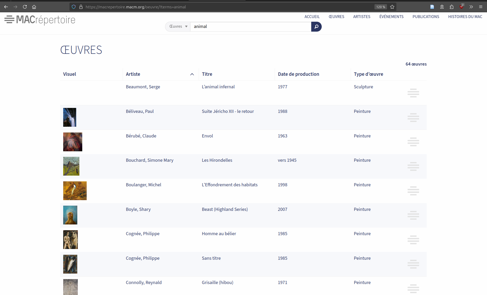
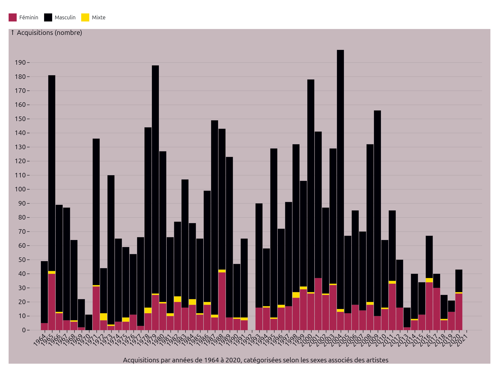
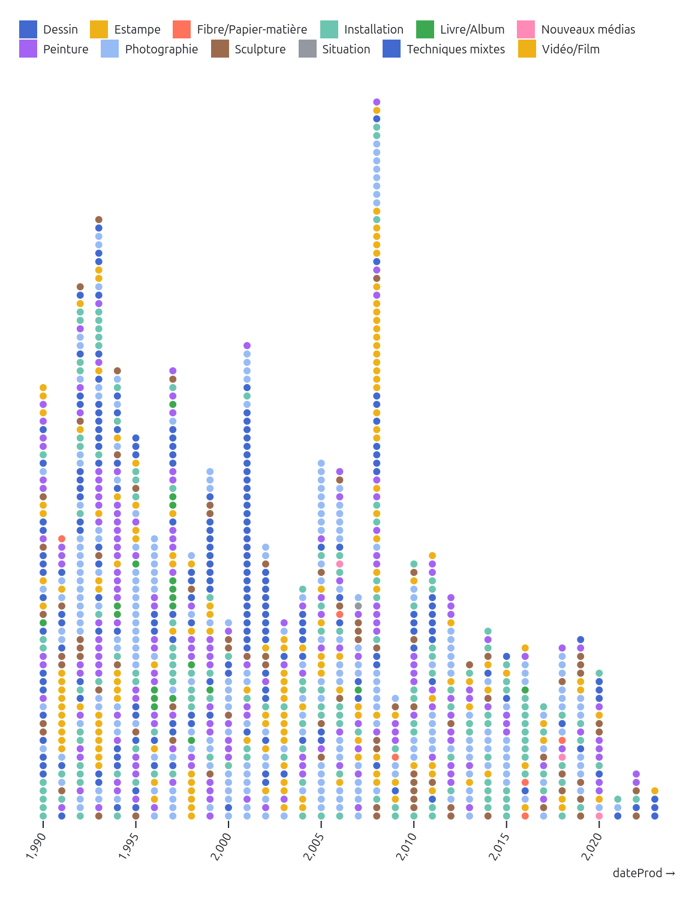
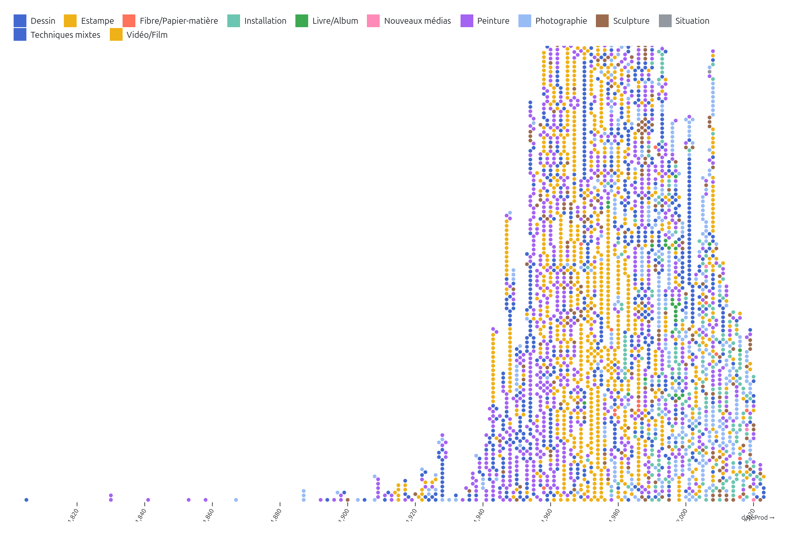
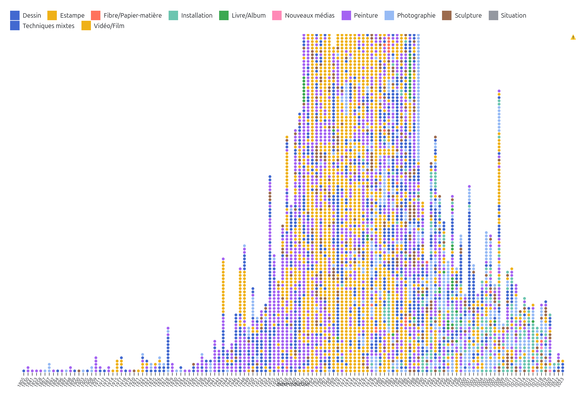

# Examen de synthèse

[toc]

*/!\ rédaction en cours*

## Introduction

<!--rédaction: idée générale d’introduction: validée, poursuivre la rédaction-->

La mission des institutions culturelles – musées, bibliothèques, centres d’archives, etc. – comporte notamment la valorisation et l’accès public à leurs contenus. L’arrivée des outils numériques dans ces institutions contribue à la transformation de leurs méthodes de travail, par exemple avec la diffusion numérique des artefacts conservés dans les réserves ou avec les expositions virtuelles. Certaines de ces institutions vont même jusqu’à la mise en ligne de leur données (Casemajor 2012, 82). Ces données décrivent de façon structurée les collections muséales, des archives ou des entités patrimoniales. Dans le cas où elles sont mises à disposition sur des plateformes de données ouvertes, elles contribuent à la documentation institutionnelle accessible et librement réutilisable. De ce fait, on peut considérer ces données comme une forme d’archive institutionnelle, ce qui ouvre de nouvelles avenues pour la recherche. 

En tant que jeune chercheuse et professionnelle au parcours multidisciplinaire en informatique et en histoire de l’art, je me suis particulièrement intéressée aux interfaces de valorisation et d’exploration de données culturelles (MK 2020, 2021; Fauchié et al. 2024; Desmorat et MK 2025 [à paraître]; Graff et al. 2024). Les interactions des publics avec ces données passent principalement par l’intermédiaire d’interfaces web permettant, par exemple, de faire des recherches dans une collection muséale. Lorsque la collection numérisée est en libre accès sur les sites web de musées, on peut habituellement l’explorer par le biais d’une barre de recherche (exemple figure 1) ou par l’usage d’un formulaire. Ces mode d’accès contraignent toutefois le potentiel de découverte de la collection. En effet, ces deux fonctions requièrent une connaissance préalable des objets, ou du moins de leurs caractéristiques, pour pouvoir les saisir : on ne peut pas rechercher ce qu’on ne connaît pas. De plus, on ne voit jamais qu’une partie de la collection. 

<figcaption style=" text-align: right ">Figure 1. Capture d’écran d’une recherche dans le MACrépertoire, le portail d’accès web à la collection du Musée d’art contemporain de Montréal, 2025.</figcaption>

Une première approche possible pour découvrir une collection dans son ensemble émerge d’une méthodologie quantitative. Anne Dymond souligne dans son ouvrage *Diversity Counts : Gender, Race, and Representation in Canadian Art Galleries* (2019) l’utilité d’indicateurs statistiques dans l’étude des pratiques institutionnelles. Dans une démarche qui reprend les objectifs des études féministes quantitatives en histoire de l’art, Valentine Desmorat et moi avons employé les données publiées par le Musée d’art contemporain de Montréal (MAC) pour étudier l’entrée des femmes artistes dans sa collection [^1]. Les portraits statistiques « permettent, en tant que visualisations de données, de donner à voir les tendances minoritaires, majoritaires, ainsi que les caractéristiques majeures des œuvres ou des artistes pris·es en compte [dans les collections] » (Desmorat 2024, 11). Guidées par les données, nous avons effectué des analyses statistiques et révélé des facteurs qui ont contribué à la représentation des œuvres d’artistes-femmes dans cette collection (Desmorat 2024, Desmorat et MK 2025 [à paraître]). Cette visualisation (figure 2) présente un regard d’ensemble sur la collection du musée, une alternative intéressante à la vue partielle issue de la recherche textuelle. 

<iframe width="100%" height="280" frameborder="0"
  src="https://observablehq.com/embed/@artistes-femmes-mac/nb-dachats-dons-acquisitions?cells=graphiqueBarres"></iframe>

<!---->

<figcaption style=" text-align: right ">Figure 2. Nombres d'acquisitions d'œuvres d'artistes-femmes et d'œuvres d'artistes-hommes par année (1964-2020), version simplifiée (sans les sélecteurs), Desmorat et MK, 2024</figcaption>

Certaines visualisations interactives amplifient le potentiel de découverte des contenus des collections. Contrairement au graphique en barre présenté plus haut, l’utilisation de points (figure 3) pour représenter les œuvres une à une les rends découvrables: en survolant un élément, on obtient le titre de l’œuvre et le clic redirige vers une page qui lui est dédiée. On peut ainsi découvrir une œuvre dont on ne connaissait ni l’existence, ni l’artiste, ni l’emplacement. Cette forme d’accès à la collection davantage caractérisée par la sérendipité et une approche sensorielle. 

<iframe width="550" height="294" frameborder="0"
  src="https://observablehq.com/embed/27a690d9c785e7cb?cells=minichrono"></iframe>

<!---->

<figcaption style=" text-align: right ">Chronologie des œuvres de la collection du MAC, vue de 1990 à 2023, MK, 2024</figcaption>

## Projet de recherche

Mon projet de recherche-création doctorale s’inscrit dans l’étude des institutions culturelles par leur données. Dans une continuité avec ma recherche sur les interfaces de valorisation et d’exploration de données culturelles, j’aimerais créer des environnements esthétiques, sensibles et non-hiérarchiques pour la valorisation et la libre exploration de ces collections. Mon objectif est de renouveler les présentations et les représentations des collections auprès des publics pour déjouer certains effets de pouvoir comme la domination des œuvres et des récits masculins coloniaux normatifs, ou encore l’excès de visibilité médiatique accordée à certains artistes au détriment des autres. Pour ce faire, j’aimerais expérimenter avec l’idée que la création de visualisations de données est une forme de commissariat. Le commissariat, en tant que processus de sélection et de mise en exposition publique d’objets, provient du milieu muséal mais s’est aujourd’hui diversifié en une variété de pratiques sociales. Des comptes Instagram aux listes de lectures Spotify, l’émergence de pratiques curatoriales sur les réseaux sociaux amènent un nouveau réseau d’acteur·rices à se pencher sur cette pratique.

> “Have you already curated today?” read the headline of an article on such varied acts of curation in the Neue Zürcher Zeitung in 2014 (Kathke et al., 2022, p. 71)

Par exemple, Torsten Kathke, Juliane Tomann et Mirko Uhlig proposent de rassembler sous le terme de « contre-curation » ou « contre-commissariat » (*counter-curation*) les pratiques sociales de commissariat qui visent à attirer l’attention sur des inégalités politiques et sociales ou à créer une opposition aux récits hégémoniques (2022, 71). Provenant du domaine de l’histoire, les auteur·rice·s rappellent que ce champs d’étude ne concerne pas uniquement les faits, mais aussi la façon dont ils sont rendus visibles, utilisables et mis en récit. On peut ainsi choisir de créer des countres-récits (*counter-narratives*), des représentations et des imaginaires partagés collectivement qui remettent en question les récits officiels ou établis. Je pense que cette posture commissariale peut également être appliquée à des données, particulièrement lorsqu’on crée de représentations, qu’elles soient visuelles ou multisensorielles, de données.

En créant des interfaces qui invitent à interagir avec les données, j’aurai pour objectif de créer des contre-récits pour déjouer les normes de visibilités qui discriminent la découvrabilité des contenus culturels. La découvrabilité représente le « potentiel pour un contenu, disponible en ligne, d'être aisément découvert par des internautes dans le cyberespace, notamment par ceux qui ne cherchaient pas précisément le contenu en question » ([OQLF «Découvrabilité»](https://vitrinelinguistique.oqlf.gouv.qc.ca/fiche-gdt/fiche/26541675/decouvrabilite)). À l’échelle d’une collection, je propose de considérer la découvrabilité comme le potentiel pour une œuvre d’être découverte parmi les données de l’institution. Ainsi, plutôt que de sélectionner des chef-d’œuvres pour représenter une collection, pourrait-on faire place à la sérendipité et à l’agentivité des publics pour se familiariser avec son contenu? 

<!--découvrabilité en data viz : il s’agirait du potentiel pour une œuvre à contribuer au récit construit par la représentation (visuelle ou matérielle)-->

### Espace et interactions

L‘espace numérique offre plusieurs formes d’interactions avec les données, en utilisant la souris ou le doigt sur un écran tactile, comme le survol (*hover*), le clic, le zoom, etc. Lors de la création de visualisations, la création de fonctionnalité interactives enrichissent considérablements l’accès au graphique produit. Contrairement à un graphique statique, on peut « en savoir plus » sur un élément, filtrer une partie des contenus ou encore zoomer sur un détail. Lors la création d’une visualisation pour l’espace numérique, on fait toutefois face à certaines contraintes, comme la taille de l’écran par exemple. Un contenu web peut être affiché sur un écran de téléphone portable, sur un écran d’ordinateur portable, sur une télévision ou même sur un écran géant. Il faut toutefois choisir l’usage auquel la visualisation est destinée, afin qu’elle soit lisible et/ou utilisable sur la taille d’écran visée. Parmi les visualisations que j’ai créées jusqu’à présent, j’ai toujours favorisé l’écran d’ordinateur personnel car, d’une part, l’écran de téléphone portable est trop contraignant (trop petit) pour créer des visualisations qui montrent +1000 éléments d’une collection. D’autre part, l’utilisation d’un écran plus grand est uniquement réaliste lorsque la diffusion est prévue dans une institution. 

Pour un accès plus général, dans le but que n’importe qui puisse consulter la visualisation sur le web à partir d’un ordinateur, il faut donc cibler environ [~1920 x 1080px](https://gs.statcounter.com/screen-resolution-stats/desktop/worldwide). Dans ce contexte, la plus petite échelle pour tracer une ligne ou pour dessiner un point serait d’un pixel. Il faut cependant que l’élément soit visible et distinguable à l’œil humain. Au minimum, une largeur de quelques pixels pour chaque élément est donc requise, ainsi que de l’espace (également un ou plusieurs pixels) entre les éléments est souvent nécessaire pour les distinguer. De plus, une visualisation emploie généralement des repères, comme des légendes ou des axes, qu’il faut également prévoir dans l’espace imparti. Même avec des marges et des repères minimalistes (100px en haut et en bas, 150px sur les côtés), il reste 1620 x 880 px. En moyenne (ou dans un contexte moins épuré), on travaille plutôt avec une largeur de 1200px et une hauteur d’environ 750px. 

Lors de la création d’une chronologie, un format prisé pour représenter les collections, on peut ainsi rapidement atteindre les limites de la taille de l’écran: une collection dont les œuvres sont datées de 1805 à 2023, comme celle du MAC, requiert la représentation de 218 années. Sur une largeur de 1200 px, cela ne laisse que 5 pixels par élément. Le manque d’espace horizontal peut être pallié par des solutions visuelles où les années sont amalgamées, comme dans l’exemple ci-dessous.

On peut sinon choisir d’utiliser uniquement les années pour lesquelles il y a au moins une œuvre acquise. Cela sauve, dans le cas de cette collection, beaucoup d’espace car une majorité écrasante des œuvres sont produites au XXe siècle. Il faut, dans ce cas, s’assurer d’expliciter ce choix qui induirait autrement la lecture chronologique en erreur car nous sommes habitué·e·s à une échelle linaire et continue pour les chronologies. 

 

Dans ce cas, le problème le plus important est cependant celui de la hauteur. Le nombre d’œuvre acquises est si grand qu’il dépasse de la hauteur moyenne d’un écran. Il y a un pic important d’œuvres produites en 1964, qui requiert une hauteur de 2250 pixels pour visualiser chacune des œuvres. Cela peut être pallié en faisant défiler la visualisation verticalement. On ne peut toutefois obtenir une vue d’ensemble et chronologique de la collection dans un espace de 1200 x 750 pixels.

Une autre limitation de l’écran est le manque de relief ou de profondeur. On ne peut pas faire « ressortir » des éléments ni en faire l’expérience tactile. On dispose de deux dimensions pour agir sur la perception et créer des interactions. Plusieurs chercheur·se·s, designer et professionnel·le·s de la visualisation de données œuvrent sur la création de nouvelles formes visuelles pour diversifier les représentations possibles et pour trouver de nouvelles solutions pour visualiser des données. Le champs (encore jeune) de la physicalisation de données propose une autre avenue, par la création « d’objets (artefacts physiques) dont la géométrie ou la matérialité *encode*[^2] des données » (Jansen et al. 2015, 2). La physicalisation amène ainsi une réflexion sur le rôle du sens du toucher dans la perception de données. Cette approche m’intéresse particulièrement, ayant moi-même certains problèmes de lecture à l’écran, mais surtout pour le potentiel d’interactions que j’entrevois dans l’approche matérielle des données. Les données, qui semblent parfois immatérielles et/ou incompréhensibles pour les profanes, prennent une forme tangible. Dans l’actuelle fatigue qui peut être ressentie face à l’omniprésence des écrans, un objet, particulièrement lorsqu’il est issu d’une production manuelle ou artisanale, peut recevoir une attention plus élevée. L’interaction tactile amène aussi une implication physique, ce qui favorise un engagement actif dans la réception. <!--sources qqpart dans la thèse de Lean--> C’est pourquoi je souhaite mener une recherche-création pour explorer la physicalisation de données comme interface de contre-curation pour des données culturelles.

### Questions de recherche

La question qui animera ma recherche est la suivante: comment la physicalisation de données peut-elle offrir une nouvelle forme d’accès pour des données culturelles? Je mènerai cette recherche à partir de l’hypothèse selon laquelle la création de ces nouvelles formes d’accès passera par une posture interdisciplinaire, en pensant l’artisanat comme une technologie et la technologie comme une pratique artisanale. À la croisée des physicalisations de données et des œuvres ou expériences *sensation*nelles, je vais expérimenter avec la fabrication d’objets qui incorporent des données culturelles. Mon objectif sera de produire des objets qui présentent des récits alternatifs et offrent de nouvelles perspectives sur les collections représentées. La création de ces objets comprend les étapes suivantes: 

1. Choisir un jeu de données provenant d’une institution culturelle
2. En faire l’analyse pour identifier un (contre-)récit à valoriser; effectuer un travail préparatoire avec les données au besoin
3. Écrire un algorithme de visualisation qui générera une représentation visuelle de ces données
4. Sélectionner une expression matérielle pour traduire la visualisation en une physicalisation
5. S’équiper du matériel nécessaire et compléter la fabrication de l’objet 

Les étapes de fabrication ne sont toutefois pas aussi linéaires. Afin de fournir un cadre à l’expérimentation, elles seront formalisées dans un protocole. Ce protocole permet également de structurer la documentation et en fait une étape essentielle pour inscrire le processus de création dans une démarche de recherche. 

Des questions connexes seront également abordées dans le cadre de cette recherche. D’une part, il s’agira d’évaluer l’utilisation d’un protocole pour mener une recherche-création. Son usage répété au cours de la thèse permettra un travail réflexif sur le protocole lui-même, sur son usage et sa pertinence pour la démarche envisagée. De l’autre, je considère les données produites par des institutions culturelles comme faisant partie des archives institutionnelles. Cela m’amènera à réfléchir aux méthodologies existantes pour étudier et pour utiliser ces données, en recherche ainsi que dans divers cadres de diffusion alternatifs.

## Représenter de données culturelles: état des lieux

La production d’un état des lieux pour cette recherche requiert en amont la définition de certains termes pour expliciter le sujet abordé.  La visualisation et la physicalisation de données sont toutes deux des façons de montrer et de donner accès à des données. Le terme anglophone « *display* » offrirait un bon point commun terminologique. Employé par Edward Tufte pour parler de « designs for display of information » (Tufte, 2018, 191), ce terme dispose d’une polyphonie pour laquelle un équivalent francophone est difficile à trouver; il signifie autant la démonstration de quelque chose, que sa mise à vue ou son exposition (au sens muséal), son affichage (notamment à l’écran) ou son étalage (comme une vitrine). En l’attente de trouver une solution terminologique plus riche, je parlerai ici de représentation de données. <!-- (dé-)monstration?--> Je préfère la représentation de *données*, par opposition au terme « visualisation de l’*information* » (*information visualisation*), car les données sont au cœur du processus de recherche. En effet, la façon de créer des représentations visuelles qui est à l’étude dans cette recherche est algorithmique. L’algorithme structure l’image de façon méthodique, elle donne la possibilité d’itérer des centaines voire des milliers de fois sur le résultat (Molnar, 1986, s.p.). Il produit un résultat « unique, carefully designed [and] data-specific » (Tufte, 2018, 179 <!--à confirmer-->) tout en étant répétable et réutilisable. L’approche algorithmique, par opposition avec l’infographie, devient ainsi particulièrement intéressante pour une démarche expérimentale en recherche-création.

J’ai divisé cet état des lieux sur la représentation de données culturelles en plusieurs parties. Tout d’abord, il situe le champs de la visualisation de données et ses fondements interdisciplinaires. Je recentre ensuite sur les données elles-même et poursuis avec l’identification des pratiques actuelles de représentations de données culturelles. Le champs plus récent de la physicalisation de données est ensuite adressé, pour terminer avec des exemples de productions artistiques incorporant des données.

### Fondements et interdisciplinarité en visualisation de données

<!-- récit dominant, questionner si ça m’intéresse de contribuer à ressasser ce récit dominant-->

La littérature au sujet de la visualisation de données provient de différents domaines. *The Visual Display of Quantitative Information* du statisticien Edward Tufte est un ouvrage fondamental qui analyse des exemples historiques et contemporain à sa publication en 1983, tout en produisant des recommandations pour la production de graphiques. Au fil des édititions et des nombreux tirages de cet ouvrage, ses recommandations sont encore aujourd’hui au centre de ce que les concepteur·rice·s et enseignant·e·s de visualisation de données nomment les « bonnes pratiques ». Tufte y définit un graphique de données comme la présentation (*display*) visuelle de quantités mesurées par l’usage combiné de points, de lignes, d’un système de coordonnées, de symboles, de mots, d’ombrages et de couleurs (Tufte, 2018, 9). En tant que statisticien, Tufte définit l’objectif des graphiques statistiques comme étant des instruments qui aident à raisonner à propos d’information quantitative  (Tufte, 2018, 91). La *Sémiologie graphique*, dont les éditions également multiples (1967, 1973, 1998, 2005, 2013) attestent de l’usage en tant qu’ouvrage de référence, provient du cartographe Jacques Bertin. Dans cette théorie de la représentation graphique, Bertin différencie la graphique, comme image rationnelle, à la fois de l’image figurative et de la mathématique (Bertin, 213, 6). En distinguant l’information de sa représentation, il établit un système graphique pour décrire l’exercice de la transcription graphique selon l’expression de chaque composante et ses variations. Michael Friendly, statisticien formé en mathématiques et professeur en psychologie, a fait d’importantes contributions à l’histoire de la visualisation de données tout au long de sa carrière, du projet web *Milestones in the History of Thematic Cartography, Statistical Graphics, and Data Visualisation. An illustrated chronology of innovations by Michael Friendly and Daniel J. Denis* publié en 2001 à la publication de l’ouvrage *A History of Data Visualisation & Graphic Communication* avec Howard Wainer (2021). <!-- Palsky *Des chiffres et des cartes*-->

Le design est un milieu qui contribue de façon important aux références en visualisations de données, comme l’ouvrage *Design for Information: An Introduction to the Histories, Theories, and Best Practices behind Effective Information Visualizations* (Meirelles, 2013). Son autrice, Isabelle Meirelles, a également contribué à la littérature en considérant les défis interdisciplinaires en visualisation de données (avec Kjærgaard, Meyer et Wong, 2012). Le *Centre for Innovation in Information Visualization and Data Driven Design* dirigé par Sara Diamond expérimente avec ces enjeux, en rassemblant des artistes, des designers et des acteurs provenant des milieux des médias, des sciences humaines et des sciences sociales dans un partenariat de recherche interdisciplinaire (2011). Issu du milieu du design industriel, Manuel Lima a contribué des ouvrages sur la dimension socio-culturelle des visualisations en réseaux (2011), les arborescences (2014) et les cercles (2017) <!-- à confirmer-->. 

Du côté de l’informatique, la visualisation de données est adressée de façon double, d’une part comme théorie et de l’autre comme pratique <!-- même chose que carto, Besse-->. *Data Visualisation: A Handbook for Data Driven Design* d’Andy Kirk (2016) cherche à distinguer la pratique de la technique, en évitant l’écueil des outils pour se concentrer sur *the underlying craft of data visualisation through a tool-agnostic approach* (Kirk, 2019, 4). *Better Data Visualisations: A Guide for Scholars, Researchers, and Wonks* (Schwabish 2021) prend quant à lui une approche plus encyclopédique, en effectuant une typologie détaillée avec plus de 500 exemples de visualisations. Il existe également un grand nombre d’ouvrages techniques, comme le *Handbook of Data Visualization* (Chen, Härdle et Unwin, 2007) ou encore *Hands-On Data Visualization* (Dougherty et Ilyankou 2021). Ces ouvrages, publiés des éditeurs spécialisés en science, en technologie et en informatique (Springer pour le premier et O’Reilly pour le second), sont des manuels qui transmettent la théorie par la production de solutions techniques. Certains se dédient spécifiquement à l’usage d’un langage ou d’une librairie de programmation, comme *Visualizing data* (Fry, 2008) dont l’auteur a co-développé *Processing*<!--note de bas de page pour faire le lien vers p5?--> ou *Interactive data visualization for the Web : an introduction to designing with D3* (Murray, 2017) qui présente l’utilisation de la librairie *D3.js*. Ces deux librairies, dédiées à la création de visualisations et de graphiques, feront l’objet d’une présentation plus étendue dans la section méthodologique car j’utilise *D3.js* et *P5.js* (la version en javascript de *Processing*) dans ma recherche.

*Critical Visualization* de Peter Hall et Patricio Davila (2023) est une publication plus thématique qui énonce les enjeux critiques sous-jacents à la visualisation de données, un aspect lacunaire ou manquant dans les nombreux ouvrages techniques. Les auteurs présentent un cadre conceptuel pour la production de visualisations critiques, en commençant par situer le fait que les décisions par rapport aux données et à leur représentation ne sont jamais neutres. Pour ce faire, ils relèvent l’importance de questionner qui a créé la visualisation, quand et pourquoi, mais surtout dans quel contexte culturel, avec quels système de croyance et en se demandant qui est exclu (ou ce qui est exclu) dans la visualisation (Hall et Davila, 2023, 14-15). Dans le chapitre « Disruptive Histories », Hall et Davila cherchent également à perturber les approches dominantes en visualisation et proposent une histoire alternative de la visualisation critique (2023, 45-75).

### Des données à leur représentation 

<!-- mettre les données au début? mais besoin d’amener hall-davila + offenhuber après -->

Il faut donc appliquer les mêmes questionnements sur les données: qui les a produites et à quelles fins, et quel est notre posture par rapport à ces données? Dans *Graphesis: Visual Forms of Knowledge Production* (2014), Johanna Drucker propose de changer le vocabulaire, en soulignant que les données ne sont pas *données* mais *captées*. Ainsi, l’aspect constructiviste des graphiques se révèle au dépit de l’illusion de leur « simple » valeur quantitative. Le but est alors de créer des visualisations qui exposent le principe interprétatif du savoir au lieu de le dissimuler dans une prétendue objectivité (Drucker, 2014, 128). 

Catherine d’Ignazio et Lauren F. Klein apportent une perspective féministe intersectionnelle sur les données avec *Data Feminism* (2020). En situant l’éthique au cœur des sciences de l’information, les autrices mettent de l’avant des principes autour de l’identification et la remise en question des enjeux de pouvoir, la place de l’émotion, de l’affect et l’expérience incarnée (*embodiment*). Elles cherchent à déconstruire les biais dans les systèmes de classifications comme la binarité et les hiérarchies et proposent de cultiver une pensée plurielle dans la conception de modèles de données comme prévention contre la violence épistémique. La documentation prend également un rôle essentiel pour nommer et créditer les besognes trop souvent sous-estimées et invisibilisées, ainsi que pour révéler le coût réel et planétaire de la production de données.

Une approche davantage axée sur la matérialité des données est apportée par Julie Freeman dans sa thèse intitulée « Defining Data as an Art Material » (2017). En tant qu’artiste, elle y explore la définition, le rôle et l’emploi de données dans le *data art*  – une appellation proposée pour regrouper les pratiques artistiques utilisant les données comme médium. Étudier l’emploi de données dans des pratiques artistiques requiert un cadre d’analyse plus précis, ce qui a mené l’autrice a co-créer une taxonomie pour décrire les données qui servent de medium artistique (Freeman, Wiggins, Starks et Sandler, 2018). Face à la grande variété de types de données, la classification permet d’expliciter ainsi ce qui est entendu par le terme « données », d’en définir la matérialité, la source, les principes (système de représentation) et les qualités (format, licence). Cette taxonomie émane des questions classiquement posée lorsqu’on étudie un médium artistique plus traditionnel: « where it was made, who made it, where it is from, what does it comprise, who owns it, how does it need to be stored, does it transform or degrade ? » (Freeman, Wiggins, Starks et Sandler, 2018, 76).

Cette veine matérialiste est amenée encore plus loin par Dietmar Offenhuber dans son ouvrage *Autographic design. The Matter of Data in a Self-Inscribing World* (2024). Le professeur du département d’art et de design à la Northeastern University introduit ainsi la notion d’autographie, par opposition avec l’allographie et comme contre-modèle à la visualisation données, comme « a practice that is less concerned with interpreting data than with revealing their material origins and the relationship between data and the world » (Offenhuber, 2024, 3). Il remonte aux sources et aux manifestations matérielles à l’origine des données pour ensuite identifier les façons dont le monde s’inscrit lui-même, où l’environnement physique archive (conserve la trace) et traite de l’information (Offenhuber, 2024, 5), comme les carottes de glace par exemple. Le design autographique est ainsi une pratique de monstration des conditions qui permettent aux traces d’émerger; il sert de guide pour leur interprétation, démontrant la causalité et la preuve qui y est contenue (Offenhuber, 2024, 49). <!-- plus de choses à dire ici, voir combien je développe-->

### La représentation de données culturelles

données culturelles <!-- reprendre intro + cf Freeman, données culturelles comme type spécifique de données, les inscrire dans la taxonomie?-->

contextes de création, buts et usages: publics vs usage interne/pour la recherche, division utile/importante?

“Munzner’s multi-level typology of abstract visualization tasks [ ], which distinguishes three main motivations for creating and using visualizations: to discover, to present, and to enjoy.” (Dragicevic et al., 2021, p. 5)

[memoire: Nous émettons l’hypothèse que pour procéder à des études quantitatives,  il s’avère nécessaire non seulement de disposer de données, mais aussi  des méthodologies et des outils pour leur manipulation.  L’instrumentation de la recherche, telle qu’étudiée par Christian Jacob  dans ses *Lieux du savoir*, identifie un défi quant au  développement d’environnements logiciels pour l’expérimentation avec des données (2013: s.p.). L’ouvrage *Graphesis. Visual Forms of Knowledge Production*, publié en 2014 par Johanna Drucker, propose une première étude  d’envergure à propos de ce type d’outils. Cette publication annonce le  potentiel d’une épistémologie visuelle au sein des interfaces de  recherche dans le domaine des sciences humaines et sociales. Dans ce  mémoire, nous proposons l’usage de la cartographie et des visualisations comme outils de compréhension et d’interprétation critique de données  quantitatives.]

- 

**2 thèses sur le sujet**, même labo à Londres (dir. Stephen Boyd Davis), emphase sur les chronologies comme forme de visualisation particulièrement importantes pour les données culturelles

Kraütli 2016 = *GLAM data viz for curators*

- exploration des collections numérisées pour faciliter *knowledge discovery*, 
- outil d’analyse visuelle des contenus, potentiel pour la recherches. 
- Recherche sur l’influence du commissariat (traces des décisions institutionnelles, biais curatoriaux) sur les collections et comment elles se manifestent dans des visualisations (time-based). 
- Montrer/étudier les données « cachées » (hidden data, not explicitely recorded but nevertheless present in the data). 
- Practice-led and collaborative approach. 8 **prototypes**, à partir desquelles émergent des **principes** de design, puis 2 implémentations pour les mettre en pratique et démontrer comment ces outils peuvent contribution à la production de connaissances dans les collections culturelles. 
- Numérisation des collections requiert de nouvelles méthode pour les explorer/interroger, deviennent des artefacts, étudier l’histoire des institutions. **Définitions** de la collection numérisée notamment

Vane 2019 = *is data enough? data viz in context, public plus large* 

- numérisation ne suffit pas pour rendre les collections accessibles, découvrables et compréhensibles (Terras 2015)
- Interfaces standards ne permettent pas forcément les interactions désirées. Visualisations pour rendre les récits historiques (historical narratives) visibles. 
- Public de cette recherche = institutions culturelles
- définition/objectif de la visualisation culturelle, enjeux de données qualitatives ou nominales
- Portfolio de 5 projets dans des musées

**Desmorat 2024**: *L’entrée des femmes artistes dans la collection du Musée d’art contemporain de Montréal, de 1964 à 2020 : analyses statistiques et facteurs déterminants*. Dirigées par la professeure Johanne Lamoureux (Université de Montréal), ces recherches ont été menées dans le cadre du Partenariat *Des nouveaux usages des collections dans les musées d’arts* (CIÉCO). La collaboration avec Lena Krause, dans son rôle de responsable de laboratoire à l’*Ouvroir d’histoire de l’art et de muséologie numériques* (Université de Montréal), a débuté à l’occasion de la clinique numérique du laboratoire.

(extraits de l’article à venir)

- Le Musée d’art contemporain de Montréal (MAC) détient une part élevée d’œuvres d’artistes-femmes, comparativement aux musées d’art québécois, nord-américains et d’Europe de l’Ouest (Desmorat 2024, 1-2) → révéler les facteurs qui ont contribué à cette représentation importante des œuvres d’artistes-femmes dans la collection par le moyen de visualisations de données interactives
- Cette recherche reprend les objectifs des études féministes quantitatives en histoire de l’art, étudiant la « mécanique » institutionnelle qui infléchit l’évolution du nombre d’acquisitions d’œuvres d’artistes-femmes. Une acquisition revient ici à l’inclusion d’une ou de plusieurs œuvres dans la collection permanente du musée, de sorte que l’entrée d’un·e artiste se concrétise à travers les achats ou les dons de ses œuvres. Dans cette perspective, l’entrée des femmes artistes au MAC s’effectue par le moyen de l’acquisition de leurs œuvres. 
- co-création de graphiques à partir de deux jeux de données ouvertes publiés par le MAC sur le portail Données Québec . Les graphiques produits sont chronologiques et interactifs. Ce sont des « portraits statistiques » qui donnent à voir les étapes de la constitution de la collection du MAC au travers du prisme des catégories de genre des artistes des œuvres acquises. 
- La mobilisation de plusieurs graphiques a permis d’adopter des points de vue complémentaires sur la répartition des acquisitions. L’interactivité des graphiques a facilité la sélection des paramètres (types d’acquisition, médiums, catégories de genre représentées) et des bornes chronologiques pour élaborer des hypothèses et pour faire apparaître des facteurs institutionnels expliquant les grandes étapes de l’entrée des artistes-femmes dans la collection.
- Les visualisations de données apportent donc une vision ou bien d’ensemble des richesses et des lacunes des collections, ou bien davantage circonscrite et spécifique, selon les paramètres sélectionnés par les personnes qui explorent le graphique. Il s’agit d’un enjeu important à l’heure où les musées cherchent à rendre leurs collections plus inclusives et à faire écho à la diversité sociale au sein des contextes où ils évoluent. Les professionnel·les des musées peuvent dorénavant, s’ils ou elles le souhaitent, s’approprier ces outils dans le cadre de l’évolution de leurs propres pratiques d’acquisition et de conservation.

**exemples dans les musées** 

- revue de littérature Vane ch2 sur les chronologies
- [memoire: En histoire de l’art numérique et dans le domaine plus large des  humanités numériques, nous relevons également la palette d’approches  visuelles originales et conçues spécifiquement pour des données  culturelles dans la thèse de doctorat de Florian Kraütli, *Visualising Cultural Data. Exploring Digital Collection Through Timeline Visualisations* (2016). Certains outils, comme *E.A.T Datascape* (Leclercq et Girard 2013) et les autres projets de l’équipe du Médialab (SciencesPo Paris), *Hypercities* (Presner et al. 2014), *Voyant Tool* (Sinclair et Rockwell 2016), *Palladio* (Conroy 2017) et *Rethinking Guernica* (Peiró et Sevillano 2017), se distinguent particulièrement par la  création d’interfaces interactives avec un riche potentiel  épistémologique. Ces interfaces facilitent les analyses quantitatives  tout en conservant une approche critique à propos des connaissances  ainsi produites.]
- SMK Open & API (+ Explore : Meyer, Louie, Johanne Engel Aaen, Anitamalina Regitse Tranberg, Peter Kun, Matthias Freiberger, Sebastian Risi, and Anders Sundnes Løvlie. 2024. “Algorithmic Ways of Seeing: Using Object Detection to Facilitate Art Exploration.”)
- faire analyse plus poussée du MAC répertoire? 

### Data phys

« d’objets (artefacts physiques) dont la géométrie ou la matérialité *encode*[^2] des données » (Jansen et al. 2015, 2)

Data physicalization has been further defined as a research area which “examines how computer-supported, physical representations of data (i.e., physicalizations), can support cognition, communication, learning, problem solving, and decision making” (Jansen et al. 2015, ?)

<!--Le champs (encore jeune) de la physicalisation de données propose une autre avenue, par la création « d’objets (artefacts physiques) dont la géométrie ou la matérialité *encode*[^2] des données » (Jansen et al. 2015, 2). La physicalisation amène ainsi une réflexion sur le rôle du sens du toucher dans la perception de données. -->

En tant que représentation matérielle de données, celle-ci est souvent contrastée avec l’immatérialité ressentie dans la visualisation de données. En effet, dans le cas de visualisation, on n’a pas accès aux données qui ont servi à déterminer la forme graphique. Sur papier dans l’espace physique comme sur l’écran d’une machine pour l’espace numérique, les données d’une visualisation ne sont pas tangibles ou palpables. 

Un des moteurs d’instigation de ce domaine porte sur les origines multiples et les apports de différentes cultures à l’histoire de l’encodage et de la transmission de l’information. Parmi les exemples populaires, on retrouve les bulle-enveloppes, des petits objets en argile employés il y a 6000 ans pour la comptabilisation de biens en Mésopotamie («Bulle-enveloppe», [Wikipédia](https://fr.wikipedia.org/wiki/Bulle-enveloppe)), ou encore les quipus (ou khipus), un système de consignation de données formé de cordes et de nœuds utilisé par l’administration de l’empire Inca et dont les traces remontent à 4500 ans («Quipu», [Wikipédia](https://fr.wikipedia.org/wiki/Quipu)). Il s’agit ainsi de reconnaître que les données – au sens d’informations enregistrées de façon en « permettre le stockage, la transmission ou le traitement » (Donnée, [GDT](https://vitrinelinguistique.oqlf.gouv.qc.ca/fiche-gdt/fiche/8358482/donnee)) – n’ont pas été inventées avec les premiers ordinateurs, ni même par les bureaux de statistiques ou d’autres administrations au fonctionnement centré sur l’écriture. Face à l’amplification exponentielle de la place des données dans notre société, ce travail de reconnaissance historique vise notamment à décentrer le savoir occidental pour faire place à une diversité d’épistémologies. Dans ce contexte, la visualisation de données bénéficie aussi d’un rôle toujours plus important, parce qu’elle facilite l’accès à ces données et leur compréhension. Les recherches en physicalisation de données se développent également en ce même sens: de nouvelles pratiques émergent en référence aux autres façons (historiques, culturelles) de penser et d’interagir avec les données. 

*Data und dasein* Trevor Hogan 2016

- brief history of data representation (ch3) beyond the visual modality & physical data representations (39-47)
- Defining multisensory data representations
  - labvels: sonification, physicalisation, data sculpture, non-visual visualization, cross/multimodal displays. Crossmodal or multi-modal display. Terms focus on the sensory channel: sensulaization, sensification, perceptualization (92)

> Multisensory data representations are a class of data representation that have a clear intent to reveal insight by encoding data in more than one representational modality and require at least two sensory channels to fully interpret and understand the data (92)

- collected and analysed 154 examples, and established a design space to question the value added by expanding the sensory channels required to interpret a data representation. Highlighted underexplored areas and future challenges, + 5 key recommendations that include
  - Further fundamental research is needed to better understand how multisensory representations impacts on people’s ability to form meaning from the representation (123)
  - beyond visual variables → taxonomy (202?)
  - new phenomenon in data representation, where the data is not encoded in the representational modalities but in the behaviour, affordance and experience of the data representation (124) … This is a departure from how HCI researchers presently think of and address the concept of (mal)functionality. Alongside this, I believe that representing data through experience can further harness people’s natural instincts and can offer researchers a platform to generate data insight in a more natural and intuitive way. (125)
  - The interpretation of data through multiple channels is not exclusive to any one community. My survey shows that it is practiced by a range of professionals and enthusiasts including academics, researchers, designers, artists, engineers and even hobbyists. While acknowledging that intentions may vary greatly, I see great potential and benefit from encouraging and supporting open collaborations between these disciplines and practitioners. By harnessing the **logical and technical skills** of information scientists and engineers with the **visually perceptive skills of designers and sensitivity of artists**, I believe that data can be represented in a manner that is artistic, engaging, aesthetic, informative and insightful (125)
  - second part focused on evaluation methodologies: gathering accounts of experience with data representation and comparing how representational modality affects people’s experience of data (271) Studies

Pierre Dragicevic, Yvonne Jansen, Andrew Vande Moere. « Data Physicalization » dans le *Springer Handbook of Human Computer Interaction* 2021

- revue de la littérature académique et des projets menés hors du contexte académique jusqu’en 2018
- utilisations: analyse, communication et éducation, accessibilité, autoréflexion et autoexpression, fun et sens (enjoyment and meaning)
- enabling technologies, reviews empiricial studies, and surveys models and theories of data physicalisation

Hornecker, Eva, Trevor Hogan, Uta Hinrichs, and Rosa Van Koningsbruggen. 2024. “A Design Vocabulary for Data Physicalization.” 

- explicit variables + implicit properties +  consequential aspects (2:5)

kate lean

### Pratiques d’art, d’artisanat et de design qui incorporent des données [notes]

 à la croisée de la textilité et de l’algorithmique agissent comme sources d’inspirations transdisciplinaires

design & réflexions sur l’accessibilité: The Senses

- [corpus d’œuvres qui inspirent la recherche](https://www.canva.com/design/DAGeuw-pplg/xXzotJr7T8XvWcPHvk2eSw/view?utm_content=DAGeuw-pplg&utm_campaign=designshare&utm_medium=link2&utm_source=uniquelinks&utlId=hef9b400c70)  circonscrire les objets qui aident à réfléchir
- Pansee Atta
- data art? algo art with data? 
- Rapport entre les données (corpus) et les œuvres (objets) qu’on étudiera pour exemplifier son processus d’expérimentation.

---

## Cadre théorique [notes]

<!--cadre pour penser l’artisanat comme une tech et la tech comme de l’artisanat. Comment est-ce qu’on pense comme ça (cadre théorique), comment est-ce qu’on le met à l’épreuve (protocole)-->

### Comment on fait, pourquoi on fait des data viz / des interfaces? 

Johanna Drucker ***Graphesis***

- développer une épistémologie visuelle pour les humanités (2014)
- visualisation comme un vecteur de réflexion, de questionnement et de production de savoir (Drucker 2020). 

***Visual Interface Design for Digital Cultural Heritage**: A Guide to Rich-Prospect Browsing* (Ruecker, Radzikowska, et Sinclair 2016)

- théorisé le design d’interfaces visuelles pour le patrimoine culturel numérique. 
- Il·elle·s analysent d’abord les formes classiques d’interfaces d’extraction ou de récupération (*retrieval interface*). Celles-ci aident l’utilisateur·rice à effectuer des requêtes dans les données. L’interface présente un formulaire pour la sélection de données qui répondent à certains critères. La machine envoie les spécifications au *back-end* , qui renvoie les données correspondantes à montrer dans l’interface. 
- Ruecker, Redikowska et Sinclair démontrent les restrictions que pose ce type d’interface dans le potentiel de recherche dans les données. Dans de nombreux cas, l’utilisateur ne peut pas voir certaines informations utiles et disponibles concernant, par exemple, les liens entre les items: les regroupements possibles, d’éventuels séquençages ou motifs dessinés par leur mise en relation (Ruecker et al. 2011: 2)
- Cet article se poursuit toutefois avec la théorisation d’une forme d’interface « d’exploration riche en perspectives » ou *rich-prospect browsing*. Celle-ci serait dotée d’une série de principes conducteurs qui visualisent les possibilités, ou *affordances*, pour la recherche dans l’interface (Ruecker et al. 2011: 3-4). 
- Ces principes incluent notamment l’affichage de grands formats ou d’une grande quantité de données structurées dans une logique perceptible par l’utilisateur·rice. 
- L’interface doit également fournir un maximum d’information pour la navigation dans l’interface et situer l’utilisateur·rice dans son exploration des données. Telle une carte routière, l’utilisateur·rice peut se servir de ces informations pour savoir où il se trouve. Il·elle visualise les parcours possibles et s’oriente dans son exploration des données.

Hinrichs, Uta, Stefania Forlini, and Bridget Moynihan. 2019. “In Defense of Sandcastles: Research Thinking through Visualization in Digital Humanities.”

> considering visualizations as sandcastles foregrounds valuable insights into the roles of visualization as a mindset, methodology, and praxis within humanities research and beyond.

Lamqaddam, Houda. 2022. “In Search of Meaning: Thinking Information Visualization within Art History Research.”

Mk mémoire? but = recherche

<!--Réfléchir à ce qui est le plus utile pour réfléchir dans tout ce que tu as listé là, tout en restant suffisamment général (transversal) pour que d’autres options s’y greffent.-->

### Faire (au sens artisanal)

Ingold:

- *Making: Anthropology, Archaeology, Art and Architecture* (2013) → à consulter (faire soi-même avec ses mains?)
- *The Textility of Making* (2010) → notes de lectures ok (textilité est une métaphore)

Faire avec un ordinateur

- Vitali-Rosati: *Éloge du bug* → fin des notes de lectures à numériser
  - relationship with technology (see it as a craft), playful bidouillage, beyond « utilitarian functionality » to learn, rethink, change perception
- Coleman *Coding Freedom*: hacking as making
- Simondon: *Du mode d’existence des objets technique* 
  - rapport entre humain et machine, rapport à la matière du technicien
  - rapport entre geste humain et geste machine, outil, inventivité

- Molnar *Eloge de l’ordinateur*

- school for poetic computation

- digital fabrication: reconsider digital fabrication within data translation activities as situated along an extended ‘trajectory of use’ in which reflective, meaningful ‘data-things’ can be created (Nissen and Bowers 2015)

- “how digital humanities can integrate data physicalization into the research process and how data physicalization is a form of critical making.” (Berger et al., 2024, pp. -)

- **data craft** et Thudt, Alice. 2018. “Visualizations for Personal Reflection and Expression.” Calgary: University of Calgary. http://hdl.handle.net/1880/106519.
  - as a way to create meaningful physical mementos based on digital records of personal and shared experiences” (Carpendale, 2017, p. 2) 

  - “Both the manual crafting process and the resulting physical artifact create opportunities for reflection and sharing memories.” (Carpendale, 2017, p. 4) 

  - “Focusing on the creation of functional everyday objects, data craft shapes opportunities to integrate personal digital data into everyday life where they can be serendipitously re-encountered and used together” (Carpendale, 2017, p. 4)

Artisanat

- Albers rapport à l’outil, la machine, le métier à tisser. Documenter, notation, …
- “people that partake in such activities tend to invest a certain meaning into the artifacts that they made themselves, which they might not do when confronted with something that was mass-produced” (Dragicevic et al., 2021, p. 19) “the manual creation and subsequent habitual use of self-made physicalizations of personal data can augment their perceived value and authenticity, and can thus spark various forms of individual or shared recollection [ ]” (Dragicevic et al., 2021, p. 20)
- + accessible “Data physicalization can also be considered as a useful fabrication activity in and by itself, as its transformative qualities can become relatively easily integrated in existing fabrication and craft activities, such as crochet and its allied practices, among many others [ ]. Several projects have demonstrated how physicalization can democratize the practice of information visualization by requiring less skills or expertise than its digital counterparts” (Dragicevic et al., 2021, p. 20)
  + “The recent focus on making reveals how data physicalization can be understood as a manifestation of data within a “trajectory of use”, which starts from before the first acquaintance with the data, over its actual design and physical fabrication, and ending in the hands of others, in the future [ ]. By considering data as a trajectory, one can recognize how people also make sense of data during the fabrication of visualization itself [ ], as physicalization makers make conscious decisions about how the data should be represented in order to evoke associations with experiences or people, to support activities that allow for episodes of reminiscing, or to encourage potential social interactions. Moreover, during the physicalization construction itself, aspects of data collection, construction and self-reflection can be deeply intertwined [ ] (see Figure -b for some concrete results). These qualities have been exploited during the process of hands-on physicalization making workshops in order to make principles of data representation more graspable [ ], or to push the creativity of students in visualization [ ]. Overall, research in personal physicalization fabrication has revealed a yet largely unexplored potential to represent more qualitative and subjective aspects that cannot yet be readily captured in data [ ]” (Dragicevic et al., 2021, p. 21)

Faire en étant située: 

- *Feminist in a Software Lab*, Tara McPherson→ notes de lectures à numériser
- *Data feminism* Catherine d’Ignazio et Laurent F Klein
- *Glitch feminism* → à consulter

Faire sans discipline? Myriam Suchet *Indiscipline*→ notes de lectures ok

Faire une interface

- interfaces poétiques

## Protocole d’expérimentation (métho)

<!--cadre pour penser l’artisanat comme une tech et la tech comme de l’artisanat. Comment est-ce qu’on pense comme ça (cadre théorique), comment est-ce qu’on le met à l’épreuve (protocole)-->

<!--expliciter en quoi le protocole aide à faire et réfléchir en même temps: attacher les fils entre les données et les expérimentations physiques; entre la théorie et le processus; entre l’écrit et le pratique,-->

<!--incertaine du terme symbolique: cherche une façon de dire que c’est connoté, contient une façon de voir le monde, **produit du sens**, contribue à la construction d’un récit-->

Pour mener cette recherche, j’ai créé un protocole d’expérimentation [[document 1]](./protocole) qui fournit un cadre à ma pratique. Ce cadre me permet de placer la réflexion-dans-l’action (*reflection-in-action*), un terme proposé par le philosophe et urbaniste Donald A. Schon pour énoncer une posture dans laquelle « on réfléchit à ce qu’on fait pendant qu’on le fait » (1983: 54). Le protocole est divisé en trois étapes: 

<!--détailler chaque étape, prendre le temps d’expliquer les idées-->

1. *Faire des choix* est une étape qui sert à nommer les décisions et les partis pris dans l’élaboration d’un objet. Parmi les trois composantes principales, les **données** sont décrites pour déterminer le sujet à représenter ainsi que pour identifier la source ou l’institution qui les a produites. L’analyse du contenu s’effectue en parallèle du prétraitement des données, une étape préparatoire au cours de laquelle les données sources sont structurées pour former un jeu de données. Ce jeu de données passe ensuite par un **algorithme de représentation**. Cet algorithme lui-même un protocole, qui applique une logique visuelle et spatiale, basée sur une intention symbolique, avec une méthodologie algorithmique. Contrairement à la visualisation de données, cet algorithme est une sorte de partition, un plan de travail qu’il reste ensuite à activer dans une **expression matérielle**. La matérialité, dans les sensations qu’elle évoque et dans le geste même du travail de la matière, exprime également une ou des sens symboliques. L’ensemble de ces choix se fait de façon itérative. Les tâtonnements, les tests et les différentes versions font partie du processus de la recherche-création.
2. *(Dé-)montrer* questionne ce qui est présent lors de la mise à vue publique. Celle-ci requiert une forme d’aboutissement de la première étape, même si le protocole lui-même peut être utilisé de façon itérative. À cette étape, l’enjeu n’est pas simplement de montrer le résultat de la physicalisation de données. Il s’agit plutôt de produire une démonstration de la recherche-création. Pour expliciter son fonctionnement, son « mode d’emploi » et ses propriétés, l’objet doit être accompagné d’une sélection d’éléments qui rapportent les choix effectués et le processus suivi. La présentation publique est également le lieu de réception de la recherche-création. La réception peut être participative, au sens où les interactions pensées dans la physicalisation peuvent aller au-delà de l’expérience pour contribuer à l’élaboration de l’objet. Pour toutefois distinguer la présentation d’un projet de l’animation d’un atelier créatif, un cadre de participation est établi au préalable et lui-même présenté dans l’espace. Une question récursive se pose: les expériences vécues par les personnes présentes, leurs actions et leurs rétroactions peuvent-elles / sont-elles exposées elles aussi? <!--Mise en commun? Partager?-->
3. *Documenter* est intrinsèque aux deux étapes précédentes. Chaque élément doit pouvoir être mobilisé pour contribuer à la recherche. Cela requiert la production délibérée d’une documentation des composantes, des itérations, de l’exposition et de la documentation elle-même, c’est-à-dire l’emploi de ce protocole.
   <!--(ré)conciliation entre la physicalité et le numérique (l’écran)? Puisqu’il s’agit de rendre les données d’un musée accessible à des publics?-->

Observations

Ce protocole prend le parti qu’il n’y a pas de recherche-création sans exposition. Pour que la physicalisation puisse faire l’objet d’interactions, le protocole requiert une présentation ou une forme de partage direct avec un public. Elle peut toutefois se dérouler dans des contextes variés, d’une exposition dans une institution culturelle à un événement de vulgarisation ou de partage de connaissance. L’examen de synthèse peut ainsi être le « lieu » de l’exposition, et son jury le public. 

Ce protocole est intrinsèquement algorithmique:

- Il fournit des instructions qui peuvent être répétées <!--est-ce que le protocole vise aussi à être reproductible? (quelqu'un qui suit ta recette avec les mêmes ingrédients obtiendra-t-elle le même dessert que toi?)-->
- Il définit des variables
- Il fait recourt aux boucles et à la récursion
- Il exploite les joies de l’aléa, dans les itérations comme dans la participation publique
- Il doit être exécuté pour avoir un résultat
- Il génère des traces et exige une documentation

Ce protocole prend appuis sur de nombreux opérateurs théoriques issus de la recherche actuelle en visualisation de données, en cartographie et dans le domaine des interfaces personnes-machines. 

### Utilisation du protocole

*comment je vais utiliser le protocole pour faire une thèse*

### Format envisagé pour la thèse

## Partie pratique

[Mise à l’épreuve du protocole](./protocole_MAC) avec les données de la collection du Musée d’art contemporain de Montréal. L’expérience a pour but d’alimenter la notion en cours de développement de contre-curation de données. Ce protocole met une emphase particulière sur la documentation des choix, des étapes et des itérations afin de rendre le processus aussi *tangible* que les données elles-mêmes.

- Données du MAC
- examen de synthèse comme contexte d’exposition ?!

### 

---

[^1]: Ce projet a pour point de départ le mémoire de maîtrise de Valentine Desmorat : *L’entrée des femmes artistes dans la collection du Musée d’art contemporain de Montréal, de 1964 à 2020 : analyses statistiques et facteurs déterminants*. Dirigées par la professeure Johanne Lamoureux (Université de Montréal), ces recherches ont été menées dans le cadre du Partenariat *Des nouveaux usages des collections dans les musées d’arts* (CIÉCO). La collaboration avec Lena Krause, dans son rôle de responsable de laboratoire à l’*Ouvroir d’histoire de l’art et de muséologie numériques* (Université de Montréal), a débuté à l’occasion de la clinique numérique du laboratoire.
[^2]: Traduction admise par l’OQLF: https://vitrinelinguistique.oqlf.gouv.qc.ca/fiche-gdt/fiche/8375546/coder
[^]: A confirmer une fois l’état des lieux est complété

[^01]: 