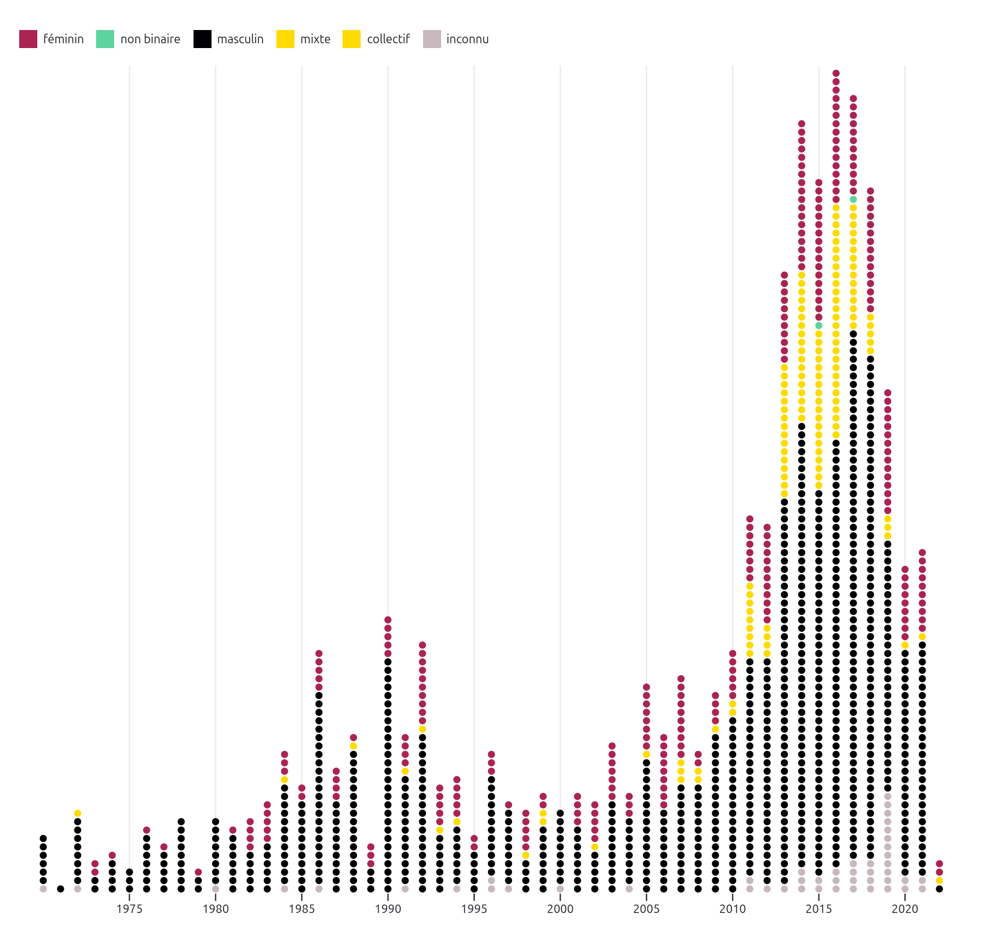

# Examen de sythèse

[toc]

*/!\ rédaction en cours*

## Introduction

La mission des institutions culturelles – musées, bibliothèques, centres d’archives, etc. – comporte notamment la valorisation et l’accès public à leurs contenus. L’arrivée des outils numériques dans ces institutions contribue à la transformation de leurs méthodes de travail, par exemple avec la diffusion numérique des artefacts conservés dans les réserves ou avec les expositions virtuelles. Certaines de ces institutions vont même jusqu’à la mise en ligne de leur données (Casemajor 2012, 82). Ces données décrivent de façon structurée les collections muséales, des archives ou des entités patrimoniales. Dans le cas où elles sont mises à disposition sur des plateformes de données ouvertes, elles contribuent à la documentation institutionnelle accessible et librement réutilisable pour la recherche. Les interactions des publics avec ces données passent principalement par l’intermédiaire d’interfaces web permettant, par exemple, de faire des recherches dans une collection muséale. En tant que jeune chercheuse et professionnelle au parcours multidisciplinaire en informatique et en histoire de l’art, je me suis particulièrement intéressée aux interfaces de valorisation et d’exploration de données culturelles (MK 2020, 2021; Fauchié et al. 2024; Desmorat et MK 2025 [à paraître]; Graff et al. 2024). 

Lorsque la collection numérisée est en libre accès sur les sites web de musées, on peut habituellement l’explorer par le biais d’une barre de recherche (exemple figure 1) ou par l’usage d’un formulaire. Ces mode d’accès contraignent toutefois le potentiel de découverte de la collection. En effet, ces deux fonctions requièrent une connaissance préalable des objets, ou du moins de leurs caractéristiques, pour pouvoir les saisir : on ne peut pas rechercher ce qu’on ne connaît pas. De plus, on ne voit jamais qu’une partie de la collection. 

Une première approche possible pour découvrir une collection dans son ensemble émerge d’une méthodologie quantitative. Anne Dymond souligne dans son ouvrage *Diversity Counts : Gender, Race, and Representation in Canadian Art Galleries* (2019) l’utilité d’indicateurs statistiques dans l’étude des pratiques institutionnelles. Dans une démarche qui reprend les objectifs des études féministes quantitatives en histoire de l’art, Valentine Desmorat et moi avons employé les données publiées par le Musée d’art contemporain de Montréal (MAC) pour étudier l’entrée des femmes artistes dans sa collection [^1]. Les portraits statistiques « permettent, en tant que visualisations de données, de donner à voir les tendances minoritaires, majoritaires, ainsi que les caractéristiques majeures des œuvres ou des artistes pris·es en compte [dans les collections] » (Desmorat 2024, 11).  Guidées par les données, nous avons effectué des analyses statistiques et révélé des facteurs qui ont contribué à la représentation des œuvres d’artistes-femmes dans cette collection (Desmorat 2024, Desmorat et MK 2025 [à paraître]). 

<figcaption style=" text-align: right ">Nombres d'acquisitions d'œuvres d'artistes-femmes et d'œuvres d'artistes-hommes par année (1964-2020), Desmorat et MK, 2024</figcaption>

<!--<iframe src=" https://observablehq.com/@artistes-femmes-mac/nb-dachats-dons-acquisitions#graphiqueBarres " height="650px"></iframe>-->

La production formes visuelles alternatives, graphiques ou matérielles, présente une autre alternative intéressante à la recherche textuelle. Elle permet non seulement de produire des représentations de ces collections, mais aussi, dans le cas de visualisations interactives par exemple, de découvrir leurs contenus. Contrairement au graphique en barre présenté plus haut, l’utilisation de points pour représenter les œuvres une les rends découvrables: en survolant un élément, on obtient le titre de l’œuvre et le clic redirige vers une page qui lui est dédiée. On peut ainsi découvrir une œuvre dont on ne connaissait ni l’existence, ni l’artiste, ni l’emplacement. On obtient ainsi une forme d’accès à la collection davantage caractérisée par la sérendipité et une approche sensorielle. 

*Faire un exemple avec les données du MAC*

<figcaption style=" text-align: right ">Chronologie des œuvres d’art public documentée dans MONA, catégorisées par identité de genre des artistes (1975-2023), MK, 2024</figcaption>

<!--<iframe src=" https://observablehq.com/@maison-mona/chronologie-et-genre#cell-5 " height="450px"></iframe>-->

### Projet de recherche

Mon projet de recherche-création doctorale s’inscrit dans l’étude des institutions culturelles par leur données. Dans une continuité avec ma recherche sur les interfaces de valorisation et d’exploration de données culturelles, j’aimerais créer des environnements esthétiques, sensibles et non-hiérarchiques pour la valorisation et la libre exploration de ces collections. Mon objectif est de renouveler les présentations et les représentations des collections auprès des publics pour déjouer certains effets de pouvoir comme la domination des œuvres et des récits masculins coloniaux normatifs, ou encore l’excès de visibilité médiatique accordée à certains artistes au détriment des autres. Pour ce faire, j’aimerais expérimenter avec l’idée que la création de visualisations de données est une forme de commissariat. Le commissariat, en tant que processus de sélection et de mise en exposition publique d’objets, provient du milieu muséal mais s’est aujourd’hui diversifié en une variété de pratiques sociales. Des comptes Instagram aux listes de lectures Spotify, l’émergence de pratiques curatoriales sur les réseaux sociaux amènent un nouveau réseau d’acteur·rices à se pencher sur cette pratique.

> “Have you already curated today?” read the headline of an article on such varied acts of curation in the Neue Zürcher Zeitung in 2014 (Kathke et al., 2022, p. 71)

Par exemple, Torsten Kathke, Juliane Tomann et Mirko Uhlig proposent de rassembler sous le terme de « contre-curation » ou « contre-commissariat » (*counter-curation*) les pratiques sociales de commissariat qui visent à attirer l’attention sur des inégalités politiques et sociales ou à créer une opposition aux récits hégémoniques (2022, 71). Provenant du domaine de l’histoire, les auteur·rice·s rappellent que ce champs d’étude ne concerne pas uniquement les faits, mais aussi la façon dont ils sont rendus visibles, utilisables et mis en récit. On peut ainsi choisir de créer des countres-récits (*counter-narratives*), des représentations et des imaginaires partagés collectivement qui remettent en question les récits officiels ou établis. Je pense que cette posture commissariale peut également être appliquée à des données, particulièrement lorsqu’on crée de représentations, qu’elles soient visuelles ou multisensorielles, de données.

En créant des interfaces qui invitent à interagir avec les données, j‘aurai pour objectif de créer des contre-récits pour déjouer les normes de visibilités qui discriminent la découvrabilité des contenus culturels. La découvrabilité représente le « potentiel pour un contenu, disponible en ligne, d'être aisément découvert par des internautes dans le cyberespace, notamment par ceux qui ne cherchaient pas précisément le contenu en question » ([OQLF «Découvrabilité»](https://vitrinelinguistique.oqlf.gouv.qc.ca/fiche-gdt/fiche/26541675/decouvrabilite)). À l’échelle d’une collection, on pourrait considérer <!--je propose de considérer?--> la découvrabilité comme le potentiel pour une œuvre d’être découverte parmi les données de l’institution. Ainsi, plutôt que de sélectionner des chef-d’œuvres pour représenter une collection, pourrait-on faire place à la sérendipité et à l’agentivité des publics pour se familiariser avec son contenu? 

<!--découvrabilité en data viz : il s’agirait du potentiel pour une œuvre à contribuer au récit construit par la représentation (visuelle ou matérielle)-->

limitations de l’écran, volonté d’expérimenter avec la matérialisation/physicalisation

utiliser les limites identifiées pour amener la question de la diversification des formes visuelles et celle de la physicalisation.

Mon projet de thèse est une recherche-création en physicalisation de données: des « objets (artefacts physiques) dont la géométrie ou la matérialité *encode*[^2] des données » (Jansen et al. 2015, 2). Il s’agit d’une représentation matérielle de données, souvent contrastée avec l’apparente immatérialité de la visualisation de données. En effet, dans le cas de visualisation, on n’a pas accès aux données qui ont servi à déterminer la forme graphique. Sur papier dans l’espace physique comme sur l’écran d’une machine pour l’espace numérique, les données d’une visualisation ne sont pas tangibles ou palpables. La physicalisation amène ainsi une réflexion sur le rôle du sens du toucher dans la perception de données.

Un des moteurs d’instigation de ce domaine porte sur les origines multiples et les apports de différentes cultures à l’histoire de l’encodage et de la transmission de l’information. Parmi les exemples populaires, on retrouve les bulle-enveloppes, des petits objets en argile employés il y a 6000 ans pour la comptabilisation de biens en Mésopotamie («Bulle-enveloppe», [Wikipédia](https://fr.wikipedia.org/wiki/Bulle-enveloppe)), ou encore les quipus (ou khipus), un système de consignation de données formé de cordes et de nœuds utilisé par l’administration de l’empire Inca et dont les traces remontent à 4500 ans («Quipu», [Wikipédia](https://fr.wikipedia.org/wiki/Quipu)). Il s’agit ainsi de reconnaître que les données – au sens d’informations enregistrées de façon en « permettre le stockage, la transmission ou le traitement » (Donnée, [GDT](https://vitrinelinguistique.oqlf.gouv.qc.ca/fiche-gdt/fiche/8358482/donnee)) – n’ont pas été inventées avec les premiers ordinateurs, ni même par les bureaux de statistiques ou d’autres administrations au fonctionnement centré sur l’écriture. Face à l’amplification exponentielle de la place des données dans notre société, ce travail de reconnaissance historique vise notamment à décentrer le savoir occidental pour faire place à une diversité d’épistémologies. Dans ce contexte, la visualisation de données bénéficie aussi d’un rôle toujours plus important, parce qu’elle facilite l’accès à ces données et leur compréhension. Les recherches en physicalisation de données se développent donc également en ce même sens: de nouvelles pratiques émergent en référence aux autres façons (historiques, culturelles) de penser les données et d’interagir avec [à développer dans l’état des lieux]. 

Je souhaite inscrire ma recherche-création dans ce domaine [physicalisation]

en adoptant moi-même une pratique de physicalisation avec des données culturelles. 

Si certaines pratiques artistiques incorporent (*embed*) des données dans leur medium, l’utilisation de la physicalisation de données comme interface pour une collection muséale reste à explorer. 

### État des lieux pour la représentation de données

#### Visualisation de données: figuration / graphique

- études des formes graphiques (Drucker 2014, 2020 ; Kräutli 2016 ; Tufte 2001 ; Bertin 2013)
- histoire de la data viz (Friendly 2007, Ingold, *Lines. A brief history*)
- Cette recherche doctorale propose de répondre à l’appel de Johanna Drucker de développer une épistémologie visuelle pour les humanités (2014). Dans ses recherches, elle introduit la visualisation comme un vecteur de réflexion, de questionnement et de production de savoir (Drucker 2020). 
- adjust goals, not arrive with necessity for a proof → Meirelles à consulter
- *critical visualisation* Peter Hall et Patricio Davila → à consulter
- *autographic design* Dietmar Offenhuber → notes de lectures partielles, à compléter

#### Cartographie

- cartographie, à la fois comme opérateur théorique, comme outil graphique, comme forme d’analyse et comme manière de penser (Besse 2010)
- processus de déconstruction, issu de la cartographie critique, peut révéler de nouvelles approches de la carte et retracer les mécanismes sociaux liés à sa production (Harley 1989, 2)
- processus de déconstruction à la visualisation de données→ détournement ou à une profanation du dispositif (Agamben 2007). 
- *thick mapping* (Presner, Shepard, et Kawano 2014) et la contre-cartographie (Orangotango+, 2018) 

#### data phyz

## Protocole d’expérimentation

<!--incertaine du terme symbolique: cherche une façon de dire que c’est connoté, contient une façon de voir le monde, **produit du sens**, contribue à la construction d’un récit-->

Pour mener cette recherche, j’ai créé un protocole d’expérimentation [[document 1]](./protocole) qui fournit un cadre à ma pratique. Ce cadre me permet de placer la réflexion-dans-l’action (*reflection-in-action*), un terme proposé par le philosophe et urbaniste Donald A. Schon pour énoncer une posture dans laquelle « on réfléchit à ce qu’on fait pendant qu’on le fait » (1983: 54). Le protocole est divisé en trois étapes:

1. *Faire des choix* est une étape qui sert à nommer les décisions et les partis pris dans l’élaboration d’un objet. Parmi les trois composantes principales, les **données** sont décrites pour déterminer le sujet à représenter ainsi que pour identifier la source ou l’institution qui les a produites. L’analyse du contenu s’effectue en parallèle du prétraitement des données, une étape préparatoire au cours de laquelle les données sources sont structurées pour former un jeu de données. Ce jeu de données passe ensuite par un **algorithme de représentation**. Cet algorithme lui-même un protocole, qui applique une logique visuelle et spatiale, basée sur une intention symbolique, avec une méthodologie algorithmique. Contrairement à la visualisation de données, cet algorithme est une sorte de partition, un plan de travail qu’il reste ensuite à activer dans une **expression matérielle**. La matérialité, dans les sensations qu’elle évoque et dans le geste même du travail de la matière, exprime également une ou des sens symboliques. L’ensemble de ces choix se fait de façon itérative. Les tâtonnements, les tests et les différentes versions font partie du processus de la recherche-création.
2. *Exposer* questionne ce qui est présent lors de la mise à vue publique. Celle-ci requiert une forme d’aboutissement de la première étape, même si le protocole lui-même peut être utilisé de façon itérative. À cette étape, l’enjeu n’est pas simplement de montrer le résultat de la physicalisation de données. Il s’agit plutôt de produire une démonstration de la recherche-création. Pour expliciter son fonctionnement, son « mode d’emploi » et ses propriétés, l’objet doit être accompagné d’une sélection d’éléments qui rapportent les choix effectués et le processus suivi. La présentation publique est également le lieu de réception de la recherche-création. La réception peut être participative, au sens où les interactions pensées dans la physicalisation peuvent aller au-delà de l’expérience pour contribuer à l’élaboration de l’objet. Pour toutefois distinguer la présentation d’un projet de l’animation d’un atelier créatif, un cadre de participation est établi au préalable et lui-même présenté dans l’espace. Une question récursive se pose: les expériences vécues par les personnes présentes, leurs actions et leurs rétroactions peuvent-elles / sont-elles exposées elles aussi? 
3. *Documenter* est intrinsèque aux deux étapes précédentes. Chaque élément doit pouvoir être mobilisé pour contribuer à la recherche. Cela requiert la production délibérée d’une documentation des composantes, des itérations, de l’exposition et de la documentation elle-même, c’est-à-dire l’emploi de ce protocole.

Observations

Ce protocole prend le parti qu’il n’y a pas de recherche-création sans exposition. Pour que la physicalisation puisse faire l’objet d’interactions, le protocole requiert une présentation forme de partage direct avec un public. Elle peut toutefois se dérouler dans des contextes variés, d’une exposition dans une institution culturelle à un événement de vulgarisation ou de partage de connaissance. L’examen de synthèse peut ainsi être le « lieu » de l’exposition, et son jury le public. 

Ce protocole est intrinsèquement algorithmique:

- Il fournit des instructions qui peuvent être répétées <!--est-ce que le protocole vise aussi à être reproductible? (quelqu'un qui suit ta recette avec les mêmes ingrédients obtiendra-t-elle le même dessert que toi?)-->
- Il définit des variables
- Il fait recourt aux boucles et à la récursion
- Il exploite les joies de l’aléa, dans les itérations comme dans la participation publique
- Il doit être exécuté pour avoir un résultat
- Il génère des traces et exige une documentation

Ce protocole prend appuis sur de nombreux opérateurs théoriques issus de la recherche actuelle en visualisation de données, en cartographie et dans le domaine des interfaces personnes-machines. 

### Faire

Ingold:

- *Making: Anthropology, Archaeology, Art and Architecture* (2013) → à consulter (faire soi-même avec ses mains?)
- *The Textility of Making* (2010) → notes de lectures ok (textilité est une métaphore)

Faire avec un ordinateur

- Vitali-Rosati: *Éloge du bug* → fin des notes de lectures à numériser
  - relationship with technology (see it as a craft), playful bidouillage, beyond « utilitarian functionality » to learn, rethink, change perception
- Coleman *Coding Freedom*: hacking as making
- Simondon: *Du mode d’existence des objets technique* 
  - rapport entre humain et machine, rapport à la matière du technicien
  - rapport entre geste humain et geste machine, outil, inventivité

- Molnar *Eloge de l’ordinateur*

Faire en étant située: 

- *Feminist in a Software Lab*, Tara McPherson→ notes de lectures à numériser
- *Data feminism* Catherine d’Ignazio et Laurent F Klein
- *Glitch feminism* → à consulter

Faire sans discipline? Myriam Suchet *Indiscipline*→ notes de lectures ok

Faire une interface

- interfaces poétiques

#### Données

- *data as capta* Drucker (et al à retrouver)
- Smitheran : question/rethink relationship with data? data as medium with agency
- Freeman *Defining Data as an Art Material* 2018 + taxonomy 2018
- data as archive?

#### Algorithme de représentation

Algorithmique : 

- machine imaginaire de Molnar

Software

- Wendy Hui Kyong Chun *Programmed Vision* → continuer la lecture
- Chun, Wendy Hui Kyong. 2005. “On Software, or the Persistence of Visual Knowledge.” → reprendre les notes de lecture (ou la lecture)
- Kittler - There is no software 1993
- Siegert, Bernhard. 2017. “After the Media: The Textility of Cultural Techniques.” In *Media Theory and Cultural Technologies: In Memoriam Friedrich Kittler*, by Maria Teresa Cruz, 1st ed. Newcastle-upon-Tyne: Cambridge Scholars Publisher.

p5.js et d3.js

#### Expression matérielle

( <!--pas sûre du placement de cette partie, peut-être pas nécessaire en attendant de trouver-->

Contexte matériel: Archéologie des médias (Huhtamo et Parikka 2011; Citton et Doudet 2019) + … 

- histoire (matérielle) de l’informatique ?

)

Expressivité / sens porté dans la matière : Barad & nouveau matérialismes (La matière a un sens)

Travail technique de la matière - artisanat

- Smith, T’ai. 2016. “The Problem with Craft.” *Art Journal* 75 (1): 80–84 (Intro artisanat, Ezra Shales *Craft Reader*) 
- Tissage
  - Anni Albers *On weaving*
  - PENELOPE – Weaving as Technical Mode of Existence
- Marks, Laura “Thinking Like a Carpet: Embodied Perception and Individuation in Algorithmic Media.”

Rapport manuel à la matière

- petites mains Margot Mellet

Technologies ancestrales d’encodage de données

- wampum: Haas 2007; L’Hirondelle 2014, 156; Loft 2014, 172; 
- quipu: Paola Torres Núñes del Prado, Alex McLean & Alpaca (algorithmic pattern project)

Textilité

- *Unravel: The Power and Politics of Textiles in Art*, edited by Lotte Johnson, Amanda Pinatih, Wells Fray-Smith, Barbican Art Gallery, and Stedelijk Museum Amsterdam. Munich London New York: Prestel
  - Bryan-Wilson, Julia. 2024. “Fibers, Creatures, Furry Beasts: Queer Textile Crittercism.”
  - « A Thread of Life: Retrieving Power through Textiles »
- “Textile, A Diagonal Abstraction: Glass Bead in Conversation with T’ai Smith.”
- Lean, Marion. 2020. “**Materialising Data Experience through Textile Thinking**.” Thesis, Royal College of Art. → lecture en cours
- Lean, Marion. 2021. “Materialising Data Feminism – How Textile Designers Are Using Materials to Explore Data Experience.” *Journal of Textile Design Research and Practice* 9 (2): 184–209. → à lire
- Igoe, Elaine, ed. 2021. *Textile Design Theory in the Making*. London New York: Bloomsbury Visual Arts. → si nécessaire à lire (à imprimer car pas de copie papier au québec)

<!--mettre l’état des lieux pour la physicalisation ici sinon? -->

### Exposer

*Références, cadre à créer*

-  commissariat (en plus de la contre-curation)
-  réception et participation

« mettre en forme autrement, pour les rendre visibles et discutables » (Hennion et Monnin 2020, 5). 

[ex thèse Marion Lean: Méthodes basée sur l’expérience de réception (incarnée): animer des ateliers de physicalisation de données avec des musées et des artistes+public? ]

### Documenter

*Références, cadre à créer*

Exemples / inspiration

- Pour produire quelque chose comme *Dear Data* ou *Data sketches* 
- Pour documenter ce qui n’est plus: *Feminist in a software lab* (mais avec plus de médias?)

*Reproductibilité? objectif de la documentation*

## Corpus

**Données**: décrites dans chaque instanciation du protocole

Des pratiques d’art, d’artisanat et de design à la croisée de la textilité et de l’algorithmique agissent comme sources d’inspirations transdisciplinaires: 

- [corpus d’œuvres qui inspirent la recherche](https://www.canva.com/design/DAGeuw-pplg/xXzotJr7T8XvWcPHvk2eSw/view?utm_content=DAGeuw-pplg&utm_campaign=designshare&utm_medium=link2&utm_source=uniquelinks&utlId=hef9b400c70) 
- lien entre textilité, récit et données mais ne sont justement pas des visualisations de données 

*Faire une sélection dans le corpus à présenter ici*

## Question de recherche

Comment la physicalisation de données peut-elle offrir une nouvelle forme d’accès pour des données culturelles? 

En pensant l’artisanat comme une technologie et la technologie comme une pratique artisanale, j’aimerais proposer des expériences sensation-nelles comme nouvelle forme d’accès aux données culturelles.

- creéer des physicalisation de données qui produisent de nouveaux récits et offrent de nouvelles perspectives sur les collections d’art (GLAM+?)

Questions connexes

- tester un protocole de recherche-création
- changement de medium → changement de récit (narrative?)

## Partie pratique

[Mise à l’épreuve du protocole](./protocole_MAC) avec les données de la collection du Musée d’art contemporain de Montréal. L’expérience a pour but d’alimenter la notion en cours de développement de contre-curation de données. Ce protocole met une emphase particulière sur la documentation des choix, des étapes et des itérations afin de rendre le processus aussi *tangible* que les données elles-mêmes.

- Données du MAC
- examen de synthèse comme contexte d’exposition ?!

### Documenter

## Plan de la thèse?

*comment je vais utiliser le protocole pour faire une thèse*

- cadre de la recherche, plusieurs utilisations (2-4?)
  - reprendre la carte aux poils de chiens avec le protocole?

---

[^1]: Ce projet a pour point de départ le mémoire de maîtrise de Valentine Desmorat : *L’entrée des femmes artistes dans la collection du Musée d’art contemporain de Montréal, de 1964 à 2020 : analyses statistiques et facteurs déterminants*. Dirigées par la professeure Johanne Lamoureux (Université de Montréal), ces recherches ont été menées dans le cadre du Partenariat *Des nouveaux usages des collections dans les musées d’arts* (CIÉCO). La collaboration avec Lena Krause, dans son rôle de responsable de laboratoire à l’*Ouvroir d’histoire de l’art et de muséologie numériques* (Université de Montréal), a débuté à l’occasion de la clinique numérique du laboratoire.
[^2]: Traduction admise par l’OQLF: https://vitrinelinguistique.oqlf.gouv.qc.ca/fiche-gdt/fiche/8375546/coder
[^]: A confirmer une fois l’état des lieux est complété

[^01]: 